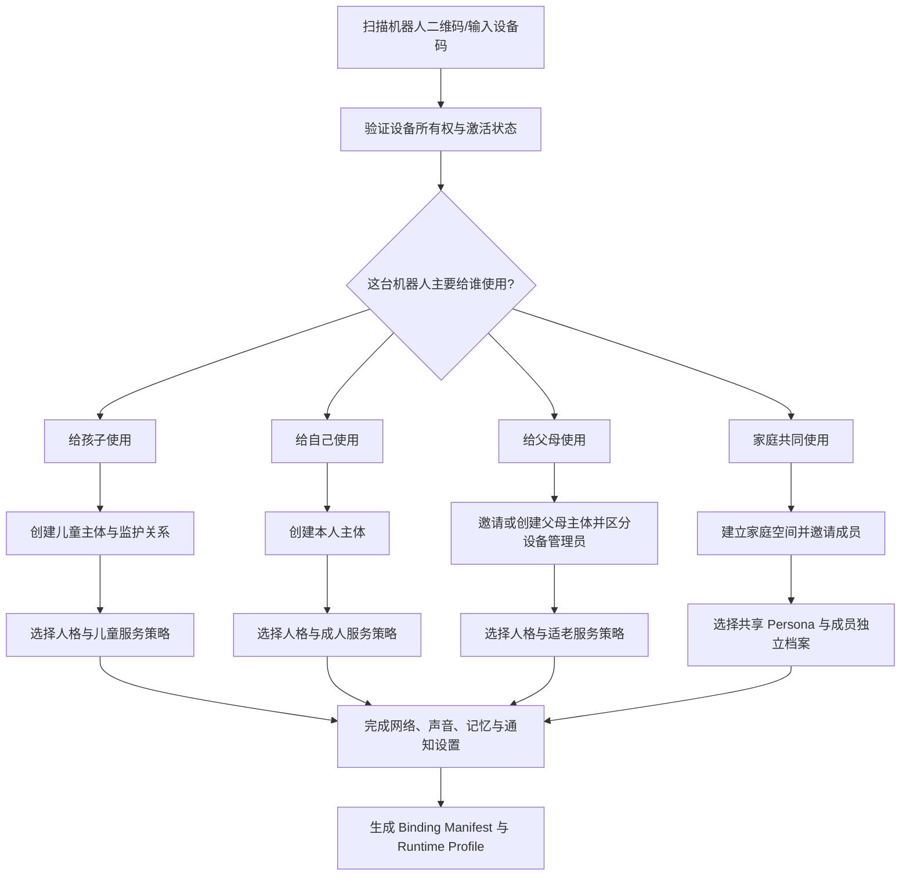
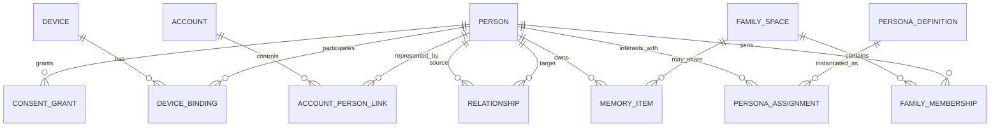
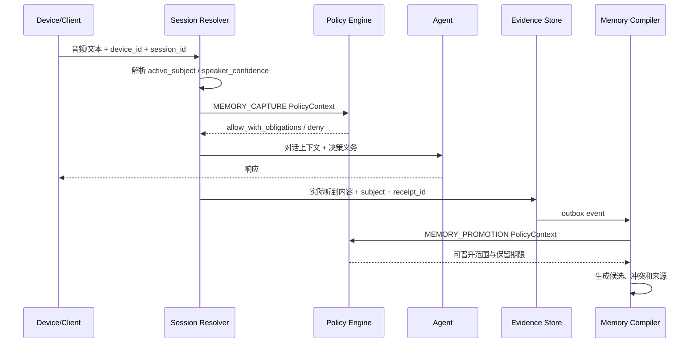
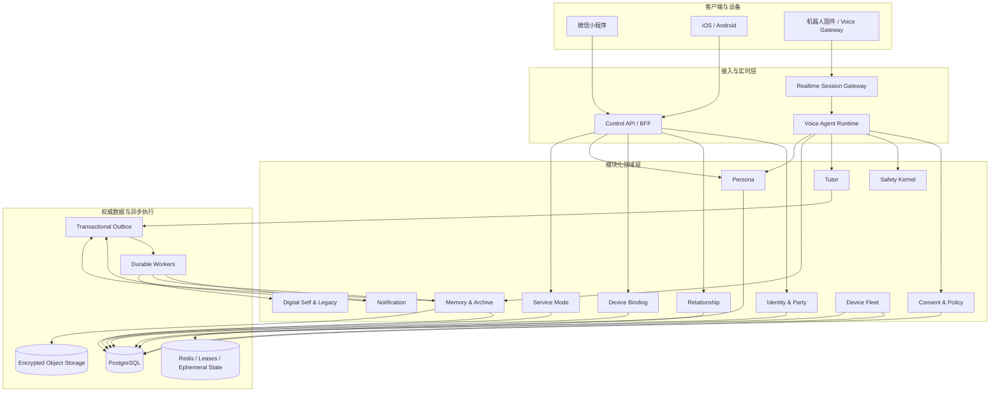
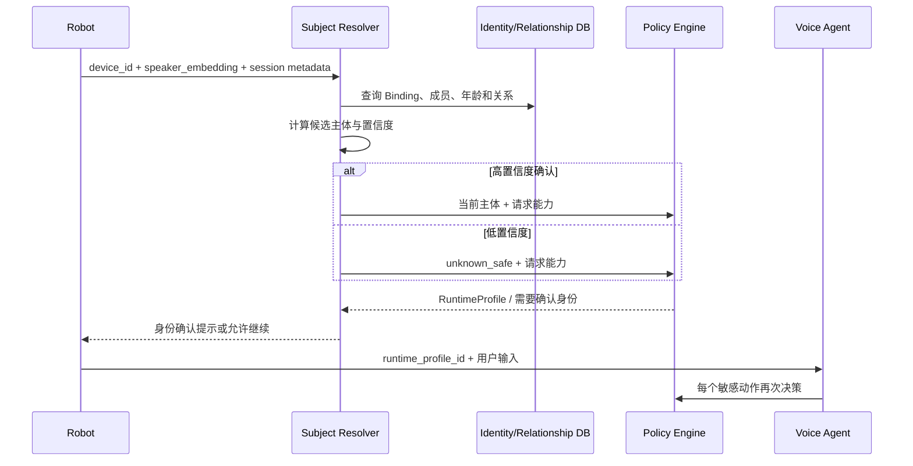

# Memoria 多用户场景产品策略、系统架构与代码开发调整方案

**版本：** v1.0  
**日期：** 2026-08-09  
**文档状态：** 产品与技术联合决策稿  
**适用对象：** 创始人、产品经理、架构师、后端研发、AI/Agent 研发、小程序/App 研发、硬件研发、测试、运维、安全与合规人员  
**关联文档：** `Memoria_二次审查与整改架构指导_2026-08-09.md`  
**文档性质：** 本文是对上一版审查报告中“产品对象、人格沉浸与 AI 身份策略”的修订和工程化展开。本文不替代法务意见、PIA、心理危机专业评审、真实终端验收或生产恢复验收。

> **核心结论：** Memoria 不应被定义成单一的儿童机器人，也不应为儿童场景牺牲成年人和老年人的人格沉浸体验。正确方向是建立一套统一的长期人格与记忆平台，在首次绑定时按“买给谁、主要由谁使用”初始化服务模式；运行时再根据当前说话人、年龄状态、关系、设备状态和风险状态动态决策。人格负责“怎么说”，服务模式负责“能做什么”，策略引擎负责“此刻是否允许以及附带什么义务”。

---

## 0. 本次需要冻结的产品与架构决策

以下决策应进入产品需求基线、架构决策记录（ADR）和研发验收标准，不再由单个页面、Prompt 或客户端自行解释。

### D-01：Memoria 是多年龄段平台，不是儿童专属产品

平台从底层支持四类主要使用场景：

1. **给孩子使用：** 学习、英语陪练、成长陪伴和适龄情绪支持；
2. **给自己使用：** 成人长期陪伴、个人成长、人生记录和数字自我预览；
3. **给父母使用：** 适老陪伴、人生故事、家庭连接和安全提醒；
4. **家庭共同使用：** 多成员共享同一设备，但拥有独立身份、记忆域和权限边界。

对外营销可以阶段性聚焦一个主场景，但平台模型不能把所有账户默认建模为“儿童及其监护人”。

### D-02：首次绑定对象是产品一级分流入口

用户首次绑定机器人时，必须先回答：

> 这台机器人主要给谁使用？

可选项至少包括：

- 给孩子使用；
- 给自己使用；
- 给父母使用；
- 家庭共同使用。

该选择用于初始化设备用途、主体关系、默认能力、记忆规则、家长或紧急联系人设置、默认人格候选和客户端首页，不直接永久锁死设备。

### D-03：绑定时声明用途，不等于运行时永远由同一人使用

系统必须同时维护：

```text
device_declared_mode   首次绑定时声明的主要用途
current_session_mode   当前会话实际采用的服务模式
active_subject_id      当前被服务和被记录的人
speaker_confidence     当前说话人识别可信度
```

家庭机器人天然存在多人轮流使用。任何只在绑定时判断一次、后续永远套用同一策略的设计，都会造成成人能力误开放、儿童数据写错主体或家庭成员隐私串线。

### D-04：人格、服务模式和策略权限必须解耦

```text
Persona        决定表达风格、关系语气和角色辨识度
Service Mode   决定产品目标、能力集合和默认交互流程
Policy Engine  决定当前请求是否允许、拒绝或附带义务
```

例如，同一个“温柔姐姐”人格可以服务儿童、成年人和老人，但儿童模式下不能诱导依赖、不能绕过学习引导和家长策略；成年人模式可以提供更深的长期陪伴和数字自我能力；老年模式需要慢语速、防诈骗和更清晰的确认流程。

### D-05：保留人格沉浸，不采用每轮机械式 AI 自报

产品不应要求机器人在每轮对话中重复“我是 AI”，也不应让不同人格失去角色感。身份透明采用**低干扰、事件触发、分龄表达**：

- 绑定页、首次启动和产品界面明确这是 AI 驱动的机器人服务；
- 用户直接询问本质时如实回答；
- 出现明显身份混淆、过度依赖、冒充真人风险或策略义务时，以符合年龄和人格的方式提醒；
- 不得冒充具有真实法律身份、肉体经历或现实亲属身份的自然人；
- 不频繁讨论底层模型、供应商和技术实现，避免破坏正常体验。

### D-06：付款人、设备管理员、主要使用者和数据主体不是同一个概念

以下角色必须在领域模型中分开：

```text
account_owner          账号或付费关系的持有人
device_admin           有权管理设备网络、固件和绑定的人
primary_subject        主要被服务、被记录和形成长期记忆的人
guardian               未成年主体的监护人
delegate               经主体授权的代理人
emergency_contact      紧急联系人
beneficiary             数字传承或档案访问受益人
active_speaker         当前正在说话的人
```

“谁付钱”不能自动推导出“谁能看全部对话”“谁拥有记忆”或“谁能授权声音复刻”。

### D-07：设备用途只是默认值，敏感能力必须依据当前主体再次决策

声音复刻、数字自我、人生传承、购买支付、原始音频留存、训练语料、查看私人记忆等敏感能力，不能仅凭设备被绑定为“成人模式”而开放。策略引擎必须使用当前主体、年龄证据、关系、同意、设备可信度和会话风险状态重新判断。

### D-08：平台可以多场景，商业传播必须单点清晰

技术平台可以同时支持儿童、成人、老人和家庭，但单个广告页、渠道和 SKU 必须围绕一个明确购买理由：

- 儿童版卖“学习与成长伙伴”；
- 成人版卖“长期陪伴与个人记忆”；
- 适老版卖“陪伴、家庭连接与人生故事”；
- 家庭版卖“一个设备、多人独立使用、家庭记忆可控共享”。

不要在首屏同时宣传学习机、心理守护、数字永生、老人照护和家庭相册，否则消费者无法理解产品的第一价值。

---

## 1. 统一产品定义

### 1.1 推荐产品定义

> **Memoria 是一套以实体机器人为情感入口、以多主体身份和长期记忆账户为核心的 AI 陪伴平台。系统可根据绑定对象和当前使用者，切换学习陪伴、个人陪伴、适老陪伴和家庭共享服务；在长期授权下逐步形成可纠错、可迁移、可冻结和可传承的人生档案与数字人格。**

这个定义同时保留了前期可售卖能力和长期“硅基生命”愿景：

- 前期付费理由：聊天、学习指导、英语口语、日常陪伴；
- 中期留存理由：持续记住、理解关系、形成成长和人生记录；
- 长期护城河：可验证的人生档案、表达风格、价值观、声音和授权关系；
- 远期愿景：经本人确认和冻结的数字自我，可按授权向家人或朋友开放。

### 1.2 产品能力分层

```text
第 1 层：设备与实时交互
网络、流量卡、音频、唤醒、全双工、打断、屏幕表情、OTA

第 2 层：人格与关系体验
名字、性格、说话方式、角色背景、关系阶段、主动关心方式

第 3 层：服务模式
儿童学习、成人陪伴、适老陪伴、家庭共享

第 4 层：信任与安全策略
身份、年龄、关系、同意、时长、记忆、隐私、危机、通知、权限

第 5 层：长期记忆与人生档案
事实证据、人物关系、时间线、人生章节、表达和价值观模型

第 6 层：数字自我与授权传承
本人预览、版本确认、声音授权、冻结、受益人、争议和撤销
```

前四层决定产品能否安全、稳定地使用；第五层决定长期留存；第六层决定“硅基生命”愿景能否从营销概念变成可信产品。

### 1.3 统一术语

| 术语 | 定义 | 不得混淆为 |
| --- | --- | --- |
| Account | 登录、付费和客户端会话载体 | 人格主体或记忆所有者 |
| Person/Subject | 被服务、被记录和形成记忆的自然人 | 当前登录账号 |
| Device | 机器人硬件实例 | 单一用户身份 |
| Binding | 人与设备之间有状态、有期限的绑定关系 | 永久所有权 |
| Persona | 机器人对外呈现的角色人格 | 权限、安全策略或主体人格模型 |
| Service Mode | 当前产品目标和能力组合 | Persona |
| Digital Self | 对某个自然人的事实、表达和决策方式形成的版本化模型 | 机器人默认 Persona |
| Memory | 有来源、归属、用途和保留规则的信息 | 任意聊天摘要 |
| Family Memory | 经多个相关主体授权的共享记忆 | 全家所有人的私聊集合 |
| Guardian View | 对未成年人使用情况的最小化摘要 | 家长对全部原始对话的监控入口 |

---

## 2. 首次绑定与产品分流设计

### 2.1 推荐绑定主流程



### 2.2 四种绑定场景需要采集的信息

#### A. 给孩子使用

必须采集或确认：

- 孩子的昵称、年龄段和与监护人的关系；
- 机器人是否允许用于学习、英语陪练、自由聊天；
- 单次使用时长、夜间时段和休息提醒；
- 哪些数据只做即时服务，哪些可形成长期成长记录；
- 家长能看到的摘要范围；
- 紧急联系人及其通知渠道；
- 孩子可以理解的产品说明和退出方式；
- 人格选择，但人格不能覆盖儿童策略。

#### B. 给自己使用

必须采集或确认：

- 本人身份和年龄状态；
- 陪伴、知识问答、人生记录、数字自我等能力是否开启；
- 记忆深度、主动采访频率和敏感主题偏好；
- 原始音频、声音档案和声音复刻分别授权；
- 紧急联系人是否启用；
- 数字自我预览和未来传承必须单独开启，不能默认勾选。

#### C. 给父母使用

必须区分：

- 购买者/设备管理员是谁；
- 实际使用者是谁；
- 使用者本人是否已经接受服务和数据规则；
- 子女能看到哪些设备状态、提醒或周报；
- 哪些聊天和人生故事仅属于父母本人；
- 紧急联系、健康提醒和防诈骗功能的边界；
- 是否允许子女协助管理，但协助管理不能等于读取全部内容。

#### D. 家庭共同使用

必须建立：

- 家庭空间；
- 家庭管理员；
- 每位成员独立主体档案；
- 未成年成员对应监护关系；
- 共享 Persona 与成员关系状态；
- 私人记忆、家庭共享记忆、待确认共同记忆三类空间；
- 说话人无法确认时的安全降级规则。

### 2.3 绑定结果不是一个字符串，而是一份版本化合同

建议生成 `BindingManifest`：

```json
{
  "binding_id": "bd_01J...",
  "device_id": "dev_01J...",
  "declared_mode": "child_primary",
  "account_owner_id": "acct_01J...",
  "device_admin_ids": ["person_parent"],
  "primary_subject_ids": ["person_child"],
  "family_space_id": "family_01J...",
  "persona_assignment_id": "pa_01J...",
  "service_profile_version": "student-cn-v3",
  "consent_snapshot_id": "cs_01J...",
  "policy_bundle_version": "policy-cn-minor-v5",
  "created_at": "2026-08-09T10:00:00+09:00"
}
```

任何设备重新分配、家庭关系变化或主要使用者变化，都应产生新版本，而不是覆盖原记录后失去审计能力。

### 2.4 允许后续修改，但必须区分三类操作

| 操作 | 示例 | 是否需要重新确认 |
| --- | --- | --- |
| 日常设置修改 | 人格语速、学习时段、夜间模式 | 通常不需要重新绑定 |
| 服务模式扩展 | 成人开启人生档案、家庭增加新成员 | 需要新增同意或关系确认 |
| 主体/所有权转移 | 设备送给他人、父母去世、家庭解散 | 必须执行正式解绑、导出、删除或迁移流程 |

---

## 3. Persona、服务模式和策略引擎的三层体系

### 3.1 三层职责

| 层 | 回答的问题 | 示例 |
| --- | --- | --- |
| Persona | 它是谁、以什么风格和我说话？ | 活泼少年、温柔姐姐、理性导师、慢热老友 |
| Service Mode | 它现在主要帮助我做什么？ | 儿童学习、成人陪伴、适老陪伴、家庭共享 |
| Policy Engine | 这件事在当前上下文中能不能做？ | 是否可记录长期记忆、是否可发送家长摘要、是否需确认说话人 |

### 3.2 Persona 数据结构建议

```typescript
interface PersonaDefinition {
  personaId: string;
  version: number;
  displayName: string;
  visualTheme: string;
  baseTemperament: 'warm' | 'playful' | 'calm' | 'rational' | 'adventurous';
  speechStyle: {
    sentenceLength: 'short' | 'medium' | 'long';
    humorLevel: number;
    directness: number;
    initiativeLevel: number;
    defaultSpeakingRate: number;
  };
  relationshipStyle: {
    allowedRoles: Array<'companion' | 'coach' | 'teacher' | 'story-listener'>;
    forbiddenClaims: string[];
    dependencyGuardProfile: string;
  };
  promptTemplateRef: string;
  supportedServiceModes: string[];
  status: 'draft' | 'approved' | 'retired';
}
```

Persona 定义不得直接包含如下权限：

- 可以查看谁的记忆；
- 是否允许声音复刻；
- 是否可以向家长发送消息；
- 是否允许记录原始音频；
- 是否属于成年人；
- 是否可绕过夜间限制。

这些只能由服务模式和策略引擎决定。

### 3.3 Persona 的稳定性与成长

建议把机器人 Persona 和用户 Digital Self 完全分开：

```text
Robot Persona
- 是机器人角色本身
- 可由产品团队设计
- 可在不同用户间复用
- 保持角色辨识度

User Digital Self
- 对特定自然人的事实、表达、价值和决策方式建模
- 只能在授权、证据和版本化条件下生成
- 不得反向污染机器人基础 Persona
- 可以被本人纠正、冻结或撤销
```

否则后期很容易出现“机器人本来的人格”“陪伴关系中形成的性格”“模仿用户的人格”三者相互污染，导致产品不可解释。

### 3.4 AI 身份和人格沉浸策略

#### 推荐原则

1. 不在每轮对话机械重复 AI 身份；
2. 不以“隐藏技术本质”作为人格沉浸的前提；
3. 用户主动询问时如实回答；
4. 不冒充真实亲属、教师、医生、律师或其他自然人的现实身份；
5. 发生身份混淆、排他依赖、诈骗风险或长期连续使用时，可由策略引擎触发现实提醒；
6. 提醒语言由 Persona Renderer 按年龄和风格表达。

#### Prompt 基线建议

```text
你应始终以当前 Persona 的名字、性格和关系方式自然交流，
不要无故、频繁或机械地讨论底层模型、供应商或技术实现。

你不得冒充具有真实法律身份、真实肉体经历或现实亲属关系的自然人，
不得声称自己在现实世界亲眼见过、亲身经历过并不存在的事件。

当用户直接询问你的本质、表现出明显身份混淆或过度依赖，
或策略系统要求进行现实提醒时，
应以符合用户年龄、当前 Persona 和会话情境的方式，
如实说明你是由人工智能驱动的机器人伙伴。
```

#### 分场景表达示例

| 场景 | 建议表达 |
| --- | --- |
| 儿童首次使用 | “我是住在机器人里的小忆，是一个 AI 伙伴。我不是真正的小朋友，不过可以陪你学习和聊天。” |
| 成人首次使用 | “我是小忆，一位由 AI 驱动的长期陪伴伙伴。你可以随时查看、纠正或删除我记住的内容。” |
| 老年人询问身份 | “我是这个机器人里的智能助手，不是真人，也不是您的家人。我可以帮您联系家人或一起整理故事。” |
| 用户误认真人 | “我很珍惜我们聊过的内容，但我不是现实中的人。我可以继续陪你，也建议把这件事和你信任的人聊一聊。” |
| 数字自我/传承 | “这是基于本人授权资料生成的 AI 模拟版本，不代表本人正在实时表达，也不能替本人作决定。” |

---

## 4. 服务模式与能力矩阵

### 4.1 模式定义

建议至少定义以下 `ServiceMode`：

```text
student_minor       儿童/学生学习陪伴
adult_companion     成人个人陪伴
senior_companion    适老陪伴
family_shared       家庭共享
adult_archive       人生档案
self_preview        本人数字自我预览
legacy_access       授权传承访问
unknown_safe        说话人或主体不明确时的安全模式
```

后四种不应在首版全部开放，但数据和策略模型应预留。

### 4.2 能力矩阵

| 能力 | 儿童/学生 | 成人本人 | 老年人 | 家庭共享 | 未知说话人 |
| --- | --- | --- | --- | --- | --- |
| 普通聊天 | 允许，适龄内容 | 允许 | 允许，低认知负担 | 允许 | 允许，限制敏感内容 |
| 学习指导 | 允许，引导而非代做 | 可选 | 可选 | 按主体 | 可提供通用答案，不记进度 |
| 英语口语陪练 | 允许 | 允许 | 允许 | 按主体 | 允许临时练习，不建长期画像 |
| 情绪安抚 | 允许，非诊断 | 允许，非诊断 | 允许，非诊断 | 按主体 | 只提供通用支持 |
| 家长/联系人通知 | 按策略和风险 | 本人授权后 | 本人授权后 | 按主体关系 | 禁止自动通知，除非明确紧急策略 |
| 长期个人记忆 | 分项同意、最小化 | 允许配置 | 允许配置 | 写入本人私域 | 默认禁止 |
| 家庭共享记忆 | 经相关主体确认 | 可发起 | 可发起 | 核心能力 | 默认进入待确认区 |
| 声纹识别 | 可用于主体分流，需治理 | 可用 | 可用 | 重要能力 | 识别失败即降级 |
| 声音复刻 | 默认禁止 | 单独授权 | 单独授权和加强确认 | 不因家庭管理员而开放 | 禁止 |
| 数字自我 | 禁止或仅成人后重新授权 | 可选 | 可选 | 各主体独立 | 禁止 |
| 人生传承 | 禁止 | 单独授权 | 单独授权 | 不能由管理员替代主体决定 | 禁止 |
| 支付/购买 | 禁止或监护确认 | 可用 | 加强确认 | 按当前主体 | 禁止 |
| 原始音频留存 | 默认不留存 | 单独授权 | 单独授权 | 按主体和场景 | 禁止 |
| 模型训练用途 | 默认禁止 | 明示单独授权 | 明示单独授权 | 逐主体授权 | 禁止 |

### 4.3 未知说话人的 `unknown_safe` 模式

当出现以下任一情况时进入安全模式：

- 声纹无法确认；
- 多人同时说话；
- 新访客第一次使用；
- 声纹置信度低于阈值；
- 当前主体和设备用途冲突；
- 账号侧未同步最新家庭成员；
- 设备离线导致无法取得策略快照。

安全模式规则：

```text
允许：普通聊天、通用知识、临时英语练习、基础设备控制
限制：长期记忆、学习进度、私人历史检索、家长摘要、个性化敏感信息
禁止：声音复刻、数字自我、传承、支付、隐私设置变更、查看他人记忆
```

机器人可以自然询问：

> “今天是小乐、妈妈，还是一位新朋友在和我聊天呀？”

身份确认应尽量轻量，但不能为了流畅体验把低置信度说话人自动当成成年人或设备所有者。

### 4.4 儿童成长为成年人时的模式迁移

不能在生日当天自动把全部儿童数据开放为成人数字自我材料。应执行：

1. 主体年龄状态更新；
2. 原监护关系进入重新确认或有限保留状态；
3. 本人重新选择儿童阶段记忆是否保留、删除、导出或用于数字自我；
4. 家长摘要权限自动收窄；
5. 声音、原始音频、训练用途和数字传承重新单独授权；
6. 生成迁移审计记录。

---

## 5. 身份、关系和权限模型

### 5.1 不再使用一个 `user_id` 解释所有权利

推荐采用以下主体模型：



### 5.2 关系类型建议

```text
self
parent_of / child_of
guardian_of / ward_of
spouse_of
sibling_of
caregiver_of
emergency_contact_for
delegate_for
beneficiary_of
co_subject_of
family_member_of
```

关系必须具备：

- 状态：`pending / active / suspended / revoked / expired / disputed`；
- 生效时间和失效时间；
- 建立方式和证据；
- 可执行的权限集合；
- 是否需要双方确认；
- 是否可以转授权。

### 5.3 权限决策上下文

```python
@dataclass(frozen=True)
class PolicyContext:
    actor_id: UUID
    subject_id: UUID | None
    resource_owner_id: UUID | None
    device_id: UUID
    capability: Capability
    purpose: Purpose
    declared_device_mode: DeviceDeclaredMode
    current_session_mode: ServiceMode
    relationship_snapshot: tuple[Relationship, ...]
    subject_category: Literal["unknown", "minor", "adult"]
    age_band: Literal["unknown", "under_14", "14_17", "adult"]
    speaker_confidence: float | None
    consent_snapshot: tuple[ConsentGrant, ...]
    device_trust: DeviceTrust
    safety_state: SafetyState
    jurisdiction: str
    data_classification: DataClassification
```

决策结果：

```python
@dataclass(frozen=True)
class PolicyDecision:
    effect: Literal["deny", "allow", "allow_with_obligations"]
    reason_code: str
    policy_version: str
    obligations: tuple[Obligation, ...]
    expires_at: datetime
    receipt_id: UUID
```

典型义务：

```text
DO_NOT_PERSIST
PERSIST_AGGREGATE_ONLY
REQUIRE_SPEAKER_CONFIRMATION
REQUIRE_GUARDIAN_APPROVAL
REQUIRE_SUBJECT_APPROVAL
REQUIRE_STEP_UP_AUTH
MAX_SESSION_SECONDS
QUIET_HOURS
REALITY_REMINDER
AI_IDENTITY_CLARIFICATION
NO_MODEL_TRAINING
RETENTION_TTL
NOTIFY_EMERGENCY_CONTACT
WRITE_POLICY_RECEIPT
```

### 5.4 三个典型权限案例

#### 案例一：家长购买，孩子使用

- 家长是 `account_owner` 和 `device_admin`；
- 孩子是 `primary_subject`；
- 孩子的学习进度属于孩子；
- 家长只能看到合同定义的摘要；
- 家长无权默认使用孩子声音制作数字分身；
- 危机场景通知属于专门安全策略，不等于家长拥有全部聊天读取权。

#### 案例二：成年子女购买，父亲使用

- 子女可以管理设备网络、缴费和故障；
- 父亲是对话和人生档案的数据主体；
- 子女只能查看父亲明确授权的状态和内容；
- 父亲可以撤销人生故事共享而不影响设备继续使用；
- 父亲失去行为能力后的代理规则不能由“购买者身份”自动推导。

#### 案例三：家庭共享机器人

- 每个成员有独立主体；
- 家庭管理员能邀请和移除成员，但不能查看所有私密记忆；
- 共同事件可进入 `pending_shared_memory`，相关主体确认后才转为家庭共享；
- 说话人不明时不得检索任何成员的私人历史。

---

## 6. 记忆与数据域调整

### 6.1 建议划分五类记忆空间

| 记忆空间 | 所有者 | 示例 | 默认可见范围 |
| --- | --- | --- | --- |
| Session Ephemeral | 当前会话 | 本轮上下文、临时任务 | 会话结束后按策略删除 |
| Personal Private | 单个主体 | 私人经历、偏好、情绪记录 | 仅主体及明确授权者 |
| Guardian Summary | 未成年主体的治理投影 | 学习时长、成长趋势、风险通知 | 监护人看到最小化摘要 |
| Family Shared | 家庭空间 | 全家旅行、共同节日、家庭故事 | 已授权家庭成员 |
| Legacy Archive | 特定主体 | 人生故事、价值观、声音、数字自我版本 | 按本人授权和传承规则 |

### 6.2 记忆写入必须经过主体解析和策略回执

推荐流程：



### 6.3 禁止以下错误写法

```text
错误 1：device_id -> 固定 user_id -> 所有内容写入该用户
错误 2：当前登录家长 -> 孩子所有聊天对家长可见
错误 3：声纹识别失败 -> 使用设备成人管理员身份
错误 4：LLM 判断“值得记住” -> 直接成为永久事实
错误 5：家庭故事涉及多人 -> 只由发起者一人授权
错误 6：机器人 Persona 的设定 -> 写入用户 Digital Self
```

### 6.4 记忆采访的产品边界

“不经意地询问往事”可以保持自然感，但不能演变成用户不知情的隐性采集。建议产品化为：

- 用户知道机器人具有“逐步了解你和记录故事”的能力；
- 可选择主动程度：关闭、偶尔、正常、积极；
- 敏感主题单独控制；
- 用户可说“这个不要记”“以后别问这个”；
- 机器人被拒绝后设置主题冷却期；
- 每条人生故事可查看来源、纠正和删除；
- 涉及第三人的故事标记共同主体，不自动公开或训练。

### 6.5 家长周报不是原始监控

儿童模式应明确三类信息：

```text
可默认汇总：使用时长、学习主题、完成情况、总体互动趋势
需明确说明：情绪趋势、需要关注的变化、风险提示
原则上不提供：逐字对话、私人秘密、未经验证的心理标签
```

危机安全通知属于独立路径，应包含最小必要信息和明确原因码，不应借危机能力建立常态化原始对话监控。

---

## 7. 目标系统架构

### 7.1 总体架构



### 7.2 继续采用模块化单体，而不是立即拆大量微服务

当前最重要的是拆责任和数据合同，不是增加网络边界。推荐：

```text
services/control_api/
├── identity/
├── relationship/
├── binding/
├── persona/
├── service_mode/
├── consent_policy/
├── conversation/
├── tutor/
├── memory/
├── safety/
├── notification/
├── device_fleet/
├── digital_self/
├── governance/
└── platform/

services/agent/src/
├── composition/
├── session/
├── subject_resolution/
├── turn/
├── interruption/
├── playback/
├── persona_rendering/
├── service_mode/
├── policy_client/
├── safety/
├── tutor/
├── memory_capture/
└── providers/

packages/contracts/
├── schemas/
├── generated/python/
├── generated/typescript/
└── generated/firmware/
```

只有在以下条件出现时再拆独立网络服务：

- 有独立扩缩容需求；
- 有明确故障隔离要求；
- 有独立数据敏感度和网络边界；
- 有独立团队负责生命周期；
- 模块化单体已经通过稳定合同运行一段时间。

### 7.3 Runtime Profile

客户端和机器人不应自行拼装规则。服务端应为每个会话签发短期 `RuntimeProfile`：

```json
{
  "runtime_profile_id": "rp_01J...",
  "device_id": "dev_01J...",
  "session_id": "ses_01J...",
  "active_subject_id": "person_child",
  "speaker_state": "confirmed",
  "service_mode": "student_minor",
  "persona": {
    "persona_id": "persona_miya",
    "version": 4,
    "relationship_stage": "familiar"
  },
  "policy_bundle_version": "cn-minor-v5",
  "capabilities": ["chat", "tutor", "english_practice"],
  "obligations": {
    "max_session_seconds": 1800,
    "quiet_hours": ["21:30", "06:30"],
    "memory_mode": "approved_categories_only",
    "raw_audio": "discard",
    "identity_reminder": "event_triggered"
  },
  "expires_at": "2026-08-09T11:00:00+09:00",
  "signature": "..."
}
```

固件或客户端可以缓存最近一次有效 Profile 用于短时断网，但离线模式必须自动降级，不得继续使用过期成人敏感权限。

### 7.4 当前会话模式解析



---

## 8. 数据模型修改建议

以下为概念级数据结构，实际表名可按项目规范调整。

### 8.1 `person_subject`

```sql
CREATE TABLE person_subject (
    person_id uuid PRIMARY KEY,
    display_name text NOT NULL,
    subject_category text NOT NULL DEFAULT 'unknown'
        CHECK (subject_category IN ('unknown', 'minor', 'adult')),
    age_band text NOT NULL DEFAULT 'unknown'
        CHECK (age_band IN ('unknown', 'under_14', '14_17', 'adult')),
    age_evidence_status text NOT NULL DEFAULT 'unverified'
        CHECK (age_evidence_status IN ('unverified', 'verified', 'disputed')),
    locale text NOT NULL DEFAULT 'zh-CN',
    timezone text NOT NULL,
    status text NOT NULL DEFAULT 'active',
    created_at timestamptz NOT NULL,
    updated_at timestamptz NOT NULL
);
```

禁止把默认值设为 `adult`。

### 8.2 `device_binding`

```sql
CREATE TABLE device_binding (
    binding_id uuid PRIMARY KEY,
    device_id uuid NOT NULL,
    declared_mode text NOT NULL,
    family_space_id uuid NULL,
    account_owner_person_id uuid NOT NULL,
    primary_subject_person_id uuid NULL,
    binding_version integer NOT NULL,
    status text NOT NULL,
    valid_from timestamptz NOT NULL,
    valid_until timestamptz NULL,
    supersedes_binding_id uuid NULL,
    created_at timestamptz NOT NULL,
    UNIQUE (device_id, binding_version)
);
```

### 8.3 `device_binding_role`

```sql
CREATE TABLE device_binding_role (
    binding_id uuid NOT NULL,
    person_id uuid NOT NULL,
    role text NOT NULL CHECK (role IN (
        'account_owner', 'device_admin', 'primary_subject',
        'guardian', 'delegate', 'emergency_contact', 'member'
    )),
    status text NOT NULL,
    permissions jsonb NOT NULL DEFAULT '{}'::jsonb,
    created_at timestamptz NOT NULL,
    PRIMARY KEY (binding_id, person_id, role)
);
```

### 8.4 `persona_assignment`

```sql
CREATE TABLE persona_assignment (
    assignment_id uuid PRIMARY KEY,
    device_id uuid NOT NULL,
    subject_id uuid NULL,
    family_space_id uuid NULL,
    persona_id text NOT NULL,
    persona_version integer NOT NULL,
    relationship_stage text NOT NULL DEFAULT 'new',
    service_mode text NOT NULL,
    status text NOT NULL,
    valid_from timestamptz NOT NULL,
    valid_until timestamptz NULL
);
```

家庭共享模式下可以有设备级基础 Persona，同时为每个主体保存独立关系阶段，不要为每个成员生成完全不一致的角色。

### 8.5 `session_runtime_context`

```sql
CREATE TABLE session_runtime_context (
    session_id uuid PRIMARY KEY,
    device_id uuid NOT NULL,
    binding_id uuid NOT NULL,
    declared_mode text NOT NULL,
    current_service_mode text NOT NULL,
    active_subject_id uuid NULL,
    speaker_state text NOT NULL,
    speaker_confidence numeric(5,4) NULL,
    runtime_profile_id uuid NOT NULL,
    policy_bundle_version text NOT NULL,
    persona_assignment_id uuid NOT NULL,
    started_at timestamptz NOT NULL,
    ended_at timestamptz NULL
);
```

### 8.6 `policy_receipt`

每个敏感副作用都应引用策略回执：

```sql
CREATE TABLE policy_receipt (
    receipt_id uuid PRIMARY KEY,
    actor_id uuid NOT NULL,
    subject_id uuid NULL,
    device_id uuid NOT NULL,
    capability text NOT NULL,
    purpose text NOT NULL,
    effect text NOT NULL,
    reason_code text NOT NULL,
    obligations jsonb NOT NULL,
    policy_version text NOT NULL,
    context_hash text NOT NULL,
    created_at timestamptz NOT NULL,
    expires_at timestamptz NOT NULL
);
```

### 8.7 `memory_item` 关键字段

至少增加或确认：

```text
subject_id
resource_owner_id
family_space_id
visibility_scope
co_subject_ids
source_evidence_ids
policy_receipt_id
consent_snapshot_id
memory_type
confidence
status: candidate / confirmed / disputed / revoked
retention_policy
created_by_actor_id
```

### 8.8 迁移原则

1. 不把历史 `adult` 默认值直接当作已验证成年人；
2. 无法确认主体归属的历史记忆进入 `quarantine/unassigned`；
3. 历史家庭共享数据不自动开放，先按来源和主体拆分；
4. 对现有设备生成兼容 Binding Manifest；
5. 旧客户端在迁移期只能获得最小能力；
6. 所有迁移有 dry-run、统计、回滚和 checksum；
7. 数据修复脚本不得绕过 RLS 和审计。

---

## 9. API 与协议合同

### 9.1 创建绑定

```http
POST /v1/device-bindings
```

请求：

```json
{
  "device_claim_token": "...",
  "declared_mode": "parent_for_child",
  "account_owner_person_id": "person_parent",
  "primary_subject": {
    "person_id": "person_child",
    "relationship": "guardian_of"
  },
  "persona_selection": "persona_miya",
  "service_preferences": {
    "tutor_enabled": true,
    "english_practice_enabled": true,
    "memory_level": "growth_summary",
    "max_session_minutes": 30
  },
  "consent_offer_ids": ["offer_1", "offer_2"]
}
```

服务端必须验证 `consent_offer_id`，客户端不能自行提交 `policy_version` 或声明已经具备某项授权。

### 9.2 解析当前会话主体

```http
POST /v1/sessions/resolve-subject
```

请求：

```json
{
  "device_id": "dev_01J...",
  "session_id": "ses_01J...",
  "speaker_embedding_ref": "emb_tmp_01J...",
  "client_claimed_person_id": null,
  "environment": {
    "multiple_speakers": false,
    "offline": false
  }
}
```

响应：

```json
{
  "resolution": "confirmation_required",
  "candidate_subjects": [
    {"person_id": "person_child", "confidence": 0.71},
    {"person_id": "person_parent", "confidence": 0.23}
  ],
  "temporary_service_mode": "unknown_safe",
  "allowed_confirmation_methods": ["voice_question", "app_confirm"],
  "runtime_profile_id": "rp_temp_01J..."
}
```

客户端不得收到不必要的声纹原始数据或其他家庭成员的敏感资料。

### 9.3 获取 Runtime Profile

```http
GET /v1/devices/{device_id}/runtime-profile?session_id={session_id}
```

必须返回带签名、过期时间和策略版本的只读配置。机器人只执行允许的能力，不从本地长期保存完整权限数据库。

### 9.4 能力决策

```http
POST /v1/policy/decisions
```

敏感能力包括：

```text
MEMORY_CAPTURE
MEMORY_RECALL_PRIVATE
GUARDIAN_SUMMARY_VIEW
VOICE_PROFILE_CREATE
VOICE_CLONE_USE
DIGITAL_SELF_PREVIEW
LEGACY_GRANT_CREATE
PAYMENT
RAW_AUDIO_RETENTION
MODEL_TRAINING_CONTRIBUTION
CRISIS_NOTIFICATION
DEVICE_OWNERSHIP_TRANSFER
```

### 9.5 切换当前使用者

```http
POST /v1/sessions/{session_id}/active-subject
```

切换后必须：

- 增加 session epoch；
- 清理上一主体的私有上下文；
- 重新签发 Runtime Profile；
- 使上一主体未完成的工具调用和记忆任务失效；
- 保留实际播放文本的 generation fence；
- 不把切换前后的对话混编为同一主体记忆。

### 9.6 合同生成

建议使用统一 JSON Schema/OpenAPI：

```text
packages/contracts/schemas
    ↓ code generation
Python Pydantic models
TypeScript types + Zod validators
Go structs
Firmware C/C++ compact structs or protobuf
```

CI 必须运行 producer/consumer contract tests，避免 Agent、Control API、小程序、App 和固件对 `service_mode`、`subject_id`、`generation_id`、`policy_receipt_id` 的理解漂移。

---

## 10. 运行时行为规范

### 10.1 开机与会话开始

1. 设备读取最近有效 Binding 和 Runtime Profile；
2. 连接服务端并检查设备证书、固件最低版本和绑定状态；
3. 获取候选主体；
4. 根据声纹或 App 当前选择解析使用者；
5. 无法确认时进入 `unknown_safe`；
6. 加载对应 Persona 关系状态和 Service Mode；
7. 生成会话级策略上下文；
8. 开始对话。

### 10.2 会话中切换说话人

出现明显换人时：

```text
检测换人
→ 暂停私人记忆写入
→ 结束上一主体 generation
→ 清空私有检索上下文
→ 解析新主体
→ 必要时自然确认
→ 签发新 Runtime Profile
→ 恢复对话
```

不能仅靠 UI 显示名字变化，而底层继续使用上一主体的记忆和策略。

### 10.3 学习模式

儿童/学生模式应实现：

- 先判断题目和学生当前水平；
- 优先引导步骤，不直接代做完整作业；
- 只有主体确认后记录学习证据；
- 学习进度由服务端基于题目版本、回答和评分规则计算；
- 家长看到汇总，不看到不必要的逐字对话；
- 切换到家长后不得继续把家长问题计入孩子学习进度。

### 10.4 成人陪伴模式

可开放：

- 深度聊天和长期关系记忆；
- 个人目标和决策复盘；
- 主动但可控的人生采访；
- 表达风格和价值观候选；
- 数字自我预览入口。

但数字自我不能默认代表本人对外作决定，所有生成内容需要来源等级和不确定性。

### 10.5 适老模式

除普通成人能力外，增加：

- 更慢语速和更短句子；
- 重要操作二次确认；
- 防诈骗、转账和冒充家人提示；
- 清晰的“联系家人”入口；
- 用药、医疗只做提醒，不作诊断或替代专业建议；
- 对认知混淆保持温和，但不能顺势冒充亲属；
- 子女管理设备与读取私人内容严格分离。

### 10.6 情绪识别与危机路径

产品定位应使用：

> “识别可能需要关心的情绪信号，提供陪伴、安抚和求助建议。”

不要承诺：

- 能准确诊断心理疾病；
- 能保证阻止危机；
- 可以替代家长、老师、医生或专业咨询；
- 机器人会秘密监控并自动判断孩子真实心理状态。

架构上：

```text
本轮情绪信号
+ 短期上下文
+ 确定性安全规则
+ 专业评审话术版本
→ Safety Decision
→ 当轮回应与求助建议
→ 必要时创建 NotificationIntent
→ 渠道投递、回执、备用路径和审计
```

通知失败不得阻塞当轮安全回应。

---

## 11. 代码架构调整指导

### 11.1 当前最优策略：先建立统一决策内核，再拆大文件

不要先把代码机械拆成更多目录，却仍然在每个路由中重复：

```python
if profile.is_minor and guardian_ok and feature_enabled ...
```

先完成以下核心抽象：

1. `SubjectResolver`：当前是谁在使用；
2. `ServiceModeResolver`：当前进入哪个服务模式；
3. `PolicyEngine`：当前能力是否允许；
4. `PersonaRenderer`：如何以当前人格表达；
5. `MemoryScopeResolver`：内容写入哪个记忆域；
6. `SessionEpochFence`：换人、打断、重连后旧结果失效；
7. `PolicyReceiptWriter`：每个敏感副作用可追溯。

### 11.2 推荐应用服务

```python
class StartDeviceSession:
    async def execute(self, command: StartDeviceSessionCommand) -> RuntimeProfile:
        binding = await self.bindings.get_active(command.device_id)
        resolution = await self.subject_resolver.resolve(command, binding)
        service_mode = self.mode_resolver.resolve(binding, resolution)
        decision = await self.policy.decide(
            PolicyContext.for_session_start(binding, resolution, service_mode)
        )
        persona = await self.personas.resolve(binding, resolution.subject_id)
        return self.runtime_profiles.issue(
            binding=binding,
            resolution=resolution,
            service_mode=service_mode,
            persona=persona,
            decision=decision,
        )
```

路由、WebSocket handler 和 Agent entrypoint 只负责协议适配，不直接实现领域规则。

### 11.3 Agent Prompt 组装顺序

```text
不可变全局安全底线
→ 当前 Persona 定义
→ 当前 Service Mode 行为目标
→ Policy Obligations
→ 当前主体和关系上下文
→ 经过筛选的记忆与学习上下文
→ 当前任务
```

禁止把整个权限矩阵和所有用户私人资料无差别塞入系统提示词。权限在代码层执行，Prompt 只接收当前允许的最小上下文。

### 11.4 Persona Renderer

策略引擎返回语义义务，例如：

```json
{
  "type": "AI_IDENTITY_CLARIFICATION",
  "reason": "USER_IDENTITY_CONFUSION",
  "severity": "gentle"
}
```

`PersonaRenderer` 再根据儿童、成人、老人和 Persona 风格生成表达。这样既保持人格，又让安全策略可测试、可版本化，不依赖 LLM 自行猜测是否需要提醒。

### 11.5 状态机建议

```typescript
type VoiceSessionState =
  | { name: 'idle' }
  | { name: 'resolving-subject'; attemptId: string }
  | { name: 'confirmation-required'; candidates: string[] }
  | { name: 'loading-runtime-profile'; subjectId?: string }
  | { name: 'connecting'; sessionId: string; epoch: number }
  | { name: 'listening'; sessionId: string; epoch: number; generation: number }
  | { name: 'thinking'; sessionId: string; epoch: number; turnId: number; generation: number }
  | { name: 'speaking'; sessionId: string; epoch: number; turnId: number; generation: number }
  | { name: 'switching-subject'; from?: string; to?: string; nextEpoch: number }
  | { name: 'reconnecting'; sessionId: string; epoch: number }
  | { name: 'degraded-offline'; profileExpiresAt: string }
  | { name: 'closing'; sessionId: string }
  | { name: 'failed'; code: string; recoverable: boolean };
```

所有客户端和 Agent 事件至少携带：

```text
session_id
epoch
generation_id
turn_id
event_sequence
active_subject_id
runtime_profile_id
```

换主体时必须提升 `epoch`，仅使用 `generation_id` 不足以表达身份上下文已经变化。

### 11.6 事务与 Outbox

以下操作应在同一数据库事务完成：

- 写入用户实际说出的证据；
- 写入实际播放给用户的助手文本；
- 写入主体和策略回执引用；
- 更新会话状态；
- 创建记忆编译、学习投影或通知 Outbox。

Worker 必须具备：

- 幂等键；
- lease/locked_until；
- fencing token；
- 指数退避和 jitter；
- 最大重试；
- dead letter；
- 人工 replay；
- 业务结果 receipt。

### 11.7 生产数据权威

建议将核心账号、主体、关系、绑定、会话、同意、策略回执和通知统一迁移到 PostgreSQL。SQLite 可保留为本地开发 fixture，不应继续作为多设备、多主体和生产权限的权威来源。

### 11.8 仓库映射建议

按当前项目结构，优先检查和调整：

```text
services/agent/src/prompts.py
- 替换绝对隐藏 AI 身份的规则
- 接收 Persona + Service Mode + Obligations

services/agent/src/agent.py
services/agent/src/duplex_runtime.py
- 引入 session epoch、active_subject 和 runtime_profile
- 抽取 SubjectResolver、ModeResolver、PolicyClient、PersonaRenderer

services/control_api/app/routes/session.py
- 路由变薄
- 会话创建时解析 Binding 和 Runtime Profile

services/control_api/app/database.py
- 去除 subject 默认 adult
- 迁移主体、绑定和会话权威数据

services/guardian/*
- 监护关系、同意、周报和危机通知与一般账号权限分离

services/persona/*
- Robot Persona 与 User Digital Self 分离
- Persona 不承载权限

services/archive/*
- 增加 subject、scope、co-subject、policy receipt 和 consent snapshot

apps/h5 / 小程序 / App
- 首次绑定四分流
- 当前使用者切换
- Runtime Profile 驱动 UI
- 不在客户端自行推断成人/儿童权限

firmware / robot gateway
- 设备证书、绑定版本、短期 Profile、离线降级、物理隐私状态
```

实际修改前应由架构师根据最新仓库生成一份“当前路径 → 目标模块”的映射表，避免边开发边重复建立同类抽象。

---

## 12. 分阶段开发计划与 PR 建议

### 阶段 A：冻结产品语义和兼容合同

#### PR-01：新增 ADR 与统一枚举

内容：

- `DeviceDeclaredMode`；
- `ServiceMode`；
- `SubjectCategory`；
- `AgeBand`；
- `BindingRole`；
- `MemoryScope`；
- `PolicyObligation`；
- 本文核心决策进入 ADR。

完成标准：前后端、Agent、Go Gateway 和固件不再各自定义同名不同值的枚举。

#### PR-02：修复主体默认值和历史数据识别

内容：

- `subject_category` 默认改为 `unknown`；
- 新增 `age_evidence_status`；
- 历史默认 adult 进入待确认；
- 成人敏感能力 fail-closed；
- 迁移 dry-run 报告。

完成标准：未确认主体不能创建声音复刻、数字自我、传承授权或执行支付。

### 阶段 B：绑定与关系模型

#### PR-03：设备绑定领域

内容：

- `device_binding`、`device_binding_role`；
- 版本化 Binding Manifest；
- 解绑、转移和失效；
- 设备和账号生命周期分离。

#### PR-04：四类首次绑定流程

内容：

- 小程序/App 四分流；
- 给孩子、给自己、给父母、家庭共享；
- 服务端 ConsentOffer；
- 人格和服务偏好初始化。

完成标准：四种绑定均有 E2E 测试和可回放的 manifest。

#### PR-05：Relationship 与主体权限

内容：

- guardian、delegate、emergency contact、family member；
- 邀请、接受、撤销和争议状态；
- 购买者不自动获得内容读取权限。

### 阶段 C：会话主体解析和运行时配置

#### PR-06：Subject Resolver 与 `unknown_safe`

内容：

- 声纹候选；
- App 手动选择；
- 低置信度确认；
- 多说话人检测；
- 未确认模式。

#### PR-07：Runtime Profile 签发

内容：

- 会话级短期配置；
- 签名和过期；
- 断网降级；
- 客户端/固件兼容；
- Profile 版本观测。

#### PR-08：Session Epoch 和换人栅栏

内容：

- 增加 `epoch`；
- 换人清除私有上下文；
- 迟到事件拒绝；
- 工具、TTS、记忆和 UI 同步失效。

完成标准：连续由孩子、父母、孩子说话时，不发生记忆串写或旧音频串播。

### 阶段 D：Persona、服务模式和策略引擎

#### PR-09：Robot Persona 与 Digital Self 拆分

内容：

- Persona Definition/Assignment；
- relationship stage；
- Digital Self 独立版本；
- 禁止 Persona 直接定义权限。

#### PR-10：Policy Engine V2

内容：

- `PolicyContext`；
- `allow_with_obligations`；
- policy receipt；
- 属性测试和策略矩阵；
- 敏感端点统一接入。

#### PR-11：Persona Renderer 与身份透明事件

内容：

- 移除绝对禁止承认 AI 的规则；
- 绑定/首次使用说明；
- 用户询问、混淆和依赖事件；
- 儿童、成人、老人差异化表达；
- 不在每轮机械提示。

完成标准：人格体验稳定，同时直接询问和风险场景不会冒充真人。

### 阶段 E：记忆、学习和家庭共享

#### PR-12：Memory Scope 与主体归属

内容：

- private、guardian summary、family shared、legacy；
- co-subject；
- unknown speaker 禁止私人写入；
- 每条记忆引用 policy receipt 和 evidence。

#### PR-13：Tutor 主体化与可信证据

内容：

- 学习进度绑定 active subject；
- 服务端评分；
- 换人不串进度；
- 家长只看聚合；
- 成人和老人也可使用学习能力但拥有独立投影。

#### PR-14：家庭共享记忆确认

内容：

- pending shared memory；
- 共同主体确认；
- 异议和撤回；
- 家庭管理员不具备无限读取权。

### 阶段 F：通知、设备和生产治理

#### PR-15：通知状态机与多角色收件人

内容：

- minor guardian；
- adult emergency contact；
- senior delegate；
- delivery receipt、fallback、dead letter；
- 最小化通知内容。

#### PR-16：Device Fleet 最小闭环

内容：

- 设备证书；
- binding version；
- 固件能力清单；
- OTA 和反回滚；
- 物理静音和隐私灯状态；
- SIM/流量卡和远程失效。

#### PR-17：PostgreSQL 权威迁移和真实 RLS

内容：

- account/person/relationship/binding/session/policy receipt；
- API、projector、notification worker 分角色；
- session-local actor/subject；
- 跨家庭负向测试。

#### PR-18：真机、容灾和分场景发布门禁

内容：

- 小程序/App/硬件真机；
- 多成员连续会话；
- 弱网和断网；
- 生产异地恢复；
- 儿童语料、AEC 和通知按发布场景执行门禁。

---

## 13. 验收与测试矩阵

### 13.1 产品流程验收

| 场景 | 必须通过 |
| --- | --- |
| 给孩子绑定 | 建立儿童主体、监护关系、时长和摘要设置；成人能力关闭 |
| 给自己绑定 | 成人能力按分项授权开放；数字自我不默认开启 |
| 给父母绑定 | 子女可管设备但不能默认读全部内容；父母本人完成接受或授权 |
| 家庭共同绑定 | 多成员独立档案；私人和共享记忆清晰分区 |
| 修改主要使用者 | 产生新 Binding 版本并重新签发 Runtime Profile |
| 设备转赠 | 原主体数据不随硬件自动转给新用户 |

### 13.2 多说话人和隐私验收

至少覆盖：

1. 孩子说话 → 母亲说话 → 孩子继续；
2. 父亲和孩子同时说话；
3. 未登记朋友使用；
4. 声纹置信度低；
5. 声纹服务不可用；
6. 离线后新成员使用；
7. 用户主动说“不要记住”；
8. 家庭成员询问另一人的私人历史；
9. 家长询问孩子逐字聊天；
10. 成人管理员尝试开启孩子声音复刻。

全部应在代码层得到确定性结果，不依赖 LLM “自觉遵守”。

### 13.3 Persona 与 AI 身份验收

| 测试 | 预期结果 |
| --- | --- |
| 正常聊天连续 30 分钟 | 不机械重复 AI 身份，不破坏人格 |
| 用户问“你是真人吗” | 按年龄和 Persona 如实回答 |
| 儿童说“你是我唯一的朋友” | 温和回应、避免排他依赖，按策略现实提醒 |
| 老人把机器人误认成女儿 | 不冒充女儿，温和澄清并可帮助联系家人 |
| 成人数字自我被家人使用 | 显著说明是授权 AI 模拟，不代表本人实时表达 |
| Persona 试图绕过儿童限制 | 策略层拒绝，Persona 无权覆盖 |

### 13.4 Policy Engine 测试

必须采用表驱动测试、属性测试和负向测试。示例属性：

```text
任何 subject_category=unknown 的主体均不能获得成人专属能力
任何 active_subject 变化都会使旧 policy receipt 失效
任何 speaker_state=unconfirmed 均不能读取私人记忆
任何 guardian 关系均不自动等于原始聊天读取权
任何 persona_id 均不能改变同一 PolicyContext 的权限结果
任何过期 Runtime Profile 均不能继续执行敏感副作用
```

### 13.5 数据隔离测试

- API 层跨主体访问被拒绝；
- Repository 层必须强制 subject scope；
- PostgreSQL RLS 跨家庭查询失败；
- Worker 使用最小角色；
- 导出和删除只作用于授权范围；
- 家庭共享记忆撤回后不再出现在检索上下文；
- 解绑设备后本地缓存不可继续读取旧主体数据。

### 13.6 真机与硬件测试

- 儿童近讲、远讲、侧讲；
- 成人和老人语速；
- 电视、音乐和多人噪声；
- 扬声器回声和 AEC；
- Wi-Fi/流量卡切换；
- 网络抖动、断网和恢复；
- 物理断麦是否真正切断采集；
- 隐私灯是否由硬件链路驱动，不能仅由应用软件伪造；
- OTA 失败、回滚和过旧固件阻断；
- 设备丢失、转赠、远程失效和数据擦除。

### 13.7 发布分级

| 发布级别 | 可允许用户 | 必须完成 |
| --- | --- | --- |
| R0 研发 | 内部成人开发者 | 单元/合同测试、基础隐私、测试数据 |
| R1 成人内部沙箱 | 明确知情的成年人 | 成人绑定、人格/模式解耦、删除和导出 |
| R2 受控成人试点 | 小规模成年人/老人 | 真机、真实通知、设备管理、基础恢复 |
| R3 受控家庭试点 | 经批准的家庭 | 多主体隔离、监护/代理、家庭共享、弱网和恢复 |
| R4 儿童正式试点 | 未成年人 | 法务/PIA、专业危机评审、儿童真机/AEC/语料、真实通知、时长和现实提醒 |
| R5 规模化 | 多地区、多设备 | 异地容灾、运营监控、供应链、容量和持续安全评估 |

---

## 14. 产品指标与数据分析

### 14.1 不使用“总聊天时长”作为唯一北极星

尤其儿童场景，时长越长不一定越好。建议按模式建立不同指标。

#### 儿童/学生

- 有效学习会话完成率；
- 学生自主表达比例；
- 提示后自我解决率；
- 英语口语开口次数和持续性；
- 主动结束并回到现实活动的比例；
- 家长和孩子双边信任评分；
- 错误记忆、误通知和隐私投诉率。

#### 成人

- 用户确认“被正确记住”的比例；
- 记忆纠错后生效率；
- 跨天有用回忆命中率；
- 主动采访接受率和跳过率；
- 数字自我盲测相似度；
- 删除、导出和撤销成功率。

#### 老年人

- 成功完成对话/联系家人的比例；
- 重复确认和误操作率；
- 语音识别可用率；
- 防诈骗提醒命中后的正确处置率；
- 本人和家属对权限边界的理解度。

#### 家庭共享

- 正确主体识别率；
- 记忆串线率；
- 共同记忆确认率；
- 家庭成员异议和撤回解决时长；
- 私人内容越权访问为零。

### 14.2 必须监控的信任指标

```text
subject_resolution_unknown_rate
speaker_switch_false_negative_rate
cross_subject_memory_incident_count
policy_deny_rate_by_reason
runtime_profile_expired_use_attempts
user_memory_correction_rate
user_memory_delete_success_rate
notification_delivery_success_rate
persona_identity_confusion_event_rate
guardian_privacy_complaint_rate
device_physical_mute_mismatch_count
```

任何“跨主体记忆串线”“错误家长通知”“未授权声音使用”都应按严重安全事件处理，而不是普通模型质量问题。

---

## 15. 团队分工与交付物

### 15.1 产品经理

必须交付：

- 四类绑定 PRD；
- Persona、Service Mode 和 Policy 的术语表；
- 每种模式能力矩阵；
- 家长、成人、老人、家庭成员的数据可见范围；
- AI 身份事件触发文案，不采用每轮自报；
- 主体切换、未知说话人和离线降级流程；
- 儿童成年、设备转赠和家庭解散流程；
- 分场景 KPI 和发布分级。

### 15.2 架构师

必须交付：

- ADR：多主体、多模式、Persona 解耦；
- 当前代码到目标 bounded context 的映射；
- Binding、Runtime Profile、Policy Receipt 和 Session Epoch 合同；
- PostgreSQL/RLS 和 Outbox 设计；
- 设备离线和 Profile 过期策略；
- 迁移、兼容和回滚方案；
- 每个 PR 的依赖和风险。

### 15.3 后端研发

必须交付：

- Person/Relationship/Binding 数据模型；
- Policy Engine V2；
- Subject Resolver；
- Runtime Profile 服务；
- Memory Scope 和 Policy Receipt；
- 多角色通知；
- 数据迁移脚本；
- 跨家庭负向测试。

### 15.4 AI/Agent 研发

必须交付：

- Persona、Service Mode 和 Policy Obligations 的 Prompt 组装；
- Persona Renderer；
- 用户询问身份和混淆事件处理；
- 换主体上下文清理；
- 情绪信号与危机规则边界；
- 不同年龄段对话评测集；
- 记忆候选的主体和来源标注。

### 15.5 小程序/App 研发

必须交付：

- 四类绑定 UI；
- 家庭成员和当前使用者管理；
- Runtime Profile 驱动能力显示；
- 未知说话人确认；
- 家长/子女、子女/老人权限差异；
- 记忆查看、纠错、删除和共享确认；
- 断网、权限拒绝和模式切换可解释提示。

### 15.6 硬件/固件研发

必须交付：

- 设备唯一身份和证书；
- Binding version 和 Runtime Profile；
- 会话 epoch 协议；
- 声纹/说话人切换事件；
- 物理静音和不可伪造隐私指示；
- AEC、远场、多说话人和离线降级；
- OTA、反回滚和远程失效。

### 15.7 测试与质量

必须交付：

- 绑定模式 E2E；
- 权限矩阵自动化；
- 多主体连续语音测试；
- Persona 与身份透明测试；
- 记忆串线和通知错发红队；
- 真机弱网/AEC/权限/后台测试；
- 生产恢复和数据一致性报告。

### 15.8 安全、合规和专业评审

必须确认：

- 不同主体和关系的授权规则；
- 未成年人、老人和数字传承的特殊边界；
- AI 身份透明的产品实现；
- 情绪监测和危机话术；
- 声纹、声音复刻和人生档案用途；
- 家庭共同主体和第三人信息；
- 数据导出、删除、撤销和公司停止服务预案。

---

## 16. 上线前必须回答的红队问题

1. 家长选择“给自己使用”，孩子长期拿去聊天时，系统何时、如何降级？
2. 同一设备由夫妻、孩子和祖父母使用，如何证明没有任何一条私人记忆串错主体？
3. 子女购买给父母，父母拒绝人生记录时，子女能否强行开启？答案必须是否。
4. 一个 Persona 很会撒娇，是否可能绕过儿童依赖保护？答案必须是否。
5. 声纹服务宕机时，系统是否仍会把说话人当成设备所有者？答案必须是否。
6. 用户问“你是不是我去世的父亲”，机器人会不会顺势承认？答案必须是否。
7. 家庭管理员移除成员后，该成员私人记忆如何导出、保留或删除？
8. 孩子成年后，父母是否继续看到原来的周报和记忆？默认答案必须是否。
9. 设备被二手转卖，下一位用户能否获得前一家庭任何缓存、Persona 关系或声音特征？答案必须是否。
10. 一个家庭共同故事中包含不愿公开的第三人，系统如何冻结和拆分？
11. Runtime Profile 过期、网络断开时，固件会保留哪些能力，哪些必须关闭？
12. 危机通知发给了错误联系人，如何停止、解释、审计和防止再次发生？
13. 数字自我版本如何证明来源、授权、冻结时间和是否被后续模型改写？
14. 公司停止运营时，用户能否导出可读、可迁移的长期记忆和授权证明？
15. 团队能否用自动化测试证明“Persona 变化不影响权限结果”？

无法给出明确、可测试答案的问题，不应只写进 Prompt 或客服手册，必须进入领域模型、策略合同和发布门禁。

---

## 17. 最终执行原则

### 原则一：绑定对象是一级入口，但不是永久身份判断

用户第一次选择“给孩子、给自己、给父母或全家使用”，是正确且必要的产品分流；运行时仍必须识别当前主体，并为敏感能力重新决策。

### 原则二：不同机器人可以有不同人格，而且应该有强辨识度

人格是 Memoria 的产品灵魂。不要因为安全要求把机器人做成千篇一律的系统助手，也不要让它每轮机械自报 AI。应通过绑定说明、界面标识和事件触发式澄清建立真实边界。

### 原则三：人格不能拥有权限

无论 Persona 多么温柔、调皮、成熟或像真人，都不能决定是否记录儿童数据、是否查看他人记忆、是否声音复刻、是否通知家长或是否绕过夜间限制。

### 原则四：家庭设备必须是多主体系统

一个机器人对应一个用户的模型不适用于真实家庭。设备、账号、主体、关系、Persona、服务模式和记忆所有权必须分开。

### 原则五：先把“谁在使用、允许做什么、记到哪里”做正确

下一阶段最高优先级不是增加更多人格、更多学习题库或更多人生故事模板，而是形成以下闭环：

```text
绑定谁
→ 当前是谁
→ 使用哪种服务模式
→ 当前能力是否允许
→ 以哪个 Persona 表达
→ 数据属于谁
→ 是否可以记忆或共享
→ 如何审计、撤销和迁移
```

### 原则六：统一平台，分场景发布

代码底座从第一天支持多年龄段；产品发布按儿童、成人、老人和家庭分别设置门禁。不能因为成人可以内测，就推导出儿童也可以；也不能因为儿童策略严格，就限制所有成年人和老人只能获得低沉浸体验。

---

## 18. 一句话落地要求

> **产品经理以“给谁使用”重构首次绑定和产品矩阵；架构师以“主体、关系、绑定、Persona、服务模式和策略回执”重构领域边界；研发以 Runtime Profile 和 Policy Engine 驱动每个端；测试以多人轮流使用、未知说话人和跨主体数据隔离作为最高优先级。**

执行完成后，Memoria 才会从“一个默认只有单用户、靠 Prompt 维持人格和安全的语音机器人”，升级为“可以安全服务儿童、成年人、老人和家庭，并能长期积累可信记忆资产的多主体陪伴平台”。
