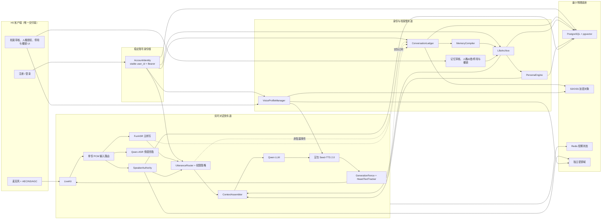
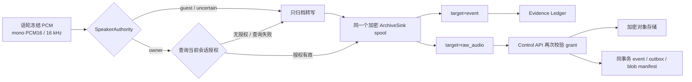
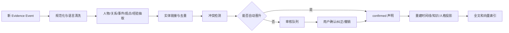

# Memoria 终身记忆、人格复刻与声纹系统架构 v1

> 状态：P0.5～P6 已部署生产；真人样本、真实设备矩阵与异地容灾仍待验收
> 日期：2026-07-21
> 适用主链：FunASR Realtime + Qwen LLM + 豆包 Seed-TTS 2.0 双向流式
> 关联研究：[实时 ASR、TTS、声音复刻与声纹能力对比](./research/20260718_realtime_voice_provider_comparison_zh.md)

## 1. 决策摘要

Memoria 保留当前低成本、可审计的级联实时语音主链，新增一条不阻塞首声的“身份与档案慢车道”。语音供应商继续负责听清与说出；终身记忆、人格演化、声纹权限和数据治理由 Memoria 自己掌握。

核心设计只有五条：

1. **一份原始证据，多种可重建投影。** 转写、实际已听文本、说话人判定、授权与纠错写入追加式证据账本；人物、时间线、知识和人格是派生结果。
2. **逻辑多模型，物理少底座。** PostgreSQL + pgvector 保存结构化档案与语义索引，S3/OSS 保存加密大对象，Redis 只保存短期状态。
3. **说话人、被谈及人物和合成声音严格分离。** `Speaker Identity`、`Person Entity`、`Speaker Profile`、`Voice Profile` 不能共用一个“用户画像”。
4. **实时快车道不等待慢编译。** 主人/访客权限在当前话轮给出；记忆抽取、档案级 ASR、人物合并和人格学习异步完成。
5. **稳定账号是数据归属根，不是说话人证明。** 注册/登录恢复同一 `user_id`；`SpeakerAuthority` 仍须独立判断当前发声者，二者共同决定私人数据权限。

“永久不会丢失”不能作绝对承诺。产品承诺应表述为：**在用户未删除或改变保存策略前，通过加密、多副本、时间点恢复、校验、导出和定期恢复演练提供长期可靠保存。**

## 2. 目标、非目标与约束

### 2.1 目标

- 完整记录文字、语音和助手实际已播放内容，并能按时间、人物、主题、故事和经验检索。
- 自动形成候选人物、关系、人生事件、家风家训、育儿理念、工作经验、处世智慧和经验问答。
- 每条长期事实与人格特征都有来源、有效时间、置信度、状态和版本，可查看、纠正、质疑、撤销。
- 长期学习口头禅、句长、停顿、语速、措辞、表达结构、价值排序和决策习惯，在每次对话中按需生成小型人格胶囊。
- 使用 speaker embedding 输出 `owner / guest / uncertain`；产品默认开启“过滤明显旁人（实验）”，明确 guest 被拒，ambiguous 为避免误静音主人可普通对话但始终不能读取或污染主人私人档案；关闭后访客也可普通对话，权限边界不变。
- 管理 CosyVoice 3.5 复刻音色的样本授权、供应商 ID、版本、效果评估和撤销。
- 不破坏现有 `GenerationFence`、`HeardTextTracker`、`UtteranceRouter`、打断和实际已听文本语义。

### 2.2 非目标

- 不把声纹作为支付、删除全量数据或导出档案的唯一认证因素。
- 不在实时主链做全量多人 diarization；第一阶段只解决目标说话人验证，离线多人归属另行处理。
- 不允许模型一次总结直接成为永久事实或永久人格。
- 不让访客发言、助手合成音频、电视回声或 A/B 模型输出进入主人训练集。
- 当前不引入 Neo4j、Elasticsearch、独立向量库、Kafka 或自研工作流引擎。
- 不要求切换 Qwen-Audio、Qwen-TTS-Realtime 或端到端 Omni 主链。

### 2.3 当前约束

- SQLite 开发适配器与 PostgreSQL 17 生产适配器已经随生产底座部署；本地合同仍不能替代真人样本、真实设备和异地恢复验收。
- Agent 已用非阻塞短缓存接入人生记忆和人格胶囊；缓存未命中、过期、非法响应或说话人降权时回退近期话轮，不在首声路径等待慢服务。
- `SpeakerAuthority` 已有固定 CAM++ ONNX HTTP 服务、三态判定、shadow/评估/激活与撤销；Control API readiness 会校验模型服务健康和版本；会话级 log-mel 只保留媒体/微噪声守卫，不能授予 owner 权限。
- 人格学习对授权 owner 话轮接收 `speech_ms / pause_ratio / quality_score`；shadow-only 的可信 `uncertain` 只使用与同一 shadow profile 绑定的文本证据，不采用声学指标。真人表达节奏、价值观和“像本人”仍需长期授权样本与 A/B 校准。
- `VoiceProfileManager` 已覆盖授权、持久化 enrollment saga、服务端盲测、客观质量探针、激活和撤销；供应商 enrollment、真人盲听及供应商删除仍需真实凭据和样本验收。
- 用户名/密码账号、匿名原地升级、跨账户隔离、导出与账户删除已经部署；同机 PostgreSQL/对象存储不等于异地容灾，仍不能承诺绝对不丢失。

## 3. 总体架构



快车道只读取预先计算好的 `ContextBundle` 和 `PersonaCapsule`，不在用户结束讲话到首声之间调用抽取模型、向量化或对象存储。慢车道通过 outbox 事件异步处理，即使暂时失败也不影响当前对话。

## 4. 领域边界与深模块

### 4.0 AccountIdentity

职责：以稳定 `user_id` 绑定账号凭据、Bearer 会话及其档案资产；支持既有匿名身份注册时原地升级，保证消息、Profile 和后续声纹/人格归属不换主键。

它不负责：判断麦克风前是谁、生成声纹结论、代替敏感动作的二次确认。账号登录与 `owner / guest / uncertain` 说话人判定是两个独立信号。

### 4.1 ConversationLedger

职责：接收并幂等追加所有可审计证据，保证同一 `event_id` 不重复，保存因果 ID、来源、授权版本和内容校验值。

它不负责：判断事实真假、组装 LLM Prompt、修改人物关系或训练人格。

### 4.2 LifeArchive

职责：对人物、关系、时间线、人生情节、知识和记忆声明提供统一写入、审核和检索接口；内部隐藏投影、去重、冲突、版本和向量查询。

它不负责：实时音频处理、声纹判定、TTS 音色解析。

### 4.3 SpeakerAuthority

职责：登记和版本化声纹模板；对当前音频给出 `owner / guest / uncertain`；结合质量、重放风险和设备上下文给出记忆/检索权限建议。

它不负责：创建合成音色、识别被谈及的人物、执行账户登录或高风险动作。

### 4.4 PersonaEngine

职责：从已授权 owner 证据及严格受限、同一 shadow profile 的 `uncertain` 文本证据中学习表达特征；处理冲突、版本和场景适用性；只把 confirmed 的安全特征组装为有预算的人格胶囊。

它不负责：保存原始音频、把单轮情绪直接变成人格、选择供应商音色。

### 4.5 VoiceProfileManager

职责：管理声音样本授权、对象引用、CosyVoice 音色 ID、模型版本、盲测结果、默认版本和撤销。

它不负责：说话人验证或敏感动作授权。

### 4.6 ContextAssembler

职责：在严格字符/Token 预算内组合近期话轮、相关记忆、人物关系、人格胶囊、权限提示和当前用户文本；记录本轮使用了哪些记忆 ID。

它不负责：抽取新记忆或修改权威档案。

## 5. 公开 seam（TDD 与调用方共同使用）

以下是 P1–P6 已确认并落地的公开测试面；内部表、SQL、供应商 ID 和盲测候选映射不进入公共 interface。

### 5.1 LifeArchive

```python
class LifeArchive:
    async def record(self, event: EvidenceEvent) -> RecordResult: ...
    async def context(self, query: ContextQuery) -> ContextBundle: ...
    async def review(self, command: MemoryReview) -> ReviewedMemory: ...
```

接口不暴露具体表、SQL、向量模型或队列。`record` 只保证证据落账和待编译状态；人物/知识投影可稍后完成。`context` 必须执行账户、说话人和敏感域权限过滤。

### 5.2 SpeakerAuthority

```python
class SpeakerAuthority:
    async def enroll(self, request: EnrollmentRequest) -> EnrollmentResult: ...
    async def classify(self, sample: SpeakerSample) -> SpeakerDecision: ...
    async def revoke(self, request: RevokeSpeakerProfile) -> None: ...
```

`classify` 返回三态、分数、质量、原因码、模型版本和模板版本；永远不只返回布尔值。

### 5.3 PersonaEngine

```python
class PersonaEngine:
    async def observe(self, evidence: PersonaEvidence) -> ObservationResult: ...
    async def capsule(self, request: PersonaRequest) -> PersonaCapsule: ...
    async def review(self, command: PersonaReview) -> PersonaTrait: ...
```

单次观察先进入 candidate。低敏表达特征达到稳定门槛后由系统自动发布：owner 至少 3 次可信观察；shadow-only uncertain 至少 6 次、跨 3 个会话、绑定同一可信 shadow profile。声纹轮换后按新 profile 独立重新累计；不同 profile 不合并。互斥风格的主导证据至少达到次高项 2 倍才可晋升，且同类别最多一个 confirmed。价值排序和决策习惯不自动发布；candidate 不进入生产 Prompt，也不进入客户默认界面。

### 5.4 Control API / H5 用户流程

- `POST /v1/auth/register`、`POST /v1/auth/login`、`GET /v1/auth/me`：创建或恢复稳定账号身份；旧匿名 Bearer 注册时保持原 `user_id`。
- `POST /v1/archive/events`：内部可信调用，追加话轮/播放/纠错事件。
- `POST /v1/archive/session-events`、`POST /v1/archive/session-context`：Agent 只提交 `session_id`，服务端解析账户；写入与读取分别使用独立 capability token。
- `GET /v1/archive/raw-voice-consent`、`POST /v1/archive/raw-voice-consent`、`DELETE /v1/archive/raw-voice-consent`：H5 查看、授予和撤销原始主人语音长期保存授权；撤销删除历史原始音频，不删除转写和结构化记忆。
- `GET /v1/archive/session-raw-voice-consent`、`POST /v1/archive/session-raw-audio`：Agent 按会话查询当前授权并提交 owner WAV；Control API 从 `session_id` 解析账户，不接受调用方指定账户。
- `GET /v1/archive/timeline`：读取不可变证据时间线，保留既有对话记录契约。
- `GET /v1/archive/life-timeline`：按事件时间和权限读取可重建人生时间线。
- `GET /v1/archive/search`：混合全文、语义和结构化筛选。
- `GET /v1/archive/review-queue`：待确认、冲突和低置信度声明。
- `POST /v1/archive/memories/{id}/review`：确认、质疑、纠正或撤销。
- `POST /v1/speakers/enrollments`、`POST /v1/speakers/{id}/activate`、`DELETE /v1/speakers/{id}`：声纹登记、门禁激活与撤销。
- `/v1/voices/consent`、`/v1/voices/enrollments`、`/v1/voices/profiles`：合成声音用途授权、登记、列表、激活和撤销。
- `POST /v1/voices/profiles/{id}/blind-trials`、`POST /v1/voices/blind-trials/{id}/preview`：服务端保存 A/B 映射，客户端只看到槽位和同文试听。
- `POST /v1/voices/profiles/{id}/evaluations`、`POST /v1/voices/profiles/{id}/quality-measurements`：主人主观盲测和内部客观质量探针分开提交，两者通过后才能激活。
- `POST /v1/voices/session-resolution`：Agent 用独立 capability token 按 `session_id` 解析当前激活音色，不接受客户端指定账户。
- `/v1/persona/consent`、`GET /v1/persona/traits`、`POST /v1/persona/traits/{id}/review`、`POST /v1/persona/session-capsule`：人格授权、已生效特征解释和会话胶囊；review 保留为纠错/停用/兼容 seam，不是客户日常确认步骤。
- `POST /v1/archive/exports`、`POST /v1/archive/deletion-requests`：导出和删除工作流。

## 6. 证据事件模型

### 6.1 通用事件信封

| 字段 | 含义 |
|---|---|
| `event_id` | 客户端或源模块生成的全局幂等 ID |
| `account_id` | 数据归属账户，不等于实际说话人 |
| `session_id / turn_id / generation_id` | 与实时控制面统一的因果坐标 |
| `event_type / schema_version` | 事件语义与向后兼容版本 |
| `occurred_at / recorded_at` | 现实发生时间与服务器入账时间 |
| `speaker_identity_id` | 实际说话人，可为空或 uncertain |
| `speaker_class` | `owner / guest / uncertain / assistant / system` |
| `source` | FunASR、档案 ASR、H5 纠错、播放追踪、用户审核等 |
| `consent_grant_id` | 采集和处理所依据的授权版本 |
| `payload` | 事件特有 JSON，敏感字段使用加密引用 |
| `content_sha256` | 内容完整性校验，不把音频直接塞入数据库 |
| `supersedes_event_id` | 纠错或新版本关联，旧事件仍保留 |

### 6.2 首批事件类型

- `conversation.session_started / session_ended`
- `speech.utterance_finalized`
- `speech.transcript_revised`
- `speaker.classified`
- `assistant.response_planned`
- `assistant.playout_progressed / playout_stopped`
- `memory.claim_reviewed`
- `persona.trait_reviewed`
- `consent.granted / consent.revoked`
- `voice_profile.enrolled / activated / revoked`
- `archive.export_requested / deletion_requested`

中间 ASR delta 默认只进短期观测，不永久保存；除非进入诊断采样且有单独授权。助手档案只保存用户实际听到的文本与播放区间，不能用完整生成文本替代。

## 7. 记忆数据模型

### 7.1 原始证据与权威文本

- `evidence_events`：不可变事件信封和小型 JSON 负载。
- `evidence_blobs`：对象键、媒体类型、字节数、SHA-256、加密密钥版本、保留策略。
- `transcript_versions`：实时转写、档案复核和用户纠错版本；同一话轮只有一个当前有效版本。
- `processing_outbox`：与事件同事务写入的待处理任务，确保崩溃后可重试。

### 7.2 人物与关系

- `person_entities`：人物实体，不保存一个会被静默覆盖的“年龄真值”。
- `person_aliases`：称谓、别名、昵称及来源。
- `relationship_claims`：A 与 B 的关系声明，含方向、有效时间、来源和状态。
- `attribute_claims`：年龄、职业、城市等带来源、有效时间和状态的声明。

示例：“我姐小林今年 35 岁”至少产生账户主人到小林的亲属关系候选、别名“小林”和带 2026 有效时间的年龄声明；不能直接写 `person.age = 35`。

### 7.3 时间线、故事与知识

- `life_episodes`：时间范围、地点、主题、摘要和参与人物。
- `episode_evidence`：情节与多个证据事件的多对多关系。
- `knowledge_artifacts`：经验问答、方法、原则、故事、家训等。
- `knowledge_evidence`：知识与声明/证据的来源关系。
- `memory_claims`：规范化主语、谓语、宾语、限定条件、状态和有效时间。
- `memory_conflicts`：不能自动合并的冲突组与解决结果。

### 7.4 人格

- `persona_traits`：类别、规范化描述、适用场景、强度、置信度和状态。
- `persona_evidence`：特征所依据的主人证据及权重。
- `persona_versions`：可发布、可回滚的人格版本。
- `speech_style_stats`：口头禅、句长、语速、停顿、重音等聚合统计，不保存为不可解释的单一标签。

### 7.5 身份与声音

- `accounts`：稳定 `user_id`、原始用户名、规范化唯一用户名、密码哈希和审计时间；不保存明文密码。当前外部 `user_id` 即账号归属 ID，迁移 PostgreSQL 时必须保持值不变。
- `speaker_identities`：账户主人、已知访客、未知访客的稳定标识。
- `speaker_profiles`：正式 embedding 模型、模板版本、阈值、质量和撤销状态；模板密文独立保存。
- `speaker_enrollment_samples`：授权音频引用、设备/场景、质量和防重放结果。
- `voice_profiles`：CosyVoice 音色 ID、模型、供应商、状态和默认版本。
- `voice_samples`：声音复刻样本引用、授权、语言、质量和内容哈希。
- `voice_enrollment_operations`：稳定 enrollment key、供应商结果、模糊结果与人工对账进度；避免网络不确定时重复创建供应商资产。
- `voice_blind_trials`：只在服务端保存候选槽位映射；导出与客户端响应都移除 `candidate_slot`。
- `voice_evaluations`：主人在未知映射下给出的相似度、自然度与诡异感评价。
- `voice_quality_measurements`：可信服务端探针记录的首包、取消尾音和时间戳误差，不能由 H5 伪造。

### 7.6 原始主人语音授权与归档

原始语音和转写是两种不同资产：转写是终身档案的基础证据，原始语音只在账户主人明确开启 `raw_voice_archive` 授权后保存。授权固定为 `account_lifetime`，可随时撤销；撤销后删除该账户已有原始语音对象和 manifest，但保留对话转写、纠错记录和已生成的结构化记忆。



运行规则：

- PCM 取自 VAD 起止之间冻结的话轮快照，不从连续麦克风流上传，避免混入下一话轮、播放回声或访客声音。
- Agent 必须先提交转写，再提交带相同 `event_id / session_id / turn_id / consent_grant_id` 的 WAV；音频失败、授权查询失败或 spool 满不能丢失转写。共享 spool 受压时只能驱逐已排队的 `raw_audio` envelope 为新转写腾出空间，不能驱逐 `event` 或旧版无 envelope 的转写行。
- 回放遇到暂时失败的 `raw_audio` 时保留该音频并继续尝试其后的转写；若 backlog 只剩失败音频，新转写仍先尝试直接交付。只有转写自身暂时失败才停止越过，保持权威证据顺序。
- 转写与音频复用同一个 `ArchiveSink` 和同一个加密 spool，通过 `target=event|raw_audio` envelope 分流；旧版无 envelope 的 spool 行按转写兼容读取。
- Control API 只接受 archive-write capability token、`speaker_class=owner` 和实际为 mono PCM16/16 kHz 的 WAV；单次 WAV 上限 2 MiB，Nginx JSON 请求体上限 4 MiB，并使用独立限流。
- `403 / 409 / 410 / 413 / 422` 对音频是永久拒绝：回放时丢弃该音频 envelope，继续处理后续转写，避免队头阻塞。
- 对象先写、数据库后提交属于补偿式 saga，不是假装跨 S3/PostgreSQL 原子事务；数据库冲突、授权竞态或请求取消时必须删除未提交对象。进程恰在两步之间崩溃仍可能留下孤儿对象，生产需用对象清单对账和回收任务处理。
- H5 的授权页只提供用途、保存期、owner-only 与撤销后果说明；原始音频不在普通时间线、搜索结果或账户导出正文中直接暴露。

## 8. 多存储底座与数据归属

| 物理底座 | 保存内容 | 不保存内容 | 可靠性要求 |
|---|---|---|---|
| PostgreSQL + pgvector | 证据元数据、声明、人物、关系、时间线、人格、权限、全文与向量投影 | 长音频、图片、文档正文大对象 | 主从/多可用区、WAL 归档、PITR、每日逻辑导出、RLS |
| S3/OSS | 加密音频、图片、文档、导出包 | 权限真相、声纹明文、业务关系 | 版本控制、跨区域副本、对象锁按策略、生命周期、校验 |
| Redis | 当前会话、分布式锁、限流、异步任务租约 | 任何唯一长期记忆 | 可丢失、TTL、重建友好 |
| KMS/密钥系统 | 数据密钥封装、声纹独立密钥、轮换记录 | 业务正文 | 最小权限、轮换、撤销、审计 |

### 8.1 为什么不是“每种记忆一个数据库”

人物、时间线、知识和人格确实是不同语义模型，但它们共享账户、证据、授权、版本和事务。先在一个 PostgreSQL 中用 schema 和权限隔离，能减少双写和跨库一致性问题。只有当容量、监管或故障域指标证明需要时，才拆物理库。

### 8.2 SQLite 迁移路径

1. 给现有 `messages`、`daily_summaries`、`profiles` 和 `voice_sessions` 做只读快照与校验。
2. 在 PostgreSQL 建新 schema，不原地改写旧 SQLite。
3. 迁移脚本为每条旧消息生成确定性 `event_id`，可重复执行且不会重复入库。
4. 双读核对数量、日期、角色和内容哈希；短期双写只作为切换保护，不长期维持两套真相。
5. 切换 Control API 读写后保留 SQLite 只读回滚窗；完成恢复演练后再归档。

## 9. MemoryCompiler 流程



自动晋升只允许低风险、重复出现且无冲突的主人陈述；涉及身份、医疗、财务、政治观点、家庭敏感关系和价值判断的推断默认停留在 `candidate`。模型输出必须通过 JSON Schema、来源校验和账户隔离后才能入库。

## 10. 检索与实时上下文

`ContextAssembler` 使用混合检索，但按以下顺序保证安全和相关性：

1. 权限过滤：账户、说话人三态、敏感域和访客模式。
2. 结构过滤：人物、时间范围、记忆状态、有效时间和主题。
3. 关键词/全文召回：人名、地点、专名和明确事实优先。
4. pgvector 语义召回：用于故事、经验和相似情境，不作为真假判断。
5. 时间衰减与稳定度排序：近期情节和稳定确认事实分开配额。
6. 去重、冲突标记和 Token 预算压缩。

建议每轮预算：近期话轮 35%、相关确认记忆 30%、人物关系 10%、人格胶囊 15%、安全和任务状态 10%。这是初始值，必须通过真实上下文命中率和首声延迟校准。

每次 LLM 调用记录 `memory_ids_used`、`persona_version` 和权限结论，不记录 Provider secret；这样可解释“为什么它这样回答”，也能在用户撤销记忆后查找受影响的派生内容。

## 11. SpeakerAuthority 三态控制面

### 11.1 输入与判定

正式声纹适配器首选评估 CAM++、ERes2NetV2 或同等级 speaker embedding。判定同时考虑：

- embedding 相似度；
- 有效语音时长、SNR、远近场、重叠说话和截断；
- 当前设备与声学场景；
- 重放/合成风险；
- 模板版本和阈值版本。

低质量、短话、重叠、回声、感冒变声或模型不可用均应进入 `uncertain`，不能 fail-open 成 owner。

### 11.2 权限矩阵

| 结论 | 普通对话 | 读取主人私人记忆 | 写主人长期记忆/人格 | 敏感动作 |
|---|---:|---:|---:|---:|
| `owner` | 允许 | 按会话授权允许 | 授权且话轮合格时进入低敏自动学习；高敏候选不自动发布 | 仍按风险需要二次认证 |
| `guest` | 默认拒绝；关闭“过滤明显旁人（实验）”后允许 | 禁止 | 禁止进入主人历史、长期记忆或 Persona | 禁止 |
| `uncertain` | `shadow_owner_candidate` 允许；`shadow_ambiguous_candidate` / formal `ambiguous_score` 为避免误静音主人允许普通聊天但不确认身份；明确的 `shadow_guest_candidate` 默认拒绝，关闭开关后允许；无档案/服务不可用保持可对话 | 默认禁止或仅公开信息 | 只有与同一可信 shadow-owner profile 及 generation 绑定的合格文本可学习低敏风格；其余话轮及对应 AI 回复不进入主人历史 | 设备解锁/Passkey/主人确认 |

### 11.3 登记与撤销

- 至少覆盖安静、日常噪声、手机近讲和正常距离；不能只使用一条 3 秒样本。
- 每条样本记录明确授权、内容哈希、设备和质量，不保存无需保留的原始音频。
- 新模板先 shadow 运行，对 FAR、FRR、EER、unknown rejection 和重放样本做离线评估，再激活。
- 撤销后停止新判定，销毁/失效对应密钥并重建相关权限投影。

## 12. PersonaEngine 学习闭环

人格分四层，不把音色等同于心智：

1. `VoiceProfile`：音色、口音和合成模型版本。
2. `SpeechStyle`：语速、停顿、句长、口头禅、重音和情绪表达。
3. `DiscourseStyle`：直接/委婉、回答结构、用词和叙事方式。
4. `ValuesDecisionModel`：价值排序、决策习惯、例外条件和随时间变化。

学习流程：

- 正式 `owner` 证据进入稳定学习；已登录、已授权 active session 中，只有 `shadow_owner_candidate`、质量合格且绑定同一 profile 的 `uncertain` 文本可进入低敏学习；正式 `guest`、匿名会话、ambiguous/no-audio/model-timeout 和 direct archive 写入不进入；
- 对合成音频、助手文本、访客、电视/回声和低质量重叠语音加硬性污染标签并排除；
- owner 低敏特征至少 3 次可信观察自动发布；uncertain 至少 6 次、跨 3 个非空 session 且同一 profile 才自动发布；同一会话重复不能代替跨会话稳定性；
- 句长、语速和停顿等互斥 bucket 按 owner/当前可信 shadow profile lane 聚合，只有主导证据至少达到次高项 2 倍才可 confirmed；声纹轮换后新 profile 可独立重新累计，且不能同时向 Prompt 注入矛盾风格；
- 正式 owner 用户话轮可携带经边界校验的 `speech_ms / pause_ratio / quality_score`，用于语速和停顿统计；guest、uncertain、非有限值、越界值与低质量指标一律不进入声学风格统计；
- 价值观和决策习惯必须附带具体情境和反例，不能压成“理性”“稳重”等单标签；
- 低敏候选达到稳定门槛后自动进入版本化 `PersonaProfile`；价值/决策候选保持内部候选，review 仅用于纠错、停用和兼容；
- 当前对话只加载与主题、关系、情绪和权限匹配的人格胶囊；`uncertain` 仅可在已登录且授权仍有效时读取主人已确认、且可映射到固定安全描述白名单的低敏表达风格，胶囊清空自由文本情境/反例/证据 ID，并排除价值/决策、私人记忆、旧话轮和工具；`guest` 始终为空；
- 客户端不展示或要求逐条确认 candidate，只展示持续学习状态和已生效特征；用户停用为 sticky，后续观察不能复活；纠正/回滚生成新版本但不删除历史解释链；
- consent 校验与 observe/capsule 在同一账户事务中完成；撤销后下一话轮先刷新授权状态，再决定是否应用缓存胶囊。

## 13. CosyVoice 3.5 声音档案

声音复刻必须是一个资产生命周期，而不是环境变量：

```text
授权 → 样本质检 → 加密上传 → 供应商登记 → shadow A/B
    → 主观/客观验收 → 激活版本 → 轮换/撤销 → 删除与审计
```

每个 `VoiceProfile` 至少保存：供应商、模型、地域、voice ID、样本授权、创建时间、供应商过期时间、支持的时间戳/指令能力、盲测分数、客观质量状态和生命周期状态。TTS 运行时只解析已激活且授权有效的版本；供应商失败只在首音频前回退一次经白名单批准的设计基线音色，已经产生音频后不整句重试，避免双音轨。

供应商登记由持久化 saga 管理：稳定 `enrollment_key` 先记录 operation，供应商结果持久化后才能提升 candidate；结果模糊时禁止自动重发，进入 reconciliation，防止生成第二个不可追踪音色。盲测的 A/B 候选映射只保存在服务端，主人主观评价与内部质量探针必须分别通过后才能激活。

客观指标包括首包、取消尾音、字时间戳偏差和长句稳定性；主观指标包括音色相似度、自然度、口音、情绪指令遵循和“像本人但不诡异”。复刻样本与声纹登记样本可以来自同一次授权采集，但必须生成两个独立用途授权和两个独立资产。

## 14. 实时接线与延迟预算

### 14.1 当前话轮

1. 同一 PCM 同时送 FunASR、情感旁路和 SpeakerAuthority。
2. FunASR final 与 speaker 三态进入 `UtteranceRouter`；纯打断、登记、普通对话继续共用现有控制面。
3. `owner` 读取授权范围内记忆；`guest/uncertain` 使用隔离上下文。
4. `ContextAssembler` 从本地预计算投影组装上下文，设置硬超时；超时回退近期话轮，不阻塞回答。
5. Qwen 输出当前回答；`DeliveryPlan` 与 `PersonaCapsule` 共同约束表达，但安全策略优先。
6. 豆包 Seed-TTS 2.0 双向流式合成；`GenerationFence` 和实际播放进度保持现有取消语义。
7. 用户 final、speaker 结论和实际已听助手文本通过 outbox 进入账本。

### 14.2 建议新增预算

- SpeakerAuthority P95：不晚于 ASR final，目标额外等待 0ms；超时为 `uncertain`。
- ContextAssembler P95：本地 80ms 内，硬超时 120ms；超时降级。
- 事件入 outbox：同事务 20ms 内；慢编译不计入首声。
- PersonaCapsule：预计算或 30ms 内读取，不能当轮调用远程 LLM 生成。

## 15. 安全、隐私与删除

- 所有接口以 `account_id` 强制隔离；PostgreSQL 使用 RLS 或等价数据库策略作为第二道门。
- 普通聊天、授权敏感记忆、声纹模板和合成声音使用不同密钥域与访问角色。
- 当前统一 PII 脱敏会损失真实人生信息；目标方案保留“普通脱敏域”和“用户明确授权的加密敏感记忆域”，而不是简单关闭脱敏。
- 原始音频默认按用途和期限保存；生成结构化记忆不等于必须永久保存原始音频。
- 原始主人语音默认关闭；只有独立授权有效且当前话轮被判为 owner 才能保存。撤销删除原始音频但保留转写和结构化记忆，授权查询或 Control API 不可用时 fail-closed 为只存转写。
- 导出包含事件、当前投影、版本和媒体清单；删除按账户、人物、会话、用途和生物特征分别执行。
- 账户导出要求重新验证密码，按账户生成规范 JSON 与 manifest SHA-256；密码哈希、声纹模板密文、对象密钥、供应商 voice ID 和盲测映射不得进入导出。
- 全账户删除先设置写入 fence 并排空在途写，随后关闭实时连接/房间、写会话 tombstone、删除供应商声音与对象版本，再删除 PostgreSQL/SQLite 权威行和投影；任何外部资产失败都保持 `deleting` 并由 worker 幂等续跑。
- 完成删除后仅保留哈希化账户 tombstone、请求 ID、步骤与最小计数审计；旧登录令牌、登录、会话查询和迟到 Agent 写入全部拒绝，不能因迟到事件“复活”数据。
- 所有管理员、编译器、导出和声纹读取操作进入不含正文的审计日志。
- Agent 内部调用按 `archive_write / memory_read / persona_read / voice_resolution` 使用相互独立的 capability token；生产禁止复用 token，也禁止把任一 token 暴露给 H5。

## 16. 可靠性、备份与恢复

- PostgreSQL：持续 WAL 归档 + PITR、每日逻辑备份、至少一个异地副本。
- S3/OSS：版本控制、跨区域复制、对象 SHA-256 巡检和生命周期策略。
- 密钥：独立备份、轮换和恢复演练；失去密钥等于失去数据。
- 每季度执行一次完整恢复：新环境恢复数据库、对象和密钥，重建全部投影并抽样比对事件计数、哈希、人物关系和检索结果。
- 对每次迁移记录源数量、目标数量、拒绝行、哈希和可逆步骤。
- RPO/RTO 初始目标：RPO ≤ 5 分钟、RTO ≤ 4 小时；上线前根据成本和用户承诺确认。
- P6 本地 PostgreSQL 17 联合恢复已覆盖 21 张权威表、档案/声音加密对象、投影重建、14 项孤儿检查和 31 张 RLS 表，实测 RTO 3.76 秒；这只证明本地工程合同，不替代生产 PITR、S3/OSS 与 KMS 演练。

## 17. 可观测性与质量门禁

### 17.1 记忆

- 事件落账成功率、outbox backlog、编译延迟、幂等冲突、投影版本。
- 人物链接准确率、声明抽取 precision/recall、冲突发现率、用户纠正率。
- 上下文命中率、无来源回答率、撤销后残留率和跨账户泄漏测试。

### 17.2 声纹

- FAR、FRR、EER、unknown rejection、uncertain 比例。
- 分设备、距离、噪声、短话、感冒、重叠和回放攻击的混淆矩阵。
- 实时延迟、模型不可用率和 fallback 原因。

### 17.3 人格与声音

- 口头禅/节奏统计稳定性、自动晋升准确率、跨会话稳定性、误自动人格率、停用/纠正/回滚率和污染样本拦截率。
- 盲测音色相似度、自然度、长句稳定性、首包、取消尾音和时间戳偏差。
- Persona 打开/关闭 A/B 的“像本人”评分，同时监控错误自信和冒犯率。

## 18. 失败与降级策略

| 故障 | 降级行为 |
|---|---|
| PostgreSQL 短暂不可用 | 当前对话继续；事件写本地有界加密 spool，恢复后幂等回放；容量受压先舍弃可选原始音频，暂时失败音频不阻塞后续转写，禁止驱逐转写或无限堆积 |
| MemoryCompiler 失败 | 证据保留，投影标记 stale 并重试；不影响实时回答 |
| 向量模型失败 | 回退全文/结构化检索；不丢失权威数据 |
| Speaker 模型超时/低质量 | `uncertain`；无档案/服务不可用时普通对话可继续，但该 generation 的双方终稿均不进入主人历史；关闭私人检索、价值/决策、声学统计和 Persona 自动晋升，只有可信 shadow-owner 文本 lane 可积累低敏候选 |
| CosyVoice 复刻音色失效 | 回退已批准系统音色并提示声音档案需要处理 |
| 对象存储失败 | 不提交声纹/声音登记完成；文本事件可先记录缺失媒体状态 |
| 权限或授权缺失 | fail-closed 于私人数据、主人历史和敏感动作；默认“过滤明显旁人（实验）”只拒绝明确 guest，ambiguous 普通聊天 fail-open 但不升级权限 |
| 账户删除中断 | 保持账户与会话 tombstone，拒绝新读写；从最后 checkpoint 幂等重试，外部资产未清空前不删账户凭据 |

## 19. 实施顺序

详细状态、交付物和验收命令见 [实施计划](./memory-persona-implementation-plan.md)。阶段顺序为：

- P0：领域、架构、ADR、接口和验收标准。
- P0.5：用户名/密码账号、稳定 `user_id`、匿名身份原地升级与 H5 账号门。
- P1：证据账本、PostgreSQL/对象存储、迁移和恢复。
- P2：SpeakerAuthority 三态与正式声纹 shadow。
- P3：人物、关系、时间线、经验知识和审核检索。
- P4：人格编译、人格胶囊和实时上下文接线。
- P5：CosyVoice 声音档案、授权、版本、撤销和 H5 管理。
- P6：全链验收、恢复演练、安全与性能收口。

### 19.1 P3 已落地形态（2026-07-19）

- `MemoryCatalog` 与 `PostgresMemoryCatalog` 实现相同公开 seam；SQLite 用于本地/测试，生产使用 PostgreSQL。
- outbox worker 与实时快车道分离；追加证据只唤醒 worker，不等待 Qwen 抽取、人物链接或检索投影。
- Qwen 输出必须通过严格 JSON、字段范围、时区和实体引用校验，失败才回退规则抽取；模型结果永远先进入 `candidate`。
- PostgreSQL 使用 RLS、结构/时间过滤、`tsvector + GIN` 全文索引；没有 pgvector 的开发库可只用全文，生产安装 pgvector 后建立可删除重建的语义投影。
- 所有人物、声明、时间线和知识展示项保存 `source_event_id`；guest、uncertain、assistant 证据只留在账本，不编译为账户主人长期记忆。

### 19.2 P4 已落地形态（2026-07-19）

- SQLite/PostgreSQL `PersonaEngine` 共用 `observe / capsule / review` seam；价值观与决策习惯默认停在内部 candidate，不自动发布。
- 低风险表达特征由 owner 3 次可信观察，或同一 `shadow_owner_candidate` profile 的 uncertain 6 次/3 会话自动晋升；不同 profile 不合并，声纹轮换后新 profile 独立累计；互斥 bucket 采用 2:1 主导门槛且同类别单一生效。助手、合成音频、guest、ambiguous/no-audio、控制话轮、echo、overlap、replay、低质量和未授权样本在入口硬拒绝。
- Persona 版本保存证据 ID、情境、反例和置信度，支持确认、纠正、禁用与回滚；授权和撤销写入证据账本。
- Agent 的 `PersonaClient` 只提交 `session_id + speaker_class + topic`；Control API 从会话解析账户，不接受 Agent 传 `account_id`。
- 每个已接受话轮在进入 Qwen 前先用有界超时刷新 Persona 授权/胶囊，撤销或失败即清除旧缓存；owner 可读取完整 confirmed 胶囊，可信 uncertain 只读固定安全描述白名单中的 confirmed 低敏风格，guest 始终为空。
- 胶囊只加入 actual-heard 聊天上下文副本，不进入长期聊天历史；Agent 明确忽略 `delivery_rate`，真人 A/B 前 CosyVoice 默认保持 `rate=1.0`。

### 19.3 P5 已落地形态（2026-07-19）

- 声音复刻与声纹登记使用独立授权、对象用途和密钥域；未授权、过期、撤销或未通过双门禁的档案不能解析给 TTS。
- enrollment saga 先持久化稳定操作与供应商结果；模糊结果进入 reconciliation，不自动重发。
- 服务端生成并隐藏声音 A/B 映射；H5 只展示同文 A/B 试听。主人主观盲测和可信服务端质量探针分别持久化，两者都通过后才能激活。
- 撤销先停止新解析，再删除供应商资产、所有对象版本与本地样本；总授权撤销同时枚举正式 profile 和尚未形成 profile 的 enrollment operation。
- 供应商/对象删除失败、profile 状态未完成或 orphan operation 尚未 reconciliation 时返回 503；确认供应商对象不存在后可继续幂等撤销，H5 分别提供 profile 续删与总授权续删入口，不能静默标记完成。

### 19.4 P6 已落地形态（2026-07-19）

- `ContextAssembler` 将 owner confirmed 人生记忆、PersonaCapsule 与 actual-heard 上下文合并为当轮副本；guest 不注入，uncertain 只允许固定白名单的 confirmed 低敏表达风格，超时、过期与非法响应均不注入私人内容。
- 内部能力令牌拆成四个最小权限域；会话级接口只接收 `session_id`，Control API 解析账户并检查删除 tombstone。
- 账户导出、写入 fence、实时会话终止、供应商/对象/数据库级删除、checkpoint 重试和完成 tombstone 构成一条可恢复删除控制面。
- `/health/ready` 同时探测 Control DB、LifeArchive、MemoryCatalog、Persona、SpeakerAuthority、VoiceProfile、档案对象存储、声音对象存储和独立 `speaker-model`；模型服务必须返回 `status=ready` 与精确 `model_version`，生产配置/Provider smoke 仍是独立门禁。
- 共享 `ArchiveSink` 把转写作为高优先级权威证据：满盘可驱逐旧 `raw_audio`，回放可绕过暂时失败音频继续转写，raw-only backlog 不阻塞新转写直送。
- 本地 PostgreSQL 17 联合恢复报告见 [`restore-drills/20260719-p6-final.json`](./restore-drills/20260719-p6-final.json)。

## 20. 必须保持的工程不变量

1. 访客内容不得写入主人长期记忆或人格，除非主人明确审核确认。
2. 合成音频、助手文本和回声不得成为主人声纹或人格训练证据。
3. 声纹相似不等于账户认证，也不等于敏感动作授权。
4. 账号登录不等于当前说话人是主人；私人记忆权限必须同时考虑账号会话和说话人结论。
5. 任何记忆或人格结论都能追溯到证据，并能被纠正、质疑和撤销。
6. 删除和授权撤销必须传播到投影、向量、缓存、导出和供应商资产。
7. 实时首声不等待慢车道；慢车道失败不能破坏现有全双工控制面。
8. SQLite 迁移、模型升级和投影重建均需幂等、可验证、可回滚。
9. 内部 capability token 必须按能力拆分且不能进入浏览器；服务端盲测映射、供应商 ID 和密钥材料也不得泄露给客户端或普通导出。
10. 原始语音与普通转写必须复用同一个加密 ArchiveSink spool 并以 envelope 分流；任何音频失败都不能阻塞或删除合法转写。
