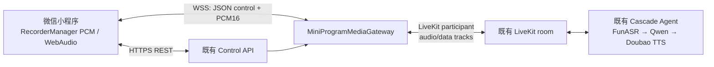

# 微信小程序原生客户端与 LiveKit 媒体接入适配器实施计划

> 日期：2026-07-24
> 状态：DEPLOYED_PARTIAL_REAL_DEVICE
> 基线：Cascade `FunASR Realtime → Qwen → Doubao Seed-TTS 2.0 → LiveKit`；现有 H5 保持不改
> 前置调研：[LiveKit 微信小程序客户端可用性调研](./research/livekit_wechat_miniprogram_client_research_zh.md)

## 1. 目标与硬边界

目标是在微信原生小程序中提供 Memoria 的陪伴、回顾、个人资料和语音会话入口，用于微信内传播与使用；服务端继续复用既有账户、ModePolicy、SpeakerAuthority、UtteranceRouter、Cascade Agent、FunASR、Qwen、Doubao TTS 与 LiveKit 房间。

本轮硬边界：

1. 不修改 `apps/h5/**`，不改变 H5 的构建、静态发布路径、接口响应或 LiveKit 直连链路。
2. 小程序不持有 LiveKit API secret，也不直接拿到 LiveKit participant token。
3. 小程序不在客户端复刻 speaker、history eligibility、mode、generation 或权限决策；所有权威事件仍由 Agent/Control API 发出。
4. 原生小程序只支持审计过的 `cascade` 后端；不为小程序接入 Qwen Omni。
5. 媒体网关不是第二个对话后端：它只做 PCM/WebSocket 与 LiveKit 音频/数据轨的适配。

## 2. 交付物

| 交付物 | 责任边界 | 状态 |
| --- | --- | --- |
| `apps/miniprogram/` | 原生微信小程序页面、账户入口、PCM 录放、现有 REST API 调用 | 已部署体验版；真实设备声学验收未完成 |
| `services/miniprogram_gateway/` | WSS 媒体接入、LiveKit participant、PCM 帧桥接、权威事件转发 | 已部署 |
| `/v1/sessions` 小程序响应 | 创建原有 cascade session 后仅返回网关地址与短期 gateway ticket | 已完成 |
| gateway ticket 刷新接口 | 已有会话在断线后重新取得短票据，不新建业务会话 | 已完成 |
| 部署与 Nginx 配置 | 新容器、最小权限环境文件、仅公开 WSS 路由 | 已部署 |
| 单元/合同测试 | ticket、帧协议、Control API、小程序纯逻辑、Compose/H5 无回归 | 已完成；真机声学门禁未完成 |

## 3. 目标拓扑



创建会话时，Control API 按既有 ModePolicy 冻结会话；当 `client.platform == "miniprogram"` 时，返回 `media_gateway`，其中 ticket 仅含已签名的会话/房间/身份声明，默认 90 秒有效。网关验证 ticket 后，使用自己的最小凭据在服务端生成 LiveKit participant token 并加入已创建的房间。

## 4. 传输合同

### 4.1 WebSocket 握手

小程序先建立 TLS WebSocket，再发送首个 JSON：

```json
{"type":"hello","protocol_version":1,"ticket":"<gateway-ticket>"}
```

网关验证成功后发送：

```json
{
  "type":"ready",
  "protocol_version":1,
  "session_id":"...",
  "audio":{"sample_rate":24000,"channels":1,"sample_format":"s16le","frame_ms":20}
}
```

ticket 不放入 URL 或日志；无效、过期、错误 audience 或非 cascade ticket 均 fail closed。

### 4.2 PCM 二进制帧

二进制帧固定 20 字节网络字节序头：

| 字段 | 类型 | 说明 |
| --- | --- | --- |
| type | `u8` | `1` 上行音频；`2` 下行音频 |
| version | `u8` | `1` 为上行/旧下行；`2` 为携带 generation 的新下行 |
| flags | `u16` | 保留，必须为 `0` |
| sequence | `u32` | 每方向单调递增帧序号 |
| generation_id | `u32` | 仅 version `2`；绑定 Agent generation |
| timestamp_ms | `u64` | 发送端单调毫秒时间 |
| payload_length | `u32` | 后续 PCM payload 长度 |

上行是 `PCM16LE / 16 kHz / mono`，网关重分帧为 20 ms 后发布 LiveKit local audio track。下行是 `PCM16LE / 24 kHz / mono / 20 ms`，网关由 Agent remote track 导出后下发给小程序；客户端按 80 ms 聚合排程，小缺包有界补偿，generation/barrier 或大缺口才硬清旧 source。

### 4.3 权威事件

网关仅转发：

1. `voice-agent.ui` topic 内的 Agent UI 事件；
2. LiveKit transcription segments；
3. 网关自身不含文本/音频内容的连接状态与安全错误码；
4. 客户端回传的 `playout_reset / playout_interrupt` 非权威播放事实。

小程序不得通过媒体 WebSocket 发送 `voice-agent.control`、speaker 判定、history eligibility 或 mode 更新。播放事实只用于日志关联，不能控制 Agent；停止回答、RTC 恢复等现有业务控制仍调用已有 Control API 会话接口。

## 5. 阶段与验收

### P0：隔离基线与契约

- [x] 确认生产主链是 cascade，而不是端到端语音模型。
- [x] 全网调研确认没有可用的微信原生小程序 LiveKit 客户端。
- [x] 固定 H5 零源码改动边界。
- [x] 为小程序 session、ticket 刷新、WSS 协议补合同测试。

### P1：服务端媒体适配器

- [x] 复用 session 冻结记录，签发独立 gateway ticket；
- [x] 以单独 Python 服务连接 LiveKit，发布 16 kHz mono PCM；
- [x] 导出 Agent 24 kHz mono音频和 `voice-agent.ui`/transcription；
- [x] 增加有界队列、序列检查、最大帧限制、断线清理和无 token 日志；
- [x] 只允许 cascade ticket，拒绝所有其他 backend。

### P2：原生小程序

- [x] 账户登录、注册、匿名体验入口；
- [x] 陪伴主页面、实时字幕、麦克风/挂断状态；
- [x] 回顾与个人资料/伙伴偏好页面；
- [x] 原生 `RecorderManager(format: "PCM")` 和 WebAudio PCM 播放；
- [x] 断线后通过会话 ticket 刷新重连，不创建第二个业务会话。

### P3：部署与不回归

- [x] 增加网关镜像、Compose service、最小权限环境文件和 Nginx WSS route；
- [x] 发布清单和 release verifier 纳入第四个 runtime 镜像；
- [x] 运行 Python / 小程序纯逻辑 / Compose / H5 全量测试和 H5 build；
- [x] 逐文件确认 `apps/h5/**` 无 diff。

## 6. 本次代码验证

- Python：`uv run pytest` 为 `1176 passed, 27 skipped`。
- H5：`npm --prefix apps/h5 test` 为 `19 files / 232 tests passed`，production build 通过；
  `git diff -- apps/h5` 为空。
- 小程序：3 个纯逻辑测试、全部 JavaScript `node --check`、JSON 配置检查通过。
- 服务端：gateway/ticket/session/Compose/release verifier 定向测试、Ruff、strict mypy、
  Shell 语法与 `git diff --check` 通过。

本机没有 `.env`，因此没有为了渲染 Compose 而创建或伪造本地环境文件；生产 Compose 的结构、
最小权限 env 路径和 Nginx WSS 路由由回归测试覆盖。

## 7. 非代码准入门槛

代码通过后，仍不能声称小程序全双工已在生产可用。必须在已备案 AppID 和真实设备验证：

1. iOS、Android 各至少一台，听筒、扬声器、蓝牙耳机分别测试；
2. 播放时持续录音是否将 Agent 声音回灌并触发错误打断；
3. 前后台、来电/微信语音打断、弱网、WSS 重连、网络切换；
4. WebSocket 合法域名、HTTPS request 合法域名、downloadFile/media 相关域名和隐私声明均已配置；
5. 首音、连续播放、时钟漂移、丢帧和 AEC 指标有真实设备证据。

若 AEC 或连续 PCM 播放无法达到可接受体验，停止扩大 UI 复刻范围，改为“文字 + 按住说话”宣传入口或评估具备小程序 SDK 的 RTC 厂商桥接；不要向 raw PCM 路径继续堆客户端规则。
