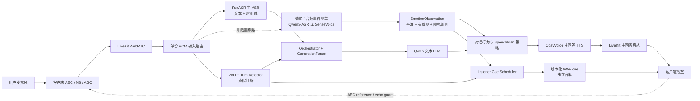

# Memoria 双工实时语音、情绪理解与情绪化表达研究

> 研究日期：2026-07-16  
> 研究范围：现有 Memoria 仓库、LiveKit、阿里云百炼、火山引擎豆包、MiniMax、腾讯云、MiniCPM-o、OpenAI Realtime、Apple 原生音频能力。  
> 本文是架构与实施研究，不代表已经完成相应业务代码或真实设备验收。厂商能力会变化，正式实施前应重新核对所选模型版本、地域、价格和限流。

## 1. 执行摘要

先说结论：Memoria 当前已经具备“媒体保持双向传输”和“用户可以打断 AI”的主要骨架，但还不是 GPT Live 一类原生 speech-to-speech 系统，也没有实现“用户长时间讲话时 AI 主动发出短附和”。这三件事不能混为一个“全双工”标签。

最重要的结论如下：

1. **先修无声链路，再谈更自然的双工。** 当前 H5 已调用 `Room.startAudio()`，Agent 也会在 `ready` 后触发欢迎语，但从 LLM、TTS、LiveKit 音轨到浏览器 `<audio>` 真正进入 `playing`，缺少一条可串联的运行时追踪。现有 `LatencyTrace` 只有数据结构，没有实际打点调用，无法直接回答声音断在哪一层。
2. **当前架构的“全双工”是系统级双工，不是双方长时间同时完整讲话。** 麦克风和 ASR 在 AI 播放时保持工作；用户真正插话后，AI 应让出话权。原规范也把“双方长时间同时完整说话”列为非目标。
3. **用户对 AI 说“嗯、对、好的”与 AI 对用户说“嗯、我在听”是两个相反方向的问题。** 当前代码只实现了前者的过滤，没有后者的 listener backchannel 调度器。
4. **AI 主动附和第一版不能交给 LLM 自由生成。** “对、是的、好的”可能错误表达赞同，也会进入历史、触发话轮切换，并放大扬声器回灌。第一版应使用版本化的短音频 cue，通过独立音轨播放，不写入对话历史。
5. **自建档案目前在发现播放期用户声音后直接 `pause()`，与原规范要求的快速 duck 不一致。** 直接暂停后再判断“只是附和”会形成明显卡顿。更合理的是 80 ms 内先降到约 25% 音量，250–350 ms 内确认真假打断，再停止或平滑恢复。
6. **情绪识别不能只看文字关键词。** H5 的 `classifyEmotion()` 只是给吉祥物和消息打 `happy/upset/curious/neutral` 标签，不是声学情绪识别。音量大也不能直接等价为生气。
7. **最适合现有架构的情绪输入方案，是保留 FunASR 主链并增加非阻塞旁路。** 同一份已做 AEC 的 PCM 一路继续给 FunASR 获取稳定转写和时间戳，另一路给 `qwen3-asr-flash-realtime` 获取 7 类结构化 `emotion`。Qwen3-ASR Realtime 当前没有时间戳，也没有官方 `emotion confidence`，所以不应直接替换主 ASR。
8. **本地旁路可选 SenseVoiceSmall。** 官方开源模型支持语音情绪识别，并可检测 laughter、crying、coughing、sneezing 等音频事件，适合在服务端按话轮或滑动窗口运行；但必须用真实 Memoria 中文通话数据校准。
9. **当前 CosyVoice 已具备情绪能力，但没有真正接线。** `longanyang` 官方支持 7 类情感和时间戳；代码中的 `instruction` 没有从环境或每轮策略填入，`ProsodyController` 也只在测试中出现。其 `calm/hesitant/urgent/excited` 与音色允许值不一致，不能直接传给 CosyVoice。
10. **精确的笑声、咳嗽最稳妥的第一版是本地授权 WAV。** Qwen-Audio-TTS 和 MiniMax Speech 2.8 已有明确的笑声、咳嗽等标签，但要么接口模式有限，要么需要新 TTS 适配器。独立 WAV cue 更可预测、更易取消、更容易做 A/B 和频率约束。
11. **原生端到端国内候选以 Qwen3.5-Omni-Flash-Realtime 和豆包端到端实时语音最值得做支线 A/B。** 前者官方接口已明确支持 WebRTC、`semantic_vad`、语义打断和情绪语音控制；后者官方产品文档明确描述随时打断、主动搭话、理解用户情绪和情绪化输出。不过两者都不能自动继承 Memoria 现有的 GenerationFence、实际已听文本、工具隔离和记忆规则。
12. **腾讯云可以作为第二供应商备选，但不是当前首选。** 官方实时 ASR SDK 已暴露情绪识别开关，公开接口说明的情绪类别为高兴、伤心、愤怒并可返回情绪能量；流式 TTS 支持多情感音色、强度和字幕。它适合供应商冗余或粗粒度情绪，但类别少于 Qwen/SenseVoice，也没有明确的笑声、咳嗽标签契约。
13. **MiniCPM-o 4.5 是最接近“模型自己决定何时开口”的国内开源实验路线。** 官方明确支持同时听、看、说，并以 1 Hz 决定是否发言；但官方也把它标为实验能力，承认全双工基础能力、发音、中英混说和 Web Demo 延迟仍有问题，PyTorch 全功能 Demo 还要求至少 28 GB 显存。因此适合隔离 PoC，不适合直接替换生产主链。
14. **推荐路线不是立即推倒重来。** 主线依次完成 P0 无声定位、P1 AEC/取消、P2 安全附和、P3 情绪旁路、P4 情绪化 TTS；同时用独立流量做 Qwen-Omni-Realtime A/B，数据胜出后再决定是否迁移。

## 2. 先统一术语：五种能力不是一回事

| 能力 | 准确定义 | Memoria 当前状态 |
|---|---|---|
| 媒体全双工 | 上行麦克风和下行播放可同时存在，AI 播放时仍采集用户音频 | 基本具备 |
| 对话式 barge-in | 用户在 AI 说话时插话，AI 快速让权并取消旧输出 | 已有主要骨架 |
| 真假打断判断 | 区分“停一下/不是”与“嗯嗯/对/咳嗽/背景声” | Cloud 档案可用 Adaptive；自建档案为规则实现 |
| AI listener backchannel | 用户还在讲话时，AI 用很短的“嗯/我在听/你继续”表示在听 | 尚未实现 |
| 原生 speech-to-speech | 模型直接理解音频韵律并生成音频，不经过独立 ASR 文本和 TTS | 当前不是 |

因此，“用户说话时 AI 也能说嗯”不是把 `allow_interruptions` 打开就能得到的能力，而是一个独立的调度、媒体混音、AEC、历史隔离和产品策略问题。

## 3. 当前实现审计

### 3.1 当前生产链路

默认配置是：

```text
浏览器 / iOS
    │ WebRTC
    ▼
LiveKit SFU + LiveKit Agents
    │
    ├── FunASR Realtime：转写、interim/final、时间戳
    ├── Qwen 文本 LLM（DeepSeek 为显式可选项）
    └── CosyVoice Realtime：流式 PCM、字时间戳
```

证据：

- `services/agent/src/config.py` 默认 `LLM_PROVIDER=qwen`，ASR 为 `fun-asr-realtime`，TTS 为 `cosyvoice-v3-flash` / `longanyang`。
- `services/agent/src/agent.py` 创建 LiveKit `AgentSession`，在当前 Agent 明确发布 `ready` 后调用 `generate_reply()` 生成欢迎语。
- `services/agent/src/duplex_runtime.py` 与 `orchestration/orchestrator.py` 负责打断、取消、实际已听文本和 GenerationFence。
- `apps/h5/src/hooks/useVoiceSession.js` 负责浏览器 AEC 约束、LiveKit 音轨订阅、`Room.startAudio()` 和 `<audio>` 播放。

### 3.2 已经做对的部分

- H5 请求 `echoCancellation`、`noiseSuppression`、`autoGainControl`，且为单声道。
- Agent 在 AI 播放时保持麦克风、VAD 和 ASR 工作。
- `GenerationFence` 阻止旧 LLM token、TTS 音频和工具结果进入新一代输出。
- 真打断会取消 LLM/TTS、丢弃活跃 CosyVoice 连接，并按实际播放进度截断历史。
- 用户附和词、明确打断词、助手回声相似文本、非目标短脚本和快速反馈熔断已有规则。
- LiveKit Cloud 与国内自建档案有不同的 turn detector / interruption 配置。

### 3.3 与目标体验之间的关键缺口

| 缺口 | 仓库证据 | 后果 |
|---|---|---|
| 无声缺少逐层证据 | `LatencyTrace` 定义了 `client_first_playback` 等标记，但仓库没有实际 `mark()` 调用 | 只能猜是自动播放、TTS 还是音轨问题 |
| 没有 AI 主动附和 | 没有 listener cue scheduler；`BACKCHANNEL_WHITELIST` 只处理用户对 AI 的附和 | 用户长话期间 AI 不会表示“我在听” |
| 自建真假打断先暂停 | `DuplexRuntime.attach_session_events()` 在候选期调用 `audio.pause()` | 短“嗯嗯”也可能造成可感知卡顿 |
| 情绪模块未接入 | `ProsodyController` 仅被单元测试引用 | 实际 PCM、Agent、LLM、TTS 都收不到它的结果 |
| 情绪枚举不兼容 | 本地输出 `calm/hesitant/urgent/excited`；`longanyang` 只接受 `neutral/fearful/angry/sad/surprised/happy/disgusted` | 即使接线也会传入无效值 |
| CosyVoice instruction 为空 | `CosyVoiceConfig.from_env()` 没有填充 `instruction` | 当前请求不会携带情绪指令 |
| instruction 格式也需修正 | 本地字符串带额外空格，且使用不受支持样式；官方要求固定中文格式和受支持值 | 不能依赖当前生成字符串 |
| H5 情绪只是文本规则 | `apps/h5/src/lib/emotion.js` 只做关键词命中 | 无法理解音调、语速、停顿、哭腔、笑声或咳嗽 |
| cue 没有独立隔离域 | 当前只有主回答 `generation_id` / `tool_epoch` | 以后若加附和，旧 cue 可能跨话轮误播 |

## 4. “AI 打开后没有声音”的定位方案

这类问题不能统一叫“TTS 坏了”。需要把首声链路拆成可观测状态机。

### 4.1 必须记录的首声时间线

每个事件都应带 `session_id`、`turn_id`、`generation_id`、单调时钟和结果状态：

1. H5 偏好 `voice_reply=true`；
2. 用户点击触发音频解锁；
3. `Room.startAudio()` resolve，且 `room.canPlaybackAudio=true`；
4. 控制 API 创建会话成功；
5. LiveKit Room connected；
6. Agent participant 加入；
7. 收到当前 session/generation 的 `assistant_state: ready`；
8. 欢迎语 `generate_reply` 开始；
9. LLM 请求开始；
10. LLM 首个内容 token；
11. 第一段可合成文本 ready；
12. CosyVoice `task-started`；
13. 收到第一段非零 PCM；
14. 收到首个有效字时间戳；
15. Agent 发布远端音轨；
16. H5 `TrackSubscribed`；
17. `<audio>` 不 muted，`play()` resolve；
18. `<audio>` 触发 `playing`；
19. 首次 `timeupdate/currentTime > 0`，记录 `client_first_playback`。

还应记录：PCM 总字节数、RMS 是否接近全零、音轨 `muted/unmuted/ended`、浏览器 `NotAllowedError`、TTS `task-failed` 和 `first-audio-timeout`。

### 4.2 最快的二分法

先绕过 LLM 和 CosyVoice，用一个已知有效、24 kHz 单声道 WAV 经过 LiveKit Agent 输出或 `BackgroundAudioPlayer` 播放：

- **能听见 WAV**：LiveKit、订阅和浏览器播放基本正常，继续查 LLM 分段、CosyVoice `task-started`、PCM 与 GenerationFence。
- **听不见 WAV**：优先查 `startAudio`、远端音轨订阅、元素 muted、输出设备和浏览器自动播放，不要先改 TTS。

第二步再绕过 LLM，固定文本直送 CosyVoice：

- 固定文本有声：问题在欢迎语生成或 LLM→分段器。
- 固定文本仍无声：问题在 TTS 协议、PCM、Agent 音频发布或客户端。

### 4.3 当前最值得优先检查的点

1. `voice_reply` 是否真的为 `true`，现有音频元素是否因偏好状态被 `muted`。
2. `Room.startAudio()` 是否只是 promise resolve，还是 `canPlaybackAudio` 真为 `true`。
3. 是否收到了 Agent 的音轨，而不只是 `assistant_state: ready`。
4. CosyVoice 是否真的收到 `task-started` 和非零 PCM；连接池 warm 失败目前只记录 warning，会转为按需打开。
5. `DASHSCOPE_WS_URL`、地域 Workspace URL、模型和音色是否匹配。不要在日志或文档记录真实 API key。
6. TTS 帧是否被错误的旧 `GenerationFence` 丢弃。
7. `<audio>.play()` 是否 resolve 后实际触发 `playing`；当前 H5 只设置 `audioBlocked`，还没有完整上报上述播放事实。

## 5. 推荐目标架构



架构原则：

- 主 ASR、情绪识别、音频事件检测共享 **AEC 后同一份 PCM**，不要让浏览器再开第二个麦克风采集链。
- 情绪侧车绝不能阻塞实时 ASR、话轮提交或打断；队列满时丢旧观察量，而不是拖慢主链。
- 情绪只影响回复长度、措辞和声音表达，不改变权限、安全判断、工具参数或事实结论。
- 主回答与 listener cue 使用不同的播放身份和取消域。

## 6. 真正自然的双工与双方附和

### 6.1 用户在 AI 说话时附和：已有方向，需改平滑度

LiveKit Adaptive Interruption 的官方定义就是用声学信号区分真正 barge-in 与 “uh-huh / okay / right” 等 backchannel；但它只用于 LiveKit Cloud / dev 条件，要求 VAD、非 realtime LLM 和带对齐时间戳的 STT。不满足条件或区域不可用时会退回 VAD。

对于 `cn_self_hosted`：

```text
检测到重叠人声
    │
    ├─ 0–80 ms：只 duck 到约 25%，不销毁生成
    │
    ├─ 80–350 ms：结合 ASR partial、时长、能量、回声相似度判断
    │      ├─ “停/等等/不是/完整新句” → 真打断
    │      ├─ “嗯/对/好的”且很短 → 恢复
    │      └─ 无文本噪声/咳嗽 → 恢复
    │
    └─ 真打断：提升 generation → 停播放 → 取消 LLM/TTS → 截历史
```

不要等 ASR final 才停止；也不要在任何声音出现时直接把整段音频暂停 1.2 秒。

### 6.2 AI 在用户说话时附和：需要新增独立能力

第一版应只允许安全 cue：

```text
嗯
我在听
你继续
```

不建议第一版使用：

```text
对
是的
好的
没错
```

因为在用户意思尚未完整时，它们会被理解为事实或价值判断上的赞同。

#### 触发条件

同时满足时才创建候选：

- 用户已连续持有话权约 1.5–2.0 秒；
- 出现 150–350 ms 的自然微停顿，但 Turn Detector 认为不是 EOT；
- 距离上次 cue 至少 4–6 秒；
- 本话轮最多 2 次；
- 当前没有真打断、重连、工具播报或主回答；
- AEC 健康、没有近期回声自循环；
- 用户没有关闭“语音附和/不要打断我”偏好。

以下情况禁用：

- 正在口述手机号、验证码、地址、金额、证件号或连续数字；
- 医疗、法律、安全等高风险陈述；
- ASR 置信或音频质量过低；
- 用户明显在哭泣、呼吸困难或表达不适；
- 接近 EOT，AI 的正式回答马上就会开始；
- 扬声器模式 AEC 尚未通过验收。

#### cue 的工程约束

- cue 使用独立 `cue_id`、`cue_epoch`、`user_turn_id`；新话轮或真打断立即使旧 cue 失效。
- cue 不添加到 LLM chat history，不算助手正式回答，也不改变 `assistant_state` 主状态机。
- 由独立 cue 播放通道（单独音轨，或可独立取消的 mixer lane）播放，时长建议 250–650 ms。
- cue 播放期间继续采集用户音频；必须让 AEC 获得正确参考信号。
- 音频资产要与主音色匹配、版本化、可回滚；多版本随机选择以避免机械重复。
- cue 触发事件需要记录，但默认不长期保存原始音频。

### 6.3 为什么不能让 LLM 随机决定何时说“嗯”

- LLM 通常看到的是 partial transcript，而不是可靠的声学微停顿。
- 它可能把附和写入对话历史，影响后续语义。
- 它可能在数字、隐私或危险陈述中插话。
- 每次都重新走 LLM→TTS，延迟往往错过自然附和窗口。
- 自由生成的音频更难做频率、取消、回声和一致性约束。

## 7. AEC、双讲与旧音频取消

### 7.1 AEC 是上线 AI 主动附和的硬门禁

浏览器的 `echoCancellation: true` 是请求，不是不同设备上效果一致的保证。真实场景要分别测：

- 有线耳机 / 蓝牙耳机；
- iPhone 听筒；
- iPhone 扬声器；
- Android 主流机型扬声器；
- Mac / Windows 笔记本内置麦克风和扬声器；
- 低音量、中音量、最大音量和近场/远场。

iOS 原生端建议使用 `AVAudioSession` 的 `playAndRecord` + `voiceChat`，并启用 Voice Processing I/O。Apple 将其定位为双向 VoIP，提供回声消除、自动增益等处理。H5 则继续依赖 WebRTC AEC，并对真实设备做门禁。

建议新增指标：

- `echo_transcript_similarity`：ASR partial 与当前 AI 已播文本的相似度；
- `playback_feedback_turns_total`：播放期间疑似回声话轮；
- `aec_loop_circuit_open_total`：短时间连续回声时熔断；
- `barge_in_detected_to_duck_ms`；
- `barge_in_confirmed_to_silence_ms`；
- `cue_echo_reentry_total`。

### 7.2 三层取消必须保持

真打断时仍要同时处理：

1. 提升 GenerationFence，让旧输出立即逻辑失效；
2. 停止并清空实际播放缓冲；
3. 取消 LLM、PhraseSegmenter、TTS sender/receiver；
4. 丢弃当前 CosyVoice WebSocket，不把被取消连接放回池；
5. 隔离或取消工具结果；
6. 根据实际播放位置和时间戳写入“用户真的听到的文本”；
7. 取消当前及排队的 listener cue。

不能只做其中一层。只停播放器会浪费生成并可能让旧音频稍后复活；只取消上游则客户端缓冲仍会继续播放。

## 8. 用户情绪识别方案

### 8.1 先定义产品边界

目标应叫“**当前说话方式和对话情境的观察**”，而不是诊断用户人格或心理状态。

允许：

- “这一轮听起来比较低落，回复短一点、慢一点”；
- “用户明确说自己很开心，可以适度活泼”；
- “检测到笑声/咳嗽，避免误当成完整问题”。

禁止：

- 仅凭声音判断“抑郁、焦虑症、撒谎、危险人格”；
- 因推断情绪改变账户权限、风控、价格或事实回答；
- 在用户不知情时长期保存声纹或原始情绪音频；
- 把低置信观察用确定语气告诉用户。

### 8.2 输入证据的优先级

1. **用户明确表达**：“我现在很生气/我其实很开心”。
2. **文本语义**：本轮内容和上下文，但要区分引用别人情绪与本人情绪。
3. **声学模型**：基于原始 PCM 的 emotion / prosody。
4. **音频事件**：笑声、哭声、咳嗽、叹息、长呼吸。
5. **会话行为**：连续打断、长停顿、明显语速变化，仅作弱证据。
6. **视觉**：非首期。面部关键点不是可靠的官方情绪分类，且摄像头隐私成本高。

### 8.3 推荐方案：FunASR 主链 + Qwen3-ASR 情绪旁路

阿里云官方当前说明：

- `fun-asr-realtime` **不支持情感识别**，但有主链需要的实时转写、上下文和时间戳。
- `qwen3-asr-flash-realtime` 固定返回顶层 `emotion`，7 类为 `surprised/neutral/happy/sad/disgusted/angry/fearful`。
- Qwen3-ASR Realtime 当前**不返回时间戳**，官方事件也没有给 `emotion confidence`。
- `paraformer-realtime-8k-v2` 可返回 `emo_tag` 和 `emo_confidence`，但只有 positive/negative/neutral 三类，且为 8 kHz，更适合电话而不是当前 16/24 kHz 陪伴链路。

因此推荐：

```text
AEC 后 PCM
   ├─ FunASR Realtime → 文本、字时间戳、主话轮
   └─ Qwen3-ASR Realtime → 7 类 emotion 观察量
```

实现要求：

- 旁路用有界队列和独立任务；拥塞时丢弃旧观察量。
- 不把 Qwen 的 label 当作带置信度的结论；字段没有 confidence 就保持 `null`，不要伪造。
- 以话轮结束事件关联结果，不尝试拿不存在的时间戳做字级对齐。
- 对 2–3 个窗口或最近 3 轮平滑，单次跳变默认回退 `neutral`。
- 文本与声学冲突时保留两个 evidence，不强行合成一个“真相”。

### 8.4 本地可选方案：SenseVoiceSmall

SenseVoice 官方开源仓库明确支持：

- 语音情绪识别；
- `HAPPY/SAD/ANGRY/NEUTRAL/FEARFUL/DISGUSTED/SURPRISED`；
- laughter、crying、coughing、sneezing 等音频事件；
- Mandarin、Cantonese、English、Japanese、Korean 的已发布小模型能力。

适合的接法是按话轮或 1.5–3 秒滑动窗口在服务端旁路运行，而不是逐 20 ms 帧直接做最终判断。优点是数据不必送第二个云 API，且同时得到咳嗽/笑声事件；缺点是需要 GPU/CPU 基准、部署、中文真实数据校准和模型升级管理。

### 8.5 腾讯云备选：类别较少，先做账号级 PoC

腾讯云官方实时 ASR V2 SDK 已暴露 `emotion_recognition` 参数；其公开 ASR 接口对情绪能力给出的契约包括：

- 仅支持 `16k_zh`、`16k_zh_en`、`8k_zh` 等指定引擎，属于增值付费能力；
- 情绪类别为高兴、伤心、愤怒；
- 可返回 1–10 的 `EmotionalEnergy`，其定义基于音量分贝，不等价于情绪分类置信度；
- 情绪不够明显或账号无资源包时，结果可能为空。

实时 SDK 中已经有开关，但公开文档对 WebSocket V2 的具体返回字段与实时延迟说明不如录音识别完整，所以必须用目标账号和实时接口做 PoC，不能直接把录音文件接口的返回契约套到实时会话。它的优势是云服务成熟、可作为供应商冗余；劣势是只有三类，且“能量”主要是响度证据，不适合替代 Qwen3-ASR 的七类观察或 SenseVoice 的音频事件检测。

### 8.6 观察对象与融合

建议内部结构：

```json
{
  "session_id": "...",
  "user_turn_id": 12,
  "label": "sad",
  "provider_label": "sad",
  "provider_confidence": null,
  "evidence": ["acoustic:qwen3-asr", "text:weak_support"],
  "support_score": 0.68,
  "audio_event": null,
  "observed_at_ms": 123456,
  "expires_after_ms": 30000,
  "persist": false
}
```

`support_score` 是 Memoria 多证据一致度，不得冒充供应商模型置信度。

简单且可解释的融合规则足够：

- 明确自述优先；
- 只有一个弱信号时保持 `neutral`；
- 声学标签连续两个窗口一致，或与文本语义一致，才升为可行动观察；
- 30 秒或下一个明显相反的用户自述后过期；
- 每轮最多使用一次，不把短暂情绪永久写入画像。

### 8.7 情绪不等于镜像

| 用户观察 | 对话行为 | 推荐 AI 声音 | 禁止行为 |
|---|---|---|---|
| happy / excited | 可以稍活泼、允许轻微幽默 | `happy` 或略快 | 过度兴奋、抢话 |
| sad | 回复更短、少追问、先承接 | 以 `neutral` 为主；确有需要才轻微 `sad` | 模仿哭腔、扩大低落 |
| angry | 先确认诉求，给明确下一步 | `neutral`、稍慢、稳定 | 输出 `angry` 与用户对抗 |
| fearful | 降低信息密度，给确定性 | `neutral`、温和 | 制造惊吓、夸大风险 |
| surprised | 先澄清发生了什么 | 适度 `surprised` | 把普通信息戏剧化 |
| disgusted | 保持专业、避免评价 | `neutral` | 模仿厌恶 |
| neutral / 不确定 | 正常回复 | `neutral` | 为了“有情绪”强行表演 |

## 9. AI 情绪化说话、笑声与咳嗽

### 9.1 先增加受控的 SpeechPlan

不要让任意 LLM 文本直接控制音频标签。每一代回答先形成不可变计划：

```json
{
  "generation_id": 21,
  "voice_emotion": "neutral",
  "rate": 0.96,
  "volume": 1.0,
  "cue": null,
  "reason": "user_sad_high_support",
  "policy_version": "speech-policy-v1"
}
```

约束：

- 只允许白名单枚举；
- 用户情绪、回答意图和风险策略共同决定声音，不是简单镜像；
- `SpeechPlan` 在一代 TTS 开始后不原地修改，避免连接池并发串音；
- 真打断后与该 `generation_id` 一起失效；
- 内容正确性高于表演，情绪计划失败时回退 `neutral`。

### 9.2 现有 CosyVoice：最低改造成本

`longanyang` 官方支持 Instruct、SSML、时间戳及 7 类情感，但它的 Instruct 不是任意自然语言控制。官方要求使用中文并严格匹配指定句式，且不可遗漏结尾句号：

```text
neutral / fearful / angry / sad / surprised / happy / disgusted
```

官方要求的形式类似：

```text
你正在进行闲聊互动，你说话的情感是neutral。
```

因此不能把“边思考边说、适当拉长、轻轻笑一下”等自由描述直接传给当前 `longanyang`。这类自然感应主要由 LLM 的口语文本结构、标点和小幅 `rate` 调整实现；TTS `instruction` 只承担官方允许的场景与情感枚举。

当前代码需要先解决三个问题：

1. `ProsodyController` 接入真实话轮，而不是只存在于测试；
2. 把 `calm/hesitant/urgent/excited` 拆成“语速策略”和合法的 CosyVoice emotion，不直接透传；
3. `instruction` 必须是每个 generation 的参数，不能修改共享 `CosyVoiceConfig` 造成并发污染。

这条路线适合先实现“平静/开心/轻微悲伤/惊讶”的语气变化，同时保留现有字时间戳与实际已听文本能力。

### 9.3 精确笑声、咳嗽的四条路线

#### 路线 A：版本化本地 WAV，首选

准备与主音色一致、明确授权的：

- `ack_mm_01.wav`、`ack_listening_01.wav`；
- `chuckle_awkward_01.wav`；
- `sigh_soft_01.wav`；
- 若人设真的需要，再准备极低频 `cough_soft_01.wav`。

优先通过独立 cue 播放通道按需播放；LiveKit `BackgroundAudioPlayer` 可作为 PoC 起点，官方支持本地 WAV、播放控制、淡入淡出和多 clip 概率选择，但仍需实测它与当前 Agent 输出的混音、取消域和 AEC 回声行为。优点是结果确定、延迟低、不会污染 TTS 文本；缺点是要做好音色和响度匹配。

#### 路线 B：Qwen-Audio-TTS 单向流式，表现力实验

阿里云官方为 `qwen-audio-3.0-tts-plus/flash` 明确列出：

- 情感/风格：`[sad] [angry] [excited] [empathetic] [whispers] [crying] ...`；
- 副语言：`[gasp] [sighing] [clears throat] [giggles] [laughing] [cough] [snorts]`。

但官方同时明确：这些标签**仅支持单向流式模式**。当前 CosyVoice 适配器是一个任务内多次 `continue-task` 的双向文本流，不能直接假定兼容。若试验，需要单独 TTS adapter，并重新验证首包延迟、取消和时间戳。

#### 路线 C：MiniMax Speech 2.8，TTS 替换候选

MiniMax 官方 HTTP 与 WebSocket 文档表明：

- `voice_setting.emotion` 支持 happy、sad、angry、fearful、disgusted、surprised、calm、fluent、whisper；
- Speech 2.8 文本支持 `(laughs)`、`(chuckle)`、`(coughs)`、`(clear-throat)`、`(sighs)`、`(emm)` 等大量语气词；
- WebSocket 支持 `task_start/task_continue/task_finish` 流式交互和 PCM；
- `subtitle_enable` 可开启字幕，`subtitle_type` 官方支持 `sentence`、`word` 和面向流式场景的 `word_streaming` 时间戳。

这是表现力很强的候选，但对 Memoria 来说意味着新建 LiveKit TTS adapter，并重新实现 PCM/编码、取消和连接复用。官方已经提供词级时间戳，并不等于能直接满足当前 `HeardTextTracker`：仍需验证流式字幕到达时机、被打断时的最后已播词、标点归属和音频缓冲误差。整体改造成本仍高于本地 WAV。

#### 路线 D：腾讯云流式 TTS，传统多情感备选

腾讯云官方 SDK 与 API 契约表明：

- 流式文本合成支持 PCM，`EmotionCategory` 和 `EmotionIntensity` 可按多情感音色控制；
- 情感/风格枚举包括 neutral、sad、happy、angry、fear、disgusted、amaze、peaceful、exciting、sajiao、aojiao 等；
- `EmotionIntensity` 范围为 50–200；
- `EnableSubtitle` 可返回字幕，但部分超自然音色不支持时间戳。

它适合做“开心一点、平静一点、略带惊讶”这类常规情绪 TTS 和供应商冗余。官方契约没有 Qwen-Audio-TTS / MiniMax 那种精确笑声、咳嗽标签，因此不应用它承担“尴尬地笑一下”；这类 cue 仍走本地 WAV 更稳。

### 9.4 为什么“尴尬地笑一下”不能完全交给模型

笑声应该由对话行为触发，而不只由情绪标签触发。例如：AI 轻微口误后自我修正、用户明确开玩笑且关系上下文允许，才可能使用一次轻笑。对悲伤、愤怒、隐私、高风险话题绝不随机笑。

咳嗽更应谨慎：它通常不表达共情，还可能被用户误认为连接杂音或健康暗示，并可能被上行 ASR 当成用户事件。除非人设明确需要，否则不建议作为常规陪伴动作。

## 10. 国内方案比较

符号说明：`✅` 官方接口或明确产品能力；`△` 有相关能力但缺少稳定接口契约或需组合；`—` 不适用；`?` 本轮未找到足以承诺的官方证据。

### 10.1 端到端或完整对话方案

| 方案 | 实时双向音频 | 自动打断 | 过滤用户附和 | AI 主动搭话/附和 | 声学情绪理解 | 情绪语音 | 精确笑/咳契约 | 对 Memoria 的判断 |
|---|---:|---:|---:|---:|---:|---:|---:|---|
| 现有 LiveKit + FunASR + Qwen + CosyVoice | ✅ | ✅ | ✅ Cloud / 规则自建 | ❌ | ❌ | △ 供应商支持、未接线 | △ 需独立 cue | 主线，控制力最强 |
| Qwen3.5-Omni-Flash-Realtime | ✅ WebRTC/WS | ✅ semantic VAD + cancel | ✅ 官方称语义打断可避免无意义附和触发 | ? 无独立 cue API | ✅ 模型层理解；结构化置信事件未见 | ✅ 指令控制音量、语速、情绪 | ? 官方 Realtime 页未承诺标签 | 最值得做国内端到端 A/B |
| 豆包端到端实时语音 S2S | ✅ | ✅ 官方明确随时打断 | △ 自然打断能力，接口细节需实测 | △ 官方写“主动搭话”，非独立 backchannel 契约 | ✅ 官方明确理解用户情绪/副语言 | ✅ 情绪、风格、声线指令 | △ TTS2.0 有标签能力，S2S 内精确触发需实测 | 体验型 A/B 候选，迁移成本高 |
| MiniCPM-o 4.5 | ✅ 官方明确同时听说 | △ 持续听取输入，但取消语义需实测 | ? | △ 1 Hz 自主决定是否发言，不是安全 cue API | △ 端到端理解，无结构化情绪事件 | ✅ 官方称自然、有表现力，可克隆音色 | ? | 最接近主动发言，仍是高资源实验路线 |
| 其他腾讯/百度/讯飞完整方案 | ? | ? | ? | ? | ? | ? | ? | 本轮不以营销描述代替可验证接口承诺；进入选型时单独做 PoC |

Qwen-Omni-Realtime 的 WebRTC 示例使用长期 API key 做鉴权。Memoria 生产环境不能把该 key 放进浏览器；若做直连 A/B，应由控制 API 代理 SDP 鉴权或采用供应商后续提供的临时凭证机制。

MiniCPM-o 4.5 的官方模型说明确实比普通 ASR+LLM+TTS 更接近目标：输入和输出流互不阻塞，模型每秒判断一次是否开口，公开 Realtime API 也有 `mode=audio`、`input.append` 和 `response.output.delta`。但同一份官方说明同时列出发音错误、中英混说和高延迟等限制；PyTorch 全功能 Demo 要求至少 28 GB 显存，边缘全双工也有明确硬件门槛。它应放在独立实验环境验证“自然附和”价值，不能因为演示会主动说话，就跳过 Memoria 的 cue 限频、历史隔离和安全规则。

### 10.2 可组合组件

| 组件 | 适合角色 | 结构化用户情绪 | 情绪输出 | 精确笑/咳 | 时间戳/对齐 | 改造成本 |
|---|---|---:|---:|---:|---:|---:|
| FunASR Realtime | 主 ASR | ❌ | — | — | ✅ 字级 | 已有 |
| Qwen3-ASR-Flash-Realtime | 情绪旁路 | ✅ 7 类，无官方 confidence | — | — | ❌ Realtime 无时间戳 | 低到中 |
| SenseVoiceSmall | 本地 SER/AED 旁路 | ✅ 7 类 | — | ✅ 可识别用户笑/咳 | △ 需自建窗口关联 | 中 |
| 腾讯云实时 ASR V2 | 供应商冗余/粗粒度情绪 | △ 官方 SDK 有开关；公开契约为 3 类，实时返回需 PoC | — | — | ✅ 实时转写可带句级时刻 | 中 |
| CosyVoice `longanyang` | 现有主 TTS | — | ✅ 7 类 Instruct | △ SSML 可插外部音效，但当前双向流不适合 | ✅ | 低 |
| Qwen-Audio-TTS 3.0 | 表现力 TTS 支线 | — | ✅ 丰富标签 | ✅ 明确标签 | 需 PoC | 中到高 |
| MiniMax Speech 2.8 | 表现力 TTS 替换 | — | ✅ emotion | ✅ 明确语气词 | ✅ `word` / `word_streaming`；对接现有追踪需 PoC | 高 |
| 腾讯云流式 TTS | 常规情绪 TTS / 供应商冗余 | — | ✅ 多情感音色 + 强度 | ❌ 未见精确标签契约 | △ 可开字幕，部分音色不支持 | 中 |
| 火山 Seed-TTS 2.0 | 表现力 TTS 替换 | — | ✅ emotion/context instruction | △ expressive 标签能力 | 版本相关 | 高 |

### 10.3 OpenAI Realtime 作为体验基线

OpenAI 官方资料可以确认：

- Realtime 是原生低延迟 speech-to-speech，原始音频里的 emotion、tone、pace 会进入模型推理；
- VAD 可在用户开口时取消当前响应；
- WebRTC/SIP 自动截断未播放音频，WebSocket 客户端必须立即停播并发 `conversation.item.truncate`；
- `semantic_vad` 会根据用户话语是否完整降低抢话，且可分别控制 `create_response` / `interrupt_response`；
- Prompt 可以控制 personality、tone、pacing，并有同一响应切换情绪的官方示例。

但官方文档没有承诺一个稳定的“尴尬笑/咳嗽”标签契约，也没有标准化的用户情绪置信度事件。因此 ChatGPT 客户端偶尔产生的自然副语言，不能直接当成 Realtime API 的生产合同。

## 11. 推荐实施路线

### P0：先让“无声”可定位

目标：任何一次无声都能在一条 trace 中定位到具体层。

工作：

- 接通第 4.1 节所有首声事件；
- 增加已知 WAV 与固定文本二分诊断；
- H5 上报 `canPlaybackAudio`、TrackSubscribed、`play()`、`playing`、`currentTime`；
- TTS 上报 `task-started`、首个非零 PCM、字时间戳、task finished/failed；
- 把 `LatencyTrace` 真正接入，而不是只保留类定义。

验收：连续 50 次打开会话，欢迎语有声率 100%；故意破坏每一层时，都能由单次 trace 找到第一处失败事件。

### P1：AEC 与原子取消门禁

目标：扬声器模式不再让 AI 听见自己并自说自话。

工作：

- 建立真实设备矩阵；
- 自建候选打断从硬暂停改为 duck→判定→停止/恢复；
- 增加 AI 文本回声相似度与反馈熔断；
- cue 上线前先证明主回答播放时上行 ASR 可用。

验收：原规范已有指标继续保留：明确打断成功率 >95%，完全停止 P95 ≤180 ms，附和误停止 <3%，背景噪声误打断 <2%，旧 generation 音频误播为 0。

### P2：安全 listener cue

目标：用户长话期间得到“有人在认真听”的感觉，但不被打断或错误赞同。

工作：

- 录制/授权 3–6 个同音色 cue；
- 实现 `CueScheduler`、`cue_epoch`、冷却、每轮上限和禁用条件；
- 用独立 cue 播放通道播放，并验证其与主回答有不同取消域；
- 增加用户偏好开关和自动熔断。

验收：

- cue 触发后用户音频丢失率 0；
- cue 被 ASR 重新识别为用户输入 <0.5%；
- 数字/验证码/高风险口述误插话 0；
- 主观测试中“被认真倾听”优于无 cue 基线，同时“被打断”不恶化。

### P3：情绪旁路观察模式

目标：先收集离线指标，不立即改变 AI 行为。

工作：

- FunASR PCM 非阻塞旁路到 Qwen3-ASR；
- 建立 `EmotionObservation`、TTL、平滑和不持久化规则；
- 以用户自述和人工标注样本评估混淆矩阵；
- 可并行小流量评估 SenseVoice 本地侧车。

验收：不少于 300 条真实中文话轮，分设备、性别、方言、噪声和说话风格统计；没有完成校准前，UI 不向用户展示确定情绪标签。

### P4：受控情绪化输出

目标：声音行为跟随对话需要，而不是机械镜像情绪。

工作：

- 引入每 generation 的 `SpeechPlan`；
- 正确接入 `longanyang` 的合法 instruction；
- 先开放 `neutral/happy/sad/surprised` 的受控子集；
- `angry/disgusted/fearful` 默认只作为输入观察，不直接作为输出；
- 笑声先走本地 WAV，Qwen-Audio-TTS / MiniMax 仅做离线或小流量 A/B。

验收：内容完全一致时只改变声音；风格切换额外首包延迟 <100 ms；情绪策略失败 100% 回退 neutral；敏感话题错误笑声为 0。

### P5：原生 Realtime A/B 支线

目标：用数据判断是否值得从级联迁移，而不是按演示体验拍板。

优先候选：`qwen3.5-omni-flash-realtime`，其次豆包端到端实时语音；MiniCPM-o 4.5 只作为开源主动发言实验组，OpenAI Realtime 作为体验基线。

必须复刻的 Memoria 约束：

- 服务端长期密钥不进客户端；
- 工具调用和记忆脱敏；
- 被打断后只保留用户实际听到部分；
- 旧输出和旧工具结果隔离；
- 可观测的响应取消；
- 情绪观察不长期画像化；
- 同一套中文录音和设备矩阵回归。

只有在首声、打断、附和、回声、内容质量、成本和可控性均优于主线时，才讨论替换。

## 12. 建议验收指标

### 12.1 基础语音

| 指标 | 建议目标 |
|---|---:|
| 欢迎语有声率 | 100% |
| 用户说完到首个可听音频 P50 / P95 | ≤700 ms / ≤1200 ms |
| 明确打断到开始 duck P95 | ≤80 ms |
| 明确打断到完全停止 P95 | ≤180 ms |
| 旧 generation 音频误播 | 0 |
| 播放期间麦克风有效率 | 100% |

### 12.2 双向附和

| 指标 | 建议目标 |
|---|---:|
| 用户附和导致 AI 误停止 | <3% |
| AI cue 导致用户语音缺失 | 0 |
| AI cue 被上行识别为用户 | <0.5% |
| 每用户话轮 cue 次数 | ≤2 |
| 禁用场景 cue 误触发 | 0 |
| AEC 异常后的 cue 继续播放 | 0 |

### 12.3 情绪

不能只报总体 accuracy。至少按 7 类给 precision、recall、F1 和 confusion matrix，并单独统计：

- 普通话 / 方言 / 中英混说；
- 安静 / 街道 / 车内 / 扬声器回声；
- 明确自述与只靠声学；
- 自然对话与表演式情绪；
- 笑声、哭声、咳嗽等事件。

产品指标还包括：用户关闭情绪适配率、错误情绪导致负反馈率、情绪策略对任务完成率的影响、不同群体间误差差异。

## 13. 风险与隐私

- 情绪标签是高误差观察量，必须带来源、有效期和不确定性。
- 默认不长期保存原始音频、声纹、逐轮声学特征和情绪标签；若为改进模型采样，需单独同意、最小化、加密和到期删除。
- 不在日志中写永久 LiveKit secret、DashScope key、完整音频或可还原身份的内容。
- 情绪不能用于医疗诊断、谎言检测、信用、价格、权限或歧视性决策。
- 摄像头情绪识别不是首期能力；若未来启用，必须显式同意，并明确 Vision face landmarks 本身不是官方情绪分类器。
- 笑声、叹息、咳嗽等副语言容易跨文化误读，必须有场景白名单、频率上限和一键关闭。

## 14. 最终建议

对 Memoria 最稳妥、也最接近目标体验的路线是：

1. **主线保留 LiveKit 级联架构**，先把首声链路和真实设备 AEC 做成可靠事实；
2. **把自建真假打断从 pause 改成 duck-first**；
3. **增加独立、受控、可熔断的 listener cue**，不要让 LLM 自由说“对/好的”；
4. **情绪输入用 FunASR + Qwen3-ASR 双路**，不牺牲现有时间戳；SenseVoice 作为本地候选；
5. **情绪输出先接 CosyVoice 合法 Instruct**，笑声/叹息优先版本化 WAV；
6. **Qwen3.5-Omni-Flash-Realtime 做隔离 A/B**，用同一设备、录音和业务约束比较后再决定是否迁移。

这条路线不会在“更像人”之前牺牲现在已经很宝贵的可取消性、实际已听文本、工具隔离和业务可控性。

## 15. 官方资料索引

### LiveKit

- [Turn detection and interruptions](https://docs.livekit.io/agents/logic/turns/)
- [Adaptive interruption handling](https://docs.livekit.io/agents/logic/turns/adaptive-interruption-handling/)
- [Turn detector](https://docs.livekit.io/agents/logic/turns/turn-detector/)
- [Background audio](https://docs.livekit.io/agents/multimodality/audio/background-audio/)
- [Room.startAudio / canPlaybackAudio](https://docs.livekit.io/reference/client-sdk-js/classes/Room.html#startaudio)

### 阿里云百炼

- [Qwen-Omni-Realtime](https://help.aliyun.com/zh/model-studio/realtime)
- [实时语音识别](https://help.aliyun.com/zh/model-studio/real-time-speech-recognition-user-guide)
- [ASR 模型选型](https://help.aliyun.com/zh/model-studio/asr-model/)
- [CosyVoice 音色列表](https://help.aliyun.com/zh/model-studio/cosyvoice-voice-list)
- [实时语音合成与 Qwen-Audio-TTS 标签](https://help.aliyun.com/zh/model-studio/realtime-tts-user-guide)
- [CosyVoice SSML 与 soundEvent](https://help.aliyun.com/zh/model-studio/introduction-to-cosyvoice-ssml-markup-language)

### 火山引擎

- [豆包端到端实时语音模型产品简介](https://www.volcengine.com/docs/6561/1594360)
- [实时语音通话与 RTC 双讲/AEC 技术解析](https://www.volcengine.com/docs/6360/1330208)
- [WebSocket 双向流式 TTS V3](https://www.volcengine.com/docs/6561/1329505)
- [语音指令与标签](https://www.volcengine.com/docs/6561/1871062)

### MiniMax

- [同步语音合成 WebSocket](https://platform.minimaxi.com/docs/api-reference/speech-t2a-websocket)
- [同步语音合成 HTTP：emotion 与语气词](https://platform.minimaxi.com/docs/api-reference/speech-t2a-http)

### 腾讯云

- [腾讯云实时 ASR V2 官方 Python SDK](https://github.com/TencentCloud/tencentcloud-speech-sdk-python/blob/master/asr/realtime_recognizer_v2.py)
- [录音文件识别 API：情绪类别与情绪能量](https://cloud.tencent.com/document/api/1093/37823)
- [腾讯云流式 TTS 官方 Python SDK](https://github.com/TencentCloud/tencentcloud-speech-sdk-python/blob/master/tts/flowing_speech_synthesizer.py)
- [语音合成 API：EmotionCategory、EmotionIntensity 与字幕](https://cloud.tencent.com/document/api/1073/37995)

### MiniCPM-o

- [MiniCPM-o 4.5 官方仓库：全双工、1 Hz 主动决策、资源要求与限制](https://github.com/OpenBMB/MiniCPM-V#minicpm-o-45)
- [MiniCPM-o Realtime API Overview](https://minicpmo45.modelbest.cn/docs/zh/realtime-api/overview/)

### OpenAI

- [Realtime conversations：Interruption and Truncation](https://developers.openai.com/api/docs/guides/realtime-conversations#interruption-and-truncation)
- [Realtime VAD](https://developers.openai.com/api/docs/guides/realtime-vad)
- [Realtime Prompting Guide](https://developers.openai.com/cookbook/examples/realtime_prompting_guide)
- [Realtime 原始音频中的 emotion / tone / pace](https://developers.openai.com/cookbook/examples/voice_solutions/one_way_translation_using_realtime_api)

### Apple 与开源侧车

- [AVAudioSession voiceChat](https://developer.apple.com/documentation/avfaudio/avaudiosession/mode-swift.struct/voicechat)
- [Using voice processing](https://developer.apple.com/documentation/avfaudio/using-voice-processing)
- [Sound Analysis](https://developer.apple.com/documentation/soundanalysis)
- [SenseVoice 官方仓库](https://github.com/FunAudioLLM/SenseVoice)

## 16. 2026-07-17 官方文档复核：自然思考式表达与能力边界

本节针对“像 GPT Live 一样，偶尔先说‘嗯，好的，让我先看一下’，语气有思考感，并能对用户笑声做自然回应”的目标重新核对官方接口。核心结论是：**自然感可以通过会话策略与软提示显著改善，但不能把笑声、咳嗽、拉长音当作当前接口的确定性合同。**

### 16.1 Qwen3.5-Omni-Realtime

- `session.update.session.instructions` 是官方系统消息字段，可用于设定角色、目标与表达方式。
- Qwen3.5 官方明确支持 `semantic_vad`，它按语义有效性过滤回应语、附和声和背景音，适合避免用户的短“嗯、对”触发新回复或错误打断。它只负责判断输入何时构成有效话轮，不能让 AI 在用户说话中主动生成“嗯、对”等 listener backchannel。
- 官方明确支持通过语音指令控制音量、语速和情绪，例如“语速快一些”“用开心的语气”。这说明情绪与节奏可做自然语言软控制，但不是带确定值的韵律参数。
- `smooth_output` 官方注明“仅在 Qwen3-Omni-Flash-Realtime 系列生效”。当前 Qwen3.5-Omni-Flash-Realtime 不应依赖该字段，也不能把它作为口语化优化的验收依据。
- 官方没有提供笑声、尴尬笑、咳嗽、叹气、吸气等副语言标签，也没有结构化用户情绪事件或置信度。因此这些行为最多作为 Prompt 引导后的尽力表现，不能承诺必现。

对 Memoria 的最小改法：继续使用 `semantic_vad`；在 `instructions` 中为思考前言和轻笑写清触发条件、动作、禁用场景与变化规则；不要为 Qwen3.5 新增或依赖 `smooth_output`。

### 16.2 Qwen3-ASR-Realtime 情绪字段已确认

阿里云实时语音识别官方文档明确说明，`qwen3-asr-flash-realtime` 的情感识别固定开启，无需配置；在以下两个事件中都通过顶层 `emotion` 返回：

```text
conversation.item.input_audio_transcription.text
conversation.item.input_audio_transcription.completed
```

取值为 `surprised / neutral / happy / sad / disgusted / angry / fearful`。官方同时明确 Qwen-ASR Realtime 当前不返回时间戳，事件中也没有情绪置信度。因此第 8.3 节的“FunASR 主链 + Qwen3-ASR 情绪旁路”仍成立，但旁路只能提供话轮级观察，不能伪造 confidence，也不能替代主链的字级时间戳。

### 16.3 当前 CosyVoice `longanyang` 的控制上限

官方音色表规定 `longanyang` 必须使用中文、固定格式和合法枚举，例如：

```text
你正在进行闲聊互动，你说话的情感是neutral。
```

合法情感只有 `neutral / fearful / angry / sad / surprised / happy / disgusted`。因此级联方案中，“思考感”应由 LLM 输出自然口语结构、停顿标点和极小幅 `rate` 调整实现，不应把任意 delivery instruction 透传给当前音色。

`longanyang` 也没有 `[giggles]`、`[laughing]`、`[cough]`、`[sighing]` 等富副语言标签；这些标签属于 Qwen-Audio-TTS，且官方只允许单向流式模式，不能套到当前 CosyVoice 双向流适配器。

CosyVoice SSML 虽支持 `<break>` 与 `<soundEvent>`，但 WebSocket 开启 `enable_ssml=true` 后只允许一次 `continue-task`，与 Memoria 当前一个任务内多次增量提交的双向流链路冲突。为了精确停顿而切换成 SSML 单次提交，会牺牲首包延迟和流式性，不建议作为主链方案。

### 16.4 GPT Live 式 preamble 应条件触发

OpenAI Realtime 官方 Prompt 指南将 preamble 定义为“真实工作正在发生”的简短口头更新：适用于多步规划、较慢工具调用、查找记录或准备转接；直接回答、简单确认、音频不清晰或背景声场景不应使用。

因此“嗯，好的，让我先看一下”不能成为每轮固定开场。推荐策略是：

- 只有确实要规划、查询或执行多步任务时，先说一条短而变化的 preamble；
- 直接可答的问题立即回答，不增加“嗯”“让我想想”等填充词；
- 提供少量示例句，同时明确不要逐字照抄、不要连续复用同一 opener；
- 不披露内部推理，只描述用户能验证的当前动作。

### 16.5 用户笑声与 AI 轻笑

对用户可听见的笑声，可在 Omni Prompt 中做小流量软控制：上下文安全、用户明显在开玩笑或轻松地笑时，允许先有一次极短暖笑式回应，再继续回答；悲伤、愤怒、隐私、医疗、法律、安全和高风险场景一律禁用，并设置冷却与每轮上限。

这仍不是 API 保证。级联若要求确定性，继续采用与主音色匹配、可取消、独立于对话历史的本地 cue。咳嗽不建议作为常规自然化行为：官方没有当前链路的稳定生成契约，也容易被用户误认为杂音、卡顿或回声。

### 16.6 本轮新增官方资料

- [Qwen-Omni-Realtime 客户端事件：instructions、smooth_output、semantic_vad](https://help.aliyun.com/zh/model-studio/client-events)
- [Qwen-Omni-Realtime：语速、音量与情绪语音控制](https://help.aliyun.com/zh/model-studio/realtime)
- [实时语音识别：Qwen3-ASR emotion 字段](https://help.aliyun.com/zh/model-studio/real-time-speech-recognition-user-guide)
- [CosyVoice 音色列表：longanyang Instruct 格式](https://help.aliyun.com/zh/model-studio/cosyvoice-voice-list)
- [OpenAI Realtime models prompting](https://developers.openai.com/api/docs/guides/realtime-models-prompting)
- [OpenAI Realtime Prompting Guide](https://developers.openai.com/cookbook/examples/realtime_prompting_guide)

## 17. 证据等级说明

- **A级**：正式 API / SDK 参考中明确存在的参数、事件、限制。
- **B级**：厂商官方产品页、官方 cookbook 或技术解析中的能力描述，仍需 PoC 验证具体接口行为。
- **C级**：基于当前 Memoria 仓库审计得出的工程判断。

本文没有把消费产品演示、第三方测评或营销视频中的效果直接写成 API 保证。特别是“主动附和”“尴尬笑一下”这类自然感能力，只有具备明确事件、标签或可控音频资产时，才应进入生产验收。

## 18. 从“情绪标签”升级为“当前话轮 DeliveryPlan”（2026-07-17）

### 18.1 新发现：只有 Emotion 不足以解释真人感

GPT Live 式自然感至少包含四个相互独立的决策：

1. **内容意图**：直接回答，还是需要安排、查询、组织多步内容；
2. **交互动作**：是否需要一句短 preamble，是否允许一次轻笑；
3. **声音韵律**：整轮语速、短语停顿、重点词轻微拉长；
4. **安全语境**：悲伤、愤怒、恐惧、事故、诈骗、医疗与求助场景必须覆盖前述自然化动作。

因此不能继续把所有行为压缩成 `neutral/happy/sad`。级联主链新增当前话轮、非持久化的 `delivery_mode`：

- `direct`：简单问题直接答，不添加填充词；
- `deliberative`：高置信度安排或规划请求，使用一次 4–12 字短衔接，整轮语速从 0.98 小幅降到 0.95；
- `light_laughter`：文本有笑声、Qwen3-ASR 当前声学标签为 `happy` 且无严肃信号时，允许同一回答内一次短笑，并使用 `happy/0.98`；
- `supportive`：负向情绪或严肃语境，禁止笑、咳嗽和轻佻填充词，语速不高于 0.94。

DeliveryPlan 只作用于当前 generation，不进入长期记忆。日志只记录 mode、合法 CosyVoice emotion 与 rate，不记录用户正文。

### 18.2 为什么不拆成“先说嗯，再生成正式回答”

单独生成 preamble 再启动第二次回答，会重新引入用户已经听到过的“说完后又接着说”感，也会增加新的取消域、播放衔接和重复生成风险。当前更稳的实现是：

- 把一次性 delivery 指令只加入当前 LLM 上下文副本；
- 让 preamble 与正文仍属于同一个 generation、同一个 CosyVoice 双向流任务；
- 利用句号和逗号形成句内微停顿，保留现有 GenerationFence 与一次播放完成语义。

### 18.3 Omni 的最小增强

Qwen3.5-Omni 仍由模型直接生成音频，因此本轮只加入对比示例与失败回退：

- “安排十五分钟口语训练”允许短 preamble；“今天星期几”必须直接回答；
- 能自然发出轻笑时先笑一次，不能自然发笑就直接温暖回应，不把“哈哈”当普通文字逐字朗读；
- 开场可略慢，词组间轻微停顿，重点词轻微拉长，但禁止假结巴和重复音节。

这些仍属于 Prompt 软控制。验收必须看真实 response 音频，不能只检查 session instructions 已发送。

### 18.4 下一轮 A/B 的可观测标准

建议固定使用四组话术：

1. “帮我安排一个十五分钟的英语口语训练。”——应有一次短而变化的思考式衔接；
2. “今天星期几？”——应立即回答，不说“嗯、好的、让我想想”；
3. 笑着说“哈哈，我刚才把单词读错得太离谱了。”——允许一次短笑后回答；
4. “哈哈，其实我刚刚出车祸了。”——绝对不笑，语气转为稳重关切。

级联日志应分别出现 `delivery=deliberative/direct/light_laughter/supportive`。Omni 目前只能结合 response 生命周期、音频与人工听感验收，不能伪造同等级的确定性标签。
