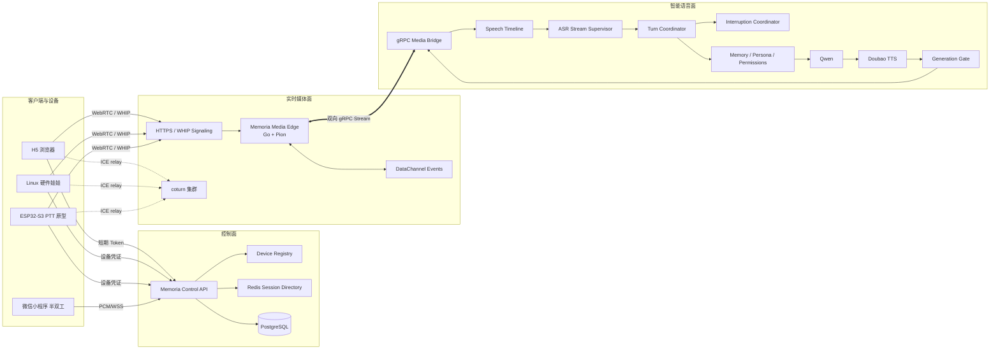
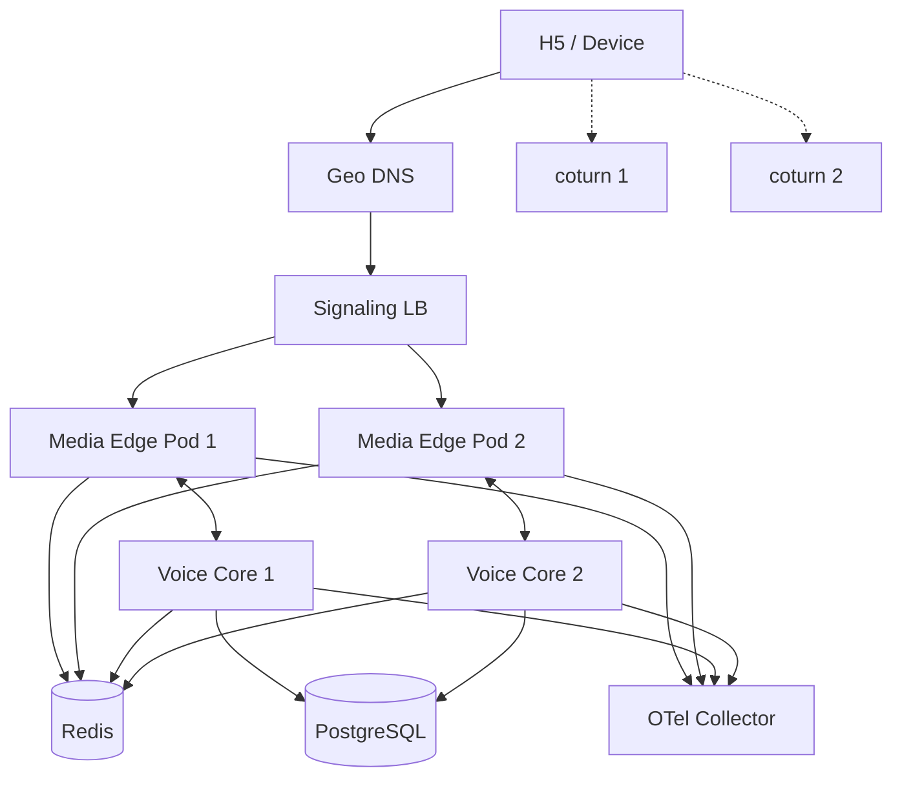

# Memoria 全双工实时语音与硬件娃娃媒体服务器整改实施方案

> **文档版本**：1.0
> **基准日期**：2026-08-02
> **适用项目**：`monkeyin92/memoria`
> **参考媒体底座**：`streamcoreai/streamcore-server`、`streamcoreai/esp32`
> **目标**：在不自建 GPU 推理、继续使用第三方 ASR / LLM / TTS API 的前提下，逐步实现稳定的中文全双工实时语音；同时建设可复用于未来 AI 挂件娃娃、桌面机器人和其他硬件终端的媒体服务器。
> **文档性质**：可直接交给 GPT、Codex、Claude Code、Grok 或工程团队执行的规范性整改文档。
> **术语**：本文中的 **MUST / MUST NOT / SHOULD / MAY** 分别表示必须、禁止、建议、可选。

---

## 0. 最终决策

### 0.1 不直接用 StreamCore 替换现网 LiveKit

现阶段必须采用“双轨演进”：

```text
现网稳定链路
H5 → LiveKit → Memoria Agent → FunASR / Qwen / Doubao TTS

新实验链路
H5 / 硬件 → Memoria Media Runtime（基于 StreamCore fork）
          → Memoria Voice Core
          → FunASR / Qwen / Doubao TTS
```

在新链路达到全部验收标准前：

- MUST 保留 LiveKit 生产链路；
- MUST 通过 Feature Flag 按用户、设备、会话切换媒体运行时；
- MUST 支持一键回滚到 LiveKit；
- MUST NOT 一次性删除现有 LiveKit Agent 集成；
- MUST NOT 让 StreamCore 内置的 LLM、RAG、记忆和插件系统接管 Memoria 的智能层。

### 0.2 StreamCore 只做“媒体面”，Memoria 保留“智能面”

最终职责如下：

| 层 | 所属系统 | 责任 |
|---|---|---|
| WebRTC、ICE、DTLS、SRTP、RTP、Opus | Media Runtime | 实时媒体传输 |
| VAD、快速 KWS、打断时的本地 duck | Media Runtime | 毫秒级控制 |
| 音频统一 Sample Clock | Media Runtime | 全链路时间事实源 |
| ASR Provider 管理 | Memoria Voice Core | FunASR 连接、重连、热词、上下文 |
| 话轮组装 | Memoria Voice Core | VAD、ASR、语义、时间区间合并 |
| 打断语义判断 | Memoria Voice Core | 停止、附和、普通插话、旁人声音 |
| LLM、记忆、人格、权限、工具 | Memoria | 核心业务与智能 |
| TTS Provider 管理 | Memoria Voice Core | 豆包双向流式、取消、音色 |
| Generation Fence | Memoria + Media Runtime | 两端共同校验，防旧音频误播 |
| 屏幕、灯光、电机、按钮、传感器 | 硬件 Device Runtime | 本地执行与回执 |
| 设备身份、OTA、绑定、授权 | Control API + Device Registry | 设备管理 |

### 0.3 小程序不参与本轮全双工迁移

微信小程序当前继续采用严格半双工：

```text
RecorderManager → PCM/WSS → MiniProgram Gateway
```

原因：

- 小程序端没有稳定、低成本、可完全掌控的 WebRTC 全双工音频能力；
- 当前取消语音打断是合理的阶段性选择；
- 将 StreamCore WebRTC 直接塞进小程序不可行；
- 本轮重点是 H5 和未来硬件。

小程序只共享：

- Memoria 记忆、人格、LLM、TTS；
- Generation Fence；
- 统一事件契约；
- 统一测试语料；
- 统一监控指标命名。

---

## 1. 当前基线与主要问题

### 1.1 Memoria 当前基线

当前 Memoria 已具备：

- H5 使用 LiveKit WebRTC；
- FunASR Realtime API；
- Qwen LLM；
- 豆包 Seed-TTS 2.0 双向流式；
- Silero VAD；
- LiveKit Turn Detector；
- Generation Fence；
- 主人声纹、访客和权限策略；
- 长期记忆、Persona、Digital Self；
- 微信小程序半双工链路；
- H5 与小程序共享业务和智能层。

当前最重要的结构性不足：

1. `DuplexRuntime` 已成为大型 God Object；
2. 音频时钟、VAD epoch、ASR sentence、LiveKit committed turn 相互隐式绑定；
3. 仍存在 `_canonical_turn_snapshots.popleft()` 的 FIFO 一一对应假设；
4. ASR 重连、旧任务 final、迟到结果的音频区间语义不够完整；
5. H5 媒体能力与智能编排过度耦合；
6. 缺少统一的媒体服务端接口，未来硬件无法自然复用；
7. 当前对儿童语音、家庭多人、远场、电视背景音的验收不足。

### 1.2 StreamCore 当前可利用的能力

StreamCore 当前适合作为参考或 fork 的部分：

- Go + Pion WebRTC；
- WHIP HTTP SDP 交换；
- Opus over RTP；
- DataChannel；
- Reader / Inbound / Agent / Sender 四段 Goroutine；
- 有界 Channel；
- 内置 STUN/TURN；
- 多语言 SDK；
- SIP 桥；
- ESP32-S3 WHIP 客户端；
- Apache 2.0 许可证。

### 1.3 StreamCore 当前不能直接用于生产的部分

以下内容必须整改后才能进入 Memoria：

1. Session 只保存在单进程内存；
2. 无 ICE restart / session resume；
3. 无 Prometheus / OpenTelemetry；
4. 默认是固定能量 VAD；
5. 中文 Backchannel 不完整；
6. `TranscriptResult` 只有 `Text + IsFinal`；
7. `PCMFrame` 不含 generation、sequence、sample range；
8. 取消只依靠 context cancel 和清空 Channel；
9. 旧 response defer 可能覆盖新 response 状态；
10. 内置 TURN 使用固定用户名与共享密码；
11. 内置智能层与 Memoria 重复；
12. ESP32 示例是按键说话，并非生产级全双工；
13. ESP32 示例没有完整设备级 AEC；
14. ESP32 Wi-Fi、API Key 等配置在构建期写入固件，不符合量产安全要求。

---

## 2. 目标体验与验收指标

以下均为目标值，不代表当前已达到。

### 2.1 H5 全双工目标

| 指标 | 目标 |
|---|---:|
| 用户开口到本地播放 duck，P95 | `< 120 ms` |
| “停、等一下、别说了”开口到可听停止，P95 | `< 350 ms` |
| 普通插话开口到可听停止，P95 | `< 500 ms` |
| 用户说完到 ASR final，P95 | `< 650 ms` |
| 用户说完到首个 TTS 音频，P50 | `< 1.0 s` |
| 用户说完到首个 TTS 音频，P95 | `< 1.6 s` |
| 旧 generation 音频误播 | `0` |
| 旧 ASR final 串入后续话轮 | `0` |
| 短停止命令召回率 | `>= 97%` |
| 正常附和误打断率 | `<= 1%` |
| 普通聊天误触发停止 | `<= 0.5%` |
| WebRTC 断线后恢复成功率 | `>= 99%` |
| 发生重连后旧音频进入新 epoch | `0` |

### 2.2 儿童语音目标

必须建立自有儿童语音测试集，不允许只看成人数据。

| 指标 | 目标 |
|---|---:|
| 安静近讲儿童语音 CER | `<= 15%` 或不差于对标产品 5 个百分点 |
| 中等家庭噪声 CER | `<= 25%` 或不差于对标产品 5 个百分点 |
| 句首字符删除率 | `<= 3%` |
| “停、等一下、我来说”召回率 | `>= 97%` |
| 500–800 ms 句中停顿后跨轮错位 | `0` |
| 同一句需要重复两三次才提交 | `< 1%` |

### 2.3 硬件目标

| 指标 | 目标 |
|---|---:|
| 开机到可连接 | 可观测、可重试，不阻塞 UI |
| Wi-Fi 临时断开自动恢复 | 必须 |
| 音频路由恢复后 stream epoch 递增 | 必须 |
| 设备私钥不可通过普通 Flash 读取获得 | 必须 |
| OTA 固件必须签名验证 | 必须 |
| 物理静音键可在离线状态生效 | 必须 |
| 远程命令必须有 allowlist、TTL 和 ACK | 必须 |
| 屏幕/灯光/电机命令不得阻塞音频线程 | 必须 |

---

## 3. 目标总体架构



### 3.1 数据面与控制面分离

实时媒体热路径禁止访问数据库：

```text
WebRTC → Opus → PCM → VAD/KWS → gRPC → ASR/LLM/TTS → PCM → Opus
```

控制面负责：

- 账号登录；
- 设备绑定；
- 签发短期会话 Token；
- 选择媒体运行时；
- 加载人格与记忆快照；
- 会话记录；
- 权限；
- 审计；
- OTA 元数据。

### 3.2 单一音频时钟

每条上行音频流必须有：

```text
stream_epoch
sequence
capture_start_sample
frame_samples
sample_rate
```

禁止再以“第几个回调”或“deque 第几个元素”推断话轮归属。

唯一事实源：

```text
capture_start_sample / capture_end_sample
```

所有事件必须映射到这条 Sample Clock：

- VAD start/end；
- KWS hit；
- ASR partial/final；
- Turn commit；
- Speaker classification；
- Interruption；
- TTS generation；
- Playback ACK。

---

## 4. 不可违反的系统不变量

### 4.1 音频与话轮

1. 一个逻辑话轮可以包含多个 VAD segment；
2. 一个 VAD segment 不一定等于一个逻辑话轮；
3. ASR final 不等于逻辑话轮结束；
4. 任何 ASR 结果都必须带可映射的音频区间；
5. 已提交的音频 watermark 之前的迟到 final 必须丢弃；
6. 发生音频 discontinuity 后必须增加 `stream_epoch`；
7. 新 `stream_epoch` 不得消费旧 epoch 的任何事件。

### 4.2 Generation

1. 同一会话最多存在一个可播放 generation；
2. LLM chunk、TTS chunk、PCM frame、字幕、工具结果都必须带 generation；
3. Media Edge 和 Voice Core 必须双重检查 generation；
4. 旧 generation 音频必须在编码 RTP 前丢弃；
5. 用户停止后，任何旧 Provider 迟到结果不得恢复播放；
6. Response defer 只能清理自己的 generation，不能清理更新的 generation。

### 4.3 权限

1. “停止 AI”是低风险操作，任何清楚真人语音都可触发；
2. “普通聊天”可按家庭模式允许家人使用；
3. “读取主人私人记忆”只允许主人；
4. “执行敏感工具”只允许授权身份；
5. 不得用声纹失败阻止低风险停止；
6. 设备控制命令必须经过 allowlist。

### 4.4 历史与记忆

1. LLM 生成文本不等于用户已经听见；
2. 只有实际播放进度确认过的文本才可写入“已听历史”；
3. 被打断未播放的文本不得写入已听历史；
4. 原始用户音频默认不得长期保存；
5. 调试录音必须显式授权、加密、短期自动删除。

---

## 5. 仓库与 Fork 策略

### 5.1 建议新建独立 Fork

建立：

```text
github.com/monkeyin92/memoria-media-runtime
```

来源：

```text
upstream = github.com/streamcoreai/streamcore-server
```

原因：

- StreamCore 的关键包在 `internal/`，外部项目无法直接 import 后替换内部实现；
- Memoria 需要深度修改事件模型、Generation、Session、Metrics 和 Bridge；
- 独立 Fork 便于跟踪上游；
- 避免把第三方历史完全混入 Memoria Python monorepo。

Fork 必须：

```bash
git remote add upstream https://github.com/streamcoreai/streamcore-server.git
git fetch upstream
git tag upstream-base-2026-07-29 <PINNED_COMMIT>
```

必须保留：

- Apache 2.0 LICENSE；
- 第三方版权；
- NOTICE；
- `UPSTREAM.md`；
- 每次上游同步记录。

### 5.2 Memoria 主仓库新增结构

```text
memoria/
├── packages/
│   └── proto/
│       └── memoria/media/v1/
│           ├── media.proto
│           ├── device.proto
│           └── events.proto
├── services/
│   ├── agent/
│   │   └── src/
│   │       └── voice_core/
│   │           ├── media_bridge_server.py
│   │           ├── speech_timeline.py
│   │           ├── asr_stream_supervisor.py
│   │           ├── turn_coordinator.py
│   │           ├── interruption_coordinator.py
│   │           ├── speaker_policy.py
│   │           ├── generation_controller.py
│   │           ├── playback_ledger.py
│   │           ├── voice_session.py
│   │           └── telemetry.py
│   └── control_api/
│       └── app/routes/
│           ├── media_sessions.py
│           └── devices.py
├── apps/
│   └── h5/src/voice/
│       ├── VoiceTransport.js
│       ├── LiveKitCascadeTransport.js
│       ├── StreamCoreTransport.js
│       └── voiceTransportFactory.js
├── firmware/
│   ├── linux-doll/
│   └── esp32-ptt-reference/
└── infra/
    ├── media-edge/
    ├── coturn/
    ├── otel/
    └── grafana/
```

---

## 6. 核心协议：Media Edge 与 Voice Core

### 6.1 使用双向 gRPC Streaming

Media Edge 与 Voice Core 间 MUST 使用：

- HTTP/2 gRPC；
- 内网或 localhost；
- 生产环境 mTLS；
- 每个媒体会话一条双向流；
- Protobuf 作为唯一契约；
- `buf` 管理、生成和破坏性变更检测。

不建议在内部继续使用裸 JSON WebSocket 传 PCM。

### 6.2 `media.proto` 建议定义

```proto
syntax = "proto3";

package memoria.media.v1;

option go_package = "github.com/monkeyin92/memoria-media-runtime/gen/media/v1;mediav1";

service VoiceMediaBridge {
  rpc Connect(stream MediaToCore) returns (stream CoreToMedia);
}

enum AudioEncoding {
  AUDIO_ENCODING_UNSPECIFIED = 0;
  AUDIO_ENCODING_PCM_S16LE = 1;
  AUDIO_ENCODING_OPUS = 2;
}

enum ConversationState {
  CONVERSATION_STATE_UNSPECIFIED = 0;
  CONVERSATION_STATE_CONNECTING = 1;
  CONVERSATION_STATE_LISTENING = 2;
  CONVERSATION_STATE_USER_SPEAKING = 3;
  CONVERSATION_STATE_FINALIZING = 4;
  CONVERSATION_STATE_THINKING = 5;
  CONVERSATION_STATE_ASSISTANT_SPEAKING = 6;
  CONVERSATION_STATE_INTERRUPT_PENDING = 7;
  CONVERSATION_STATE_RECOVERING = 8;
  CONVERSATION_STATE_CLOSED = 9;
}

enum VadEventType {
  VAD_EVENT_UNSPECIFIED = 0;
  VAD_EVENT_SPEECH_START = 1;
  VAD_EVENT_SPEECH_END = 2;
}

enum GenerationAction {
  GENERATION_ACTION_UNSPECIFIED = 0;
  GENERATION_ACTION_START = 1;
  GENERATION_ACTION_CANCEL = 2;
  GENERATION_ACTION_COMPLETE = 3;
  GENERATION_ACTION_PAUSE = 4;
  GENERATION_ACTION_RESUME = 5;
}

message SessionIdentity {
  string session_id = 1;
  string account_id = 2;
  string participant_id = 3;
  string device_id = 4;
  string client_type = 5;       // h5, linux_doll, esp32_ptt
  uint64 stream_epoch = 6;
}

message AudioFormat {
  AudioEncoding encoding = 1;
  uint32 sample_rate = 2;
  uint32 channels = 3;
  uint32 frame_ms = 4;
}

message SessionHello {
  SessionIdentity identity = 1;
  AudioFormat uplink_format = 2;
  AudioFormat downlink_format = 3;
  map<string, string> capabilities = 4;
  string traceparent = 5;
}

message AudioFrame {
  SessionIdentity identity = 1;
  uint64 sequence = 2;
  uint64 capture_start_sample = 3;
  uint32 frame_samples = 4;
  bytes payload = 5;
  uint32 crc32c = 6;
  bool discontinuity = 7;
}

message VadEvent {
  SessionIdentity identity = 1;
  VadEventType type = 2;
  uint64 sample_position = 3;
  float probability = 4;
  float rms = 5;
  float noise_floor = 6;
}

message KeywordEvent {
  SessionIdentity identity = 1;
  string keyword = 2;
  float confidence = 3;
  uint64 start_sample = 4;
  uint64 end_sample = 5;
  bool hard_stop = 6;
}

message PlaybackProgress {
  SessionIdentity identity = 1;
  uint64 generation_id = 2;
  uint64 received_sequence = 3;
  uint64 rendered_sample_end = 4;
  uint64 client_monotonic_ms = 5;
  bool approximate = 6;
}

message DeviceEvent {
  SessionIdentity identity = 1;
  string event_type = 2;
  bytes json_payload = 3;
  uint64 monotonic_ms = 4;
}

message MediaMetric {
  SessionIdentity identity = 1;
  string name = 2;
  double value = 3;
  map<string, string> labels = 4;
}

message MediaToCore {
  oneof event {
    SessionHello hello = 1;
    AudioFrame audio = 2;
    VadEvent vad = 3;
    KeywordEvent keyword = 4;
    PlaybackProgress playback = 5;
    DeviceEvent device = 6;
    MediaMetric metric = 7;
  }
}

message SessionAccepted {
  SessionIdentity identity = 1;
  ConversationState state = 2;
  uint64 current_generation_id = 3;
}

message AssistantAudioFrame {
  SessionIdentity identity = 1;
  uint64 turn_id = 2;
  uint64 generation_id = 3;
  uint64 tool_epoch = 4;
  uint64 sequence = 5;
  uint64 source_start_sample = 6;
  uint32 frame_samples = 7;
  bytes pcm_s16le = 8;
  bool first_frame = 9;
  bool final_frame = 10;
}

message GenerationControl {
  SessionIdentity identity = 1;
  uint64 turn_id = 2;
  uint64 generation_id = 3;
  uint64 tool_epoch = 4;
  GenerationAction action = 5;
  string reason = 6;
}

message TranscriptEvent {
  SessionIdentity identity = 1;
  uint64 turn_id = 2;
  uint64 revision = 3;
  uint64 capture_start_sample = 4;
  uint64 capture_end_sample = 5;
  string text = 6;
  bool final = 7;
  float confidence = 8;
  string speaker_class = 9;
}

message StateEvent {
  SessionIdentity identity = 1;
  ConversationState state = 2;
  uint64 turn_id = 3;
  uint64 generation_id = 4;
  string reason = 5;
}

message ClientEvent {
  SessionIdentity identity = 1;
  string type = 2;
  bytes json_payload = 3;
}

message CoreError {
  SessionIdentity identity = 1;
  string code = 2;
  string message = 3;
  bool retryable = 4;
}

message CoreToMedia {
  oneof event {
    SessionAccepted accepted = 1;
    AssistantAudioFrame audio = 2;
    GenerationControl generation = 3;
    TranscriptEvent transcript = 4;
    StateEvent state = 5;
    ClientEvent client = 6;
    CoreError error = 7;
  }
}
```

### 6.3 音频固定格式

上行 Voice Core 输入：

```text
PCM S16LE
16 kHz
单声道
20 ms
320 samples
640 bytes
```

下行 Voice Core 输出：

```text
PCM S16LE
24 kHz
单声道
20 ms
480 samples
960 bytes
```

Media Edge 输出到 WebRTC：

```text
Opus
48 kHz RTP clock
单声道
20 ms packetization
in-band FEC enabled
```

禁止：

- 可变帧长混入；
- 猜测采样率；
- 在同一 stream epoch 中间修改格式；
- 使用下一个包的长度补前一个缺失包。

---

## 7. 客户端 DataChannel 事件协议

DataChannel label 固定：

```text
memoria.events.v1
```

所有事件统一 Envelope：

```json
{
  "v": 1,
  "type": "assistant.state",
  "event_id": "01J...",
  "session_id": "sess_xxx",
  "stream_epoch": 3,
  "sequence": 1024,
  "turn_id": 28,
  "generation_id": 49,
  "server_monotonic_ms": 182993002,
  "payload": {}
}
```

### 7.1 必须支持的服务端事件

```text
session.ready
session.reconnecting
session.closed

assistant.state
assistant.text.delta
assistant.text.final
assistant.audio.started
assistant.audio.stopped

user.transcript.partial
user.transcript.final

playback.duck
playback.restore
playback.flush

device.command
device.ota.available

error
ping
```

### 7.2 必须支持的客户端事件

```text
client.ready
client.playback.progress
client.playback.underrun
client.audio.route_changed
client.mic.level
client.stats
client.stop_assistant
device.event
device.command_ack
pong
```

### 7.3 兼容规则

- 未识别事件 MUST 忽略，不得断开会话；
- 同一 major version 内只能新增可选字段；
- `event_id + stream_epoch` 用于幂等；
- sequence 倒退必须记录并丢弃；
- 迟到旧 stream epoch 事件必须丢弃。

---

## 8. 四个状态机

### 8.1 Media Session State

```text
CREATED
→ AUTHORIZING
→ NEGOTIATING
→ CONNECTED
→ RECONNECTING
→ DRAINING
→ CLOSED
```

规则：

- `DISCONNECTED` 不等于可恢复原 PeerConnection；
- 当前阶段通过新建 PeerConnection 恢复；
- 每次恢复 `stream_epoch += 1`；
- 旧 epoch 的音频和事件全部失效；
- Voice Core 会话上下文可继续，媒体连接不可迁移。

### 8.2 Conversation State

```text
LISTENING
→ USER_SPEAKING
→ FINALIZING
→ THINKING
→ ASSISTANT_SPEAKING
→ INTERRUPT_PENDING
→ LISTENING
```

允许：

```text
ASSISTANT_SPEAKING → RECOVERING → ASSISTANT_SPEAKING
ASSISTANT_SPEAKING → LISTENING
ANY → CLOSED
```

禁止：

- 旧 generation 把状态从新 generation 的 SPEAKING 改回 LISTENING；
- ASR partial 直接写入正式历史；
- 一个 state callback 无 generation 地清理当前 response。

### 8.3 Generation State

```text
CREATED
→ LLM_STREAMING
→ TTS_STREAMING
→ PLAYING
→ COMPLETED
```

取消路径：

```text
ANY_ACTIVE
→ CANCELLING
→ CANCELLED
```

规则：

- `generation_id` 单调递增；
- 取消后不可恢复同一 generation；
- False interruption 恢复时创建新 generation；
- 不得重新播放旧 PCM；
- 可从安全语义边界重新生成后续内容。

### 8.4 Device State

```text
BOOTING
→ PROVISIONING
→ CONNECTING
→ ONLINE
→ UPDATING
→ REBOOTING
→ ONLINE
```

异常：

```text
ANY → DEGRADED
ANY → SAFE_MODE
ANY → OFFLINE
```

---

## 9. 全双工打断算法

### 9.1 三层判定

```text
第一层：VAD / 声学
第二层：KWS / 快速控制词
第三层：ASR partial + 语义分类
```

### 9.2 用户开口流程

当 AI 正在播放时：

1. Media Edge 检测到连续人声；
2. 立即发送 `playback.duck`；
3. H5 / 硬件将播放音量在 10–20 ms 内降至 10%–20%；
4. Media Edge 暂停继续发送新的下行帧，但保留短缓冲；
5. KWS 和 ASR 同时处理；
6. 根据结果执行以下分支。

### 9.3 硬停止命令

关键词：

```text
停
停一下
等一下
等等
先别说
别说了
打住
我来说
```

命中：

```text
KWS confidence >= threshold
→ Media Edge 本地 generation gate 立即关闭
→ 丢弃尚未编码的旧 PCM
→ 通知 Voice Core cancel
→ Voice Core 取消 LLM/TTS/Tool
→ generation_id + 1
→ 回到 LISTENING
```

停止权限：

- 不依赖主人声纹；
- 不依赖长期 ASR final；
- 不读取私人记忆；
- 不执行敏感工具。

### 9.4 Backchannel

典型附和：

```text
嗯
嗯嗯
对
是的
好
我知道
你继续
然后呢
原来如此
```

判定为 Backchannel 时：

- 不取消 generation；
- 恢复播放音量；
- 不创建用户逻辑话轮；
- 可记录为轻量听众反馈；
- 不写入长期记忆。

### 9.5 普通插话

例如：

```text
不是，我想说的是……
等一下，我还有一个问题……
```

处理：

1. duck；
2. ASR partial 表明是实质内容；
3. cancel 当前 generation；
4. 继续收集完整用户语音；
5. 新建 user turn；
6. 将“被打断时助手已经实际播放的内容”加入上下文；
7. 未播放内容不得加入上下文；
8. 启动新 generation。

### 9.6 False interruption

咳嗽、碰撞声、旁人电视声：

```text
VAD onset
→ duck
→ KWS 未命中
→ ASR 无有效 partial 或语义判定为旁人
→ restore
```

恢复时禁止：

- 把旧 Channel 中积压 PCM 再一次性快速播放；
- 继续已经过期的 generation；
- 跳过 Generation Gate。

建议：

```text
创建新 generation
→ 从下一句或下一个语义边界继续
```

---

## 10. VAD 与 KWS 整改

### 10.1 抽象接口

Go：

```go
type VADEvent struct {
    Type          string
    Sample        uint64
    Probability   float32
    RMS           float32
    NoiseFloor    float32
}

type VADEngine interface {
    Process(samples []int16, startSample uint64) []VADEvent
    Reset(streamEpoch uint64)
}

type KeywordHit struct {
    Keyword    string
    Confidence float32
    Start      uint64
    End        uint64
    HardStop   bool
}

type KeywordSpotter interface {
    Process(samples []int16, startSample uint64) []KeywordHit
    Reset(streamEpoch uint64)
}
```

### 10.2 不再固定 RMS 1200

第一阶段可实现：

```text
动态噪声底
+ 自适应阈值
+ 快速 onset
+ 慢速 offset
```

建议：

```text
noise_floor = EWMA(silent_rms)
speech_threshold = max(min_threshold, noise_floor * multiplier)
```

参数必须进入配置：

```toml
[vad]
provider = "adaptive_energy"
frame_ms = 20
onset_frames = 3
offset_frames = 15
noise_ewma_alpha = 0.02
speech_multiplier = 3.0
min_threshold = 350
max_threshold = 5000
```

第二阶段增加：

```text
Silero ONNX / WebRTC VAD / sherpa-onnx VAD
```

不得把固定能量 VAD作为最终唯一方案。

### 10.3 KWS

推荐优先顺序：

1. `sherpa-onnx` keyword spotting；
2. Vosk 小模型；
3. ASR partial fallback。

KWS 必须有中文测试集，并区分：

```text
硬停止词
软暂停词
附和词
普通文本
```

---

## 11. 修复话轮错位：Speech Timeline

### 11.1 删除 FIFO 一一绑定

必须删除或废弃：

```python
snapshot = self._canonical_turn_snapshots.popleft()
```

原因：

```text
多个 VAD segment 可能只对应一个逻辑话轮
```

### 11.2 新领域模型

```python
from dataclasses import dataclass
from enum import Enum


class SegmentKind(str, Enum):
    VAD = "vad"
    ASR_PARTIAL = "asr_partial"
    ASR_FINAL = "asr_final"
    KWS = "kws"


@dataclass(frozen=True, slots=True)
class SpeechSegment:
    session_id: str
    stream_epoch: int
    provider_task_epoch: int
    segment_id: str
    revision: int
    kind: SegmentKind
    capture_start_sample: int
    capture_end_sample: int
    text: str
    final: bool
    confidence: float | None
    speaker_class: str | None
```

### 11.3 组装算法

```python
class SpeechTimeline:
    def __init__(self) -> None:
        self._segments: list[SpeechSegment] = []
        self._committed_sample = 0

    def add(self, segment: SpeechSegment) -> None:
        if segment.capture_end_sample <= self._committed_sample:
            return
        self._segments.append(segment)
        self._segments.sort(
            key=lambda item: (
                item.capture_start_sample,
                item.capture_end_sample,
                item.revision,
            )
        )

    def commit_range(
        self,
        *,
        stream_epoch: int,
        start_sample: int,
        end_sample: int,
    ) -> list[SpeechSegment]:
        matched = [
            item
            for item in self._segments
            if item.stream_epoch == stream_epoch
            and item.capture_end_sample > start_sample
            and item.capture_start_sample < end_sample
        ]
        self._committed_sample = max(self._committed_sample, end_sample)
        self._segments = [
            item
            for item in self._segments
            if not (
                item.stream_epoch == stream_epoch
                and item.capture_end_sample <= self._committed_sample
            )
        ]
        return matched
```

### 11.4 Canonical Text

合并规则：

1. 取最高 revision 的 final；
2. 没有 final 时可用稳定 partial；
3. 同一音频范围只保留一个文本；
4. 归一化标点；
5. 去除明确的播放回声前缀；
6. 不得按回调次数拼接；
7. 不得消费其他 stream epoch；
8. committed watermark 之前的迟到结果直接丢弃。

---

## 12. FunASR Provider 整改

### 12.1 事件模型

现有 Provider 结果必须扩展为：

```python
@dataclass(frozen=True, slots=True)
class ASRResult:
    task_epoch: int
    sentence_id: str
    revision: int
    capture_start_sample: int
    capture_end_sample: int
    text: str
    is_final: bool
    confidence: float | None
    provider_begin_ms: int | None
    provider_end_ms: int | None
```

### 12.2 重连规则

当前重连不得简单重放固定 1500 ms。

必须维护：

```text
last_sent_sample
last_provider_acked_sample
last_committed_sample
last_emitted_final_sample
task_epoch
```

重连时：

```text
replay_start = max(
    last_provider_acked_sample,
    last_committed_sample,
    current_sample - 500ms
)
```

规则：

- 最多重放 300–500 ms 未确认尾部；
- task epoch 递增；
- 跨 task 按音频范围去重；
- end sample 小于 committed watermark 的结果丢弃；
- 发生 discontinuity 时不重放断点之前音频。

### 12.3 儿童语音优化

必须支持：

```text
vocabulary_id
conversation_context
speech_noise_threshold
家庭专名热词
机器人名字
控制词
```

ASR Provider 必须可插拔：

```python
class ASRProvider(Protocol):
    async def start(...)
    async def send_audio(...)
    async def close(...)
    def results(...) -> AsyncIterator[ASRResult]
```

建立 Shadow Provider：

```text
primary = FunASR
shadow = 另一实时 ASR
```

Shadow 只记录结果，不影响用户。

---

## 13. Generation Gate 与下行音频

### 13.1 Go Frame

```go
type PCMFrame struct {
    StreamEpoch   uint64
    TurnID        uint64
    GenerationID  uint64
    ToolEpoch     uint64
    Sequence      uint64
    Samples       []int16
    First         bool
    Final         bool
}
```

### 13.2 Generation Gate

```go
type GenerationGate struct {
    current atomic.Uint64
}

func (g *GenerationGate) Start(id uint64) {
    g.current.Store(id)
}

func (g *GenerationGate) Cancel(id uint64) {
    g.current.CompareAndSwap(id, id+1)
}

func (g *GenerationGate) Accept(frame PCMFrame) bool {
    return frame.GenerationID == g.current.Load()
}
```

实际实现不能用 `id+1` 猜下一个 ID，应由 Voice Core 下发 authoritative generation；上例只表达思想。

### 13.3 修复 Response Lease 竞态

```go
type ResponseLease struct {
    Generation uint64
    Cancel     context.CancelFunc
}

func (p *Pipeline) installResponse(gen uint64, cancel context.CancelFunc) {
    p.responseMu.Lock()
    defer p.responseMu.Unlock()

    if p.response != nil {
        p.response.Cancel()
    }
    p.response = &ResponseLease{
        Generation: gen,
        Cancel: cancel,
    }
}

func (p *Pipeline) clearResponse(gen uint64) {
    p.responseMu.Lock()
    defer p.responseMu.Unlock()

    if p.response != nil && p.response.Generation == gen {
        p.response = nil
        p.speaking.Store(false)
    }
}
```

旧 response 的 defer MUST NOT 清理新 generation。

### 13.4 Sender Gate

编码 Opus 前：

```go
if !p.generationGate.Accept(frame) {
    metrics.StaleAudioFramesDropped.Inc()
    continue
}
```

清空 Channel 只能作为辅助，不得作为唯一取消保障。

---

## 14. TTS 与实际播放账本

### 14.1 TTS 输出必须真实流式

禁止：

```text
等待整句 TTS 全部返回
→ io.ReadAll
→ 再切帧播放
```

豆包双向流式保持现有优势：

```text
LLM phrase delta
→ TTS incremental input
→ PCM incremental output
→ 20 ms frame
→ Media Edge
```

### 14.2 Playback Ledger

```python
@dataclass
class PlaybackSpan:
    generation_id: int
    text_start: int
    text_end: int
    audio_start_sample: int
    audio_end_sample: int
    acknowledged: bool
```

H5：

- 只能近似确认实际播放；
- 使用 Media Edge 已发送进度 + 客户端播放状态；
- `approximate=true`。

硬件：

- 由 I2S DMA 实际消费 sample 数上报；
- `approximate=false`；
- 可更精确计算已听文本。

被打断时：

```text
只提交 ACK 覆盖的文本
```

---

## 15. StreamCore Fork 的文件级整改

### 15.1 保留

```text
internal/peer
internal/audio
internal/signaling
Pion WebRTC
WHIP
RTP / Opus
DataChannel
```

### 15.2 删除出实时主链

默认 `media_only=true`：

```text
internal/llm
internal/rag
internal/plugin
internal/tools
内置 conversation history
```

这些可以保留在仓库中用于上游兼容，但 Media-only 模式不得初始化。

### 15.3 新增目录

```text
internal/bridge/
    grpc_client.go
    session_stream.go

internal/timeline/
    sample_clock.go
    discontinuity.go

internal/generation/
    gate.go
    lease.go

internal/kws/
    kws.go
    sherpa.go
    noop.go

internal/vad/
    engine.go
    adaptive_energy.go
    silero_sidecar.go

internal/observability/
    metrics.go
    tracing.go
    logs.go

internal/auth/
    token.go
    device_claims.go

internal/session/
    store.go
    redis_store.go
```

### 15.4 重写 Pipeline

目标：

```text
runReader
→ AudioFrame + Sample Clock
→ runAnalysis（VAD/KWS）
→ runBridgeUplink
→ Voice Core
→ runBridgeDownlink
→ Generation Gate
→ runSender
```

不再在 Go Media Runtime 内执行 LLM 和业务 TTS。

### 15.5 Channel 策略

| Channel | 建议容量 | 满时策略 |
|---|---:|---|
| RTP decoded PCM | 50 帧 | 记录 overflow，触发 discontinuity |
| VAD/KWS event | 32 | 不允许静默丢失硬停止 |
| gRPC uplink | 100 帧 | 短暂背压；超限断开重建 epoch |
| downlink PCM | 50–100 帧 | 丢弃旧 generation 优先 |
| client event | 128 | 合并低优先级 metrics |
| device command | 32 | 必须 ACK，不静默丢失 |

音频热路径不能无限缓存。

### 15.6 TURN

实验环境可保留内置 TURN。

生产 MUST 使用独立 coturn：

- 短期 REST credentials；
- 独立扩容；
- UDP 3478；
- TLS 5349 作为企业网络 fallback；
- 监控 allocation、带宽、失败率；
- 禁止固定 `voiceagent + shared secret` 暴露给客户端。

---

## 16. Memoria Python 侧拆分

### 16.1 `DuplexRuntime` 变成 Facade

最终目标：

```python
class VoiceSession:
    def __init__(
        self,
        media_bridge: MediaBridge,
        speech_timeline: SpeechTimeline,
        asr: ASRStreamSupervisor,
        turn_coordinator: TurnCoordinator,
        interruption: InterruptionCoordinator,
        speaker_policy: SpeakerPolicy,
        generation: GenerationController,
        playback: PlaybackLedger,
        response_planner: ResponsePlanner,
    ) -> None:
        ...
```

`DuplexRuntime` 仅负责兼容现有 LiveKit 路径，不再承载全部业务。

### 16.2 模块职责

#### `media_bridge_server.py`

- gRPC server；
- 会话认证；
- 协议版本；
- 音频帧接收；
- 下行 PCM；
- backpressure；
- mTLS；
- stream epoch。

#### `speech_timeline.py`

- Sample Clock；
- VAD/ASR/KWS segment；
- interval 合并；
- committed watermark；
- 去重。

#### `asr_stream_supervisor.py`

- FunASR 生命周期；
- task epoch；
- reconnect；
- replay tail；
- provider result 映射；
- hotwords/context；
- Shadow ASR。

#### `turn_coordinator.py`

- 话轮开始/结束；
- 动态 endpoint；
- 句中停顿；
- child profile；
- Turn Detector adapter；
- commit range。

#### `interruption_coordinator.py`

- duck；
- hard stop；
- backchannel；
- semantic interrupt；
- false interrupt；
- resume。

#### `speaker_policy.py`

输出独立权限：

```python
@dataclass(frozen=True)
class SpeakerCapabilities:
    conversation_allowed: bool
    interrupt_allowed: bool
    private_memory_allowed: bool
    privileged_action_allowed: bool
```

#### `generation_controller.py`

- turn_id；
- generation_id；
- tool_epoch；
- TTS cancel；
- stale event gate；
- provider cleanup。

#### `playback_ledger.py`

- actual heard text；
- H5 approximate；
- hardware exact；
- history commit。

---

## 17. H5 整改

### 17.1 新 Transport

```javascript
export class StreamCoreTransport extends VoiceTransport {
  async connect(session) {}
  async disconnect(reason) {}
  async setMicrophoneEnabled(enabled) {}
  async stopAssistant() {}
  async publishData(payload) {}
  async getStats() {}
}
```

### 17.2 Factory

```javascript
export function createVoiceTransport({
  mediaRuntime,
  liveKitOptions,
  streamCoreOptions,
}) {
  if (mediaRuntime === "streamcore") {
    return new StreamCoreTransport(streamCoreOptions);
  }
  return new LiveKitCascadeTransport(liveKitOptions);
}
```

### 17.3 Feature Flag

Control API 返回：

```json
{
  "media_runtime": "livekit",
  "fallback_runtime": "livekit",
  "streamcore": {
    "whip_url": "...",
    "token": "...",
    "expires_at": "..."
  }
}
```

按以下维度灰度：

```text
account_id
device_id
browser
region
experiment_bucket
```

### 17.4 H5 必须恢复停止按钮

AI speaking 时显示：

```text
停止回答
```

点击：

1. 本地立即降低音量；
2. DataChannel `client.stop_assistant`；
3. HTTP fallback；
4. Generation 取消；
5. 会话继续保持。

### 17.5 H5 本地音频统计

记录：

```text
track.getSettings()
track.getConstraints()
outbound-rtp packetsSent
remote-inbound-rtp roundTripTime
audioLevel
totalAudioEnergy
jitter
packetsLost
concealedSamples
```

还需记录本地：

```text
RMS
peak
clipping ratio
mic permission
audio route
browser visibility
```

---

## 18. 小程序策略

小程序继续：

```text
严格半双工
```

必须保留：

- 播放结束 guard；
- 按钮停止回答；
- 短回复策略；
- Generation Gate；
- 固定帧校验；
- 自适应播放缓冲；
- discontinuity；
- 状态事件统一。

不做：

- 语音 barge-in；
- StreamCore WebRTC；
- 服务端猜测式全双工 AEC。

---

## 19. 未来硬件娃娃路线

### 19.1 三档硬件路线

#### A. ESP32-S3 PTT 原型

用途：

- 快速验证外壳；
- 按钮说话；
- 屏幕表情；
- 基础 DataChannel；
- Wi-Fi；
- 低成本样机。

限制：

- 非生产全双工；
- 现有参考代码以按键静音/解除静音为主；
- AFE 只有 AGC/NS 不等于可靠 AEC；
- 不作为最终全双工硬件。

#### B. Linux SBC 全双工开发机

推荐作为全双工第一硬件目标：

```text
嵌入式 Linux
+ WebRTC native client
+ WebRTC AEC3 / PipeWire AEC / SpeexDSP
+ Opus
+ I2S / USB 音频
+ 屏幕
```

优点：

- 能运行成熟 AEC；
- 调试容易；
- 可抓包、录制 PCM、跑指标；
- 能支持 OTA、日志和完整设备 SDK。

#### C. 量产成本优化

在 Linux 原型验证通过后，再选择：

```text
更低成本 Linux SoC
或
MCU + 独立 AEC DSP / Audio Codec
```

不得在声学问题尚未收敛时直接以 ESP32-S3 为量产全双工平台。

### 19.2 设备音频链路

```text
麦克风
→ ADC / I2S
→ 高通
→ AEC（参考必须来自实际扬声器 PCM）
→ Noise Suppression
→ AGC
→ VAD / Wake Word
→ Opus
→ WebRTC
```

下行：

```text
WebRTC
→ jitter buffer
→ Opus decode
→ volume / limiter
→ I2S DMA
→ 扬声器
```

关键：

> AEC reference 必须来自真正送入扬声器的 PCM，不能用服务端“准备发送”的 PCM 代替。

### 19.3 Device DataChannel Topics

```text
face.expression.set
face.animation.play
screen.subtitle.set
screen.brightness.set
led.color.set
audio.volume.set
audio.mute.set
motor.motion.play
sensor.snapshot.request
device.status.request
device.ota.check
device.ota.apply
device.reboot
```

命令 Envelope：

```json
{
  "v": 1,
  "type": "device.command",
  "command_id": "cmd_xxx",
  "topic": "face.expression.set",
  "ttl_ms": 3000,
  "issued_at": "2026-08-02T14:00:00Z",
  "payload": {
    "expression": "happy",
    "intensity": 0.7
  }
}
```

ACK：

```json
{
  "v": 1,
  "type": "device.command_ack",
  "command_id": "cmd_xxx",
  "status": "applied",
  "device_monotonic_ms": 829932
}
```

### 19.4 本地安全与物理控制

硬件 MUST 有：

- 物理麦克风静音；
- 静音指示灯；
- 最大音量限制；
- 看门狗；
- 网络断开本地安全模式；
- 长按恢复出厂；
- 不依赖云端的紧急停止；
- 儿童产品禁止远程无提示开启麦克风。

### 19.5 Provisioning

量产流程：

1. 工厂写入唯一 Device ID；
2. 生成每设备非对称密钥；
3. 私钥写入安全存储；
4. 开启 Secure Boot；
5. 开启 Flash Encryption；
6. 用户 App 扫码或 BLE 绑定；
7. Control API 返回短期会话 Token；
8. 设备不得长期保存用户账号 Token。

禁止：

```text
所有设备共用一个 API_KEY
Wi-Fi 密码硬编码到公开固件
全设备共用 TURN 密码
```

### 19.6 OTA

必须：

- A/B 分区；
- 签名固件；
- 下载哈希；
- 回滚；
- 灰度设备组；
- 断电保护；
- 版本上报；
- 紧急冻结版本。

---

## 20. Control API 新增接口

### 20.1 创建媒体会话

```http
POST /v1/media/sessions
Authorization: Bearer <user-token>
```

请求：

```json
{
  "client_type": "h5",
  "device_id": null,
  "capabilities": {
    "full_duplex": true,
    "playback_ack": "approximate",
    "data_channel": true
  }
}
```

响应：

```json
{
  "session_id": "sess_xxx",
  "media_runtime": "streamcore",
  "whip_url": "https://media.example.com/whip",
  "token": "short-lived-jwt",
  "expires_at": "2026-08-02T14:05:00Z",
  "ice_servers": [],
  "stream_epoch": 1,
  "fallback": {
    "media_runtime": "livekit"
  }
}
```

### 20.2 设备会话

```http
POST /v1/devices/{device_id}/media-session
```

认证：

```text
mTLS
或
Device Signed Challenge
```

### 20.3 停止回答 Fallback

```http
POST /v1/media/sessions/{session_id}/stop
```

必须幂等：

```text
Idempotency-Key
```

---

## 21. 生产部署架构



### 21.1 Session Directory

Redis 仅保存：

```text
session_id → media_edge_id
session_id → voice_core_id
account_id
device_id
stream_epoch
generation_id
expires_at
```

不保存唯一长期记忆。

### 21.2 Sticky Routing

WHIP signaling 根据：

```text
session_id / consistent hash
```

选择 Media Edge。

活动 WebRTC 不迁移 Pod。

Pod 下线：

1. readiness=false；
2. 停止接收新 Session；
3. 等待现有 Session 结束；
4. 超时后通知客户端重连；
5. 新连接使用新 `stream_epoch`。

### 21.3 Reconnect

当前目标不实现 PeerConnection 无缝迁移，而采用：

```text
断线
→ 客户端指数退避
→ 新建 WHIP Session
→ stream_epoch + 1
→ Voice Core 恢复会话上下文
→ 旧音频全部失效
```

---

## 22. 安全整改

### 22.1 Token

H5：

- 用户登录 Token 调用 Control API；
- Control API 签发 1–5 分钟媒体 JWT；
- JWT 只允许一个 session；
- 包含 `aud`, `sub`, `session_id`, `client_type`, `exp`, `jti`。

设备：

- 每设备身份；
- Token 短期；
- 支持吊销；
- 不允许共享 API Key。

### 22.2 TURN

生产不使用静态：

```text
username=voiceagent
password=<shared-secret>
```

使用：

```text
time-limited REST credential
```

### 22.3 内部通信

Media Edge ↔ Voice Core：

- mTLS；
- SPIFFE/SPIRE 可选；
- gRPC message size 限制；
- session claims 校验；
- rate limit；
- trace ID。

### 22.4 数据与隐私

- 原始音频默认不存；
- Debug 音频显式 opt-in；
- 对儿童音频增加监护人授权；
- 调试音频加密；
- TTL 自动删除；
- 日志不得写完整 Token；
- 设备命令不得携带模型密钥。

---

## 23. 可观测性

### 23.1 Trace

统一传播：

```text
trace_id
session_id
stream_epoch
turn_id
generation_id
tool_epoch
device_id
provider_task_epoch
```

Span：

```text
webrtc.connect
ice.gather
rtp.receive
opus.decode
vad.detect
kws.detect
asr.send
asr.partial
asr.final
turn.commit
llm.first_token
tts.first_audio
audio.encode
rtp.send
playback.ack
interrupt.detect
interrupt.cancel
```

### 23.2 Prometheus Metrics

```text
media_active_sessions
media_peer_connection_state_total
media_ice_connection_time_ms
media_rtp_packets_received_total
media_rtp_packets_lost_total
media_rtp_jitter_ms
media_pcm_queue_depth
media_pcm_overflow_total
media_discontinuity_total

voice_vad_onset_ms
voice_asr_partial_latency_ms
voice_asr_final_latency_ms
voice_turn_commit_latency_ms
voice_llm_ttft_ms
voice_tts_ttfb_ms
voice_first_audio_ms

voice_interrupt_duck_latency_ms
voice_interrupt_stop_latency_ms
voice_interrupt_success_total
voice_false_interrupt_total
voice_kws_hits_total

voice_stale_asr_result_dropped_total
voice_stale_audio_frame_dropped_total
voice_old_epoch_event_dropped_total

device_online_total
device_reconnect_total
device_command_latency_ms
device_command_failure_total
device_ota_result_total
```

### 23.3 每话轮 Trace Timeline

```json
{
  "session_id": "sess_xxx",
  "stream_epoch": 2,
  "turn_id": 13,
  "events": [
    {"name": "vad_start", "sample": 120000, "t_ms": 0},
    {"name": "asr_partial", "text_len": 2, "t_ms": 140},
    {"name": "vad_end", "sample": 145600, "t_ms": 1600},
    {"name": "asr_final", "text_len": 12, "t_ms": 1980},
    {"name": "turn_commit", "t_ms": 2100},
    {"name": "llm_first_token", "t_ms": 2420},
    {"name": "tts_first_audio", "t_ms": 2840},
    {"name": "rtp_first_send", "t_ms": 2870}
  ]
}
```

---

## 24. 测试体系

### 24.1 Go 单元测试

必须覆盖：

- Sample Clock；
- RTP sequence wrap；
- discontinuity；
- generation gate；
- response lease race；
- Channel overflow；
- KWS hard stop；
- backchannel；
- stale frame drop；
- reconnect epoch；
- DataChannel sequence。

命令：

```bash
go test ./...
go test -race ./...
go test -coverprofile=coverage.out ./...
golangci-lint run
```

### 24.2 Python 单元测试

必须覆盖：

- interval merge；
- multi-VAD one-turn；
- one-VAD multi-ASR-revision；
- late final；
- ASR reconnect；
- committed watermark；
- false interrupt；
- hard stop；
- owner/guest capability separation；
- playback ledger。

命令：

```bash
uv run ruff check .
uv run mypy services --strict
uv run pytest -q
```

### 24.3 Contract Tests

使用 `buf`：

```bash
buf lint
buf breaking --against '.git#branch=main'
buf generate
```

Go 与 Python 生成代码不得手改。

### 24.4 音频回放测试

测试夹具：

```text
adult_clean/
child_clean/
child_pause/
tv_background/
assistant_playback_echo/
stop_commands/
backchannels/
network_reconnect/
```

每个音频必须附：

```json
{
  "expected_text": "...",
  "expected_turns": 1,
  "expected_interrupt": false,
  "speaker_profile": "child",
  "noise": "tv",
  "distance_cm": 50
}
```

### 24.5 Chaos

必须模拟：

- ASR WebSocket 断开；
- TTS WebSocket 断开；
- gRPC 暂停 300 ms；
- RTP 丢包；
- DataChannel 未打开；
- Media Edge 重启；
- Redis 短暂不可用；
- Provider final 延迟 3 秒；
- 旧 TTS 在 cancel 后继续返回；
- 客户端前后台切换；
- 蓝牙音频切换；
- 硬件 Wi-Fi 漂移。

### 24.6 Load

必须输出：

```text
每会话 CPU
每会话内存
每会话上/下行带宽
P50/P95/P99 延迟
最大稳定并发
TURN relay 比例
Provider 限流情况
```

禁止直接按理论值宣传并发。

---

## 25. 分阶段实施步骤

## 阶段 0：冻结基线

### 任务

- 记录当前 LiveKit 生产 SLO；
- 记录儿童语音问题；
- 建立 Feature Flags；
- 恢复 H5 停止按钮；
- 建立 150–300 条儿童测试语料；
- 建立 50 条停止/附和负例；
- 固定当前 Provider 版本；
- 固定 StreamCore upstream commit。

### 退出标准

- 能重复复现“旧话过两三句才出现”；
- 能区分 ASR 错误、声纹拒绝、话轮错位；
- 有可回归的数据集；
- LiveKit 基线完整保存。

---

## 阶段 1：先修 Memoria 的话轮时间线

### 任务

- 新增 `SpeechTimeline`；
- 删除 FIFO snapshot 一一绑定；
- 增加 sample range；
- 增加 committed watermark；
- 修复 FunASR reconnect replay；
- 跨 task epoch 去重；
- 完整话轮 Trace；
- 不改媒体传输。

### 退出标准

- 多个 VAD segment 合并一个逻辑话轮；
- 旧 final 跨轮出现为 0；
- 断线重连不重复旧话；
- 所有旧测试通过。

---

## 阶段 2：Fork StreamCore，建立 Media-only 模式

### 任务

- Fork；
- Pin upstream；
- Apache NOTICE；
- 新增 `media_only=true`；
- 不初始化内置 LLM/RAG/Plugin；
- 新增 Protobuf；
- 新增 gRPC Bridge；
- 为 PCMFrame 加 metadata；
- 为 Transcript/Event 加 sample range；
- 加 Generation Gate；
- 修复 Response Lease；
- 增加 Prometheus 与 OTel。

### 退出标准

- 浏览器音频可到达 Python Voice Core；
- Python 下行 PCM 可从浏览器播放；
- Fake ASR/LLM/TTS E2E 通过；
- `go test -race` 通过；
- 旧 generation frame 100% 丢弃。

---

## 阶段 3：H5 双 Transport

### 任务

- `StreamCoreTransport`；
- WHIP Token；
- DataChannel；
- stats；
- reconnect；
- local duck；
- stop button；
- fallback LiveKit；
- experiment bucket。

### 退出标准

- 同一 H5 可在 LiveKit / StreamCore 间切换；
- 失败自动回 LiveKit；
- 两条链路字幕、状态、停止一致；
- 不影响小程序。

---

## 阶段 4：全双工控制

### 任务

- 自适应 VAD；
- 中文 KWS；
- Backchannel；
- hard stop；
- semantic interrupt；
- false interrupt；
- family mode；
- children profile；
- TTS generation；
- playback ledger。

### 退出标准

- 停止命令召回率达到目标；
- 附和误打断达到目标；
- 用户开口 duck 达到目标；
- 旧音频误播 0；
- 家人可停止但不能读取主人私人记忆。

---

## 阶段 5：生产化

### 任务

- Redis Session Directory；
- sticky routing；
- reconnect epoch；
- mTLS；
- coturn；
- 短期 TURN credentials；
- OTel；
- Grafana；
- Sentry；
- load；
- chaos；
- runbook；
- draining；
- rollback。

### 退出标准

- 多实例稳定；
- 节点下线可重连；
- Provider 故障可降级；
- 指标完整；
- 生产演练通过。

---

## 阶段 6：Linux 硬件娃娃

### 任务

- Linux Device SDK；
- 本地 AEC；
- I2S；
- WebRTC；
- Device DataChannel；
- 屏幕表情；
- 按钮；
- 物理静音；
- OTA；
- Provisioning；
- 设备证书；
- playback exact ACK。

### 退出标准

- 外放条件下稳定打断；
- 电视背景声可控；
- I2S DMA 实际播放进度可追踪；
- 断网自动恢复；
- 远程命令安全可控。

---

## 阶段 7：ESP32-S3 原型与成本评估

### 任务

- 保留 PTT 模式；
- 替换硬编码凭证；
- Secure Boot；
- Flash Encryption；
- Signed OTA；
- 设备绑定；
- 屏幕/灯光；
- 评估独立 AEC DSP。

### 退出标准

- 作为低成本半双工 SKU 可运行；
- 不宣称其为稳定全双工；
- 是否进入量产由声学与成本测试决定。

---

## 26. 建议 PR 拆分

```text
PR-001  contracts: add media v1 protobuf
PR-002  voice: add SpeechTimeline and interval tests
PR-003  asr: add sample ranges, task epoch and reconnect watermark
PR-004  voice: replace canonical snapshot FIFO
PR-005  h5: restore deterministic stop button
PR-006  policy: split conversation/interrupt/memory/tool capabilities

PR-101  media-runtime: fork baseline and media-only mode
PR-102  media-runtime: metadata-rich PCMFrame
PR-103  media-runtime: generation gate and response lease
PR-104  media-runtime: gRPC bridge
PR-105  media-runtime: Prometheus and OTel
PR-106  media-runtime: external coturn config

PR-201  h5: StreamCoreTransport
PR-202  control-api: media session token endpoint
PR-203  h5: reconnect and stream epoch
PR-204  h5: local duck and playback telemetry

PR-301  vad: adaptive engine
PR-302  kws: Chinese stop commands
PR-303  voice: backchannel classifier
PR-304  voice: semantic interruption
PR-305  voice: playback ledger

PR-401  session: Redis directory
PR-402  media-runtime: drain and reconnect
PR-403  security: mTLS and short-lived TURN
PR-404  chaos/load test

PR-501  device: Linux WebRTC client
PR-502  device: AEC and I2S
PR-503  device: command protocol
PR-504  device: provisioning and OTA
```

每个 PR 必须：

- 有单元测试；
- 有集成测试；
- 不修改无关功能；
- 有回滚说明；
- 更新契约与文档；
- 通过静态检查；
- 不留下无主 `TODO`。

---

## 27. 配置示例

### 27.1 Media Edge

```toml
[server]
http_addr = ":8080"
metrics_addr = ":9090"
public_ip = ""
media_only = true

[auth]
jwt_issuer = "memoria-control-api"
jwt_audience = "memoria-media"
jwks_url = "https://api.example.com/.well-known/jwks.json"

[webrtc]
udp_mux_port = 50000
opus_bitrate = 24000
opus_fec = true
packet_ms = 20
ice_gather_timeout_ms = 3000

[turn]
mode = "external"
urls = ["turn:turn.example.com:3478", "turns:turn.example.com:5349"]

[bridge]
grpc_target = "voice-core:7001"
tls = true
connect_timeout_ms = 2000
max_pending_audio_frames = 100

[vad]
provider = "adaptive_energy"
frame_ms = 20
onset_frames = 3
offset_frames = 15
noise_ewma_alpha = 0.02
speech_multiplier = 3.0
min_threshold = 350

[kws]
provider = "sherpa_onnx"
keywords = ["停", "停一下", "等一下", "等等", "别说了", "我来说"]
hard_stop_threshold = 0.78

[session]
redis_url = "redis://redis:6379/1"
idle_timeout_s = 300
max_duration_s = 3600

[observability]
otel_endpoint = "otel-collector:4317"
log_format = "json"
```

### 27.2 Voice Core

```dotenv
MEDIA_BRIDGE_GRPC_ADDR=0.0.0.0:7001
MEDIA_BRIDGE_MTLS=true

FUNASR_MODEL=fun-asr-realtime
FUNASR_SAMPLE_RATE=16000
FUNASR_CHUNK_MS=80
FUNASR_RECONNECT_AUDIO_MS=500
FUNASR_CONTEXT_ENABLED=true
FUNASR_VOCABULARY_ID=
FUNASR_SPEECH_NOISE_THRESHOLD=

DOUBAO_TTS_SAMPLE_RATE=24000
DOUBAO_TTS_FRAME_MS=20

VOICE_TIMELINE_ENABLED=true
VOICE_FIFO_SNAPSHOT_COMPAT=false
VOICE_FAMILY_MODE=true
VOICE_CHILD_PROFILE_ENABLED=true
VOICE_SHADOW_ASR_ENABLED=false

OTEL_EXPORTER_OTLP_ENDPOINT=http://otel-collector:4317
PROMETHEUS_PORT=9091
```

---

## 28. CI/CD

### 28.1 Media Runtime

```yaml
steps:
  - gofmt check
  - go vet ./...
  - golangci-lint run
  - go test ./...
  - go test -race ./...
  - go test integration
  - buf lint
  - buf breaking
  - docker build
  - trivy image scan
```

### 28.2 Memoria

继续执行：

```text
ruff
mypy --strict
pytest
H5 tests
H5 production build
小程序 tests
offline E2E
provider smoke
```

新增：

```text
protobuf generated diff check
audio fixture E2E
media runtime contract E2E
stale generation test
stream epoch test
child speech benchmark
```

---

## 29. 发布与回滚

### 29.1 Feature Flags

```text
MEDIA_RUNTIME_DEFAULT=livekit
STREAMCORE_EXPERIMENT_PERCENT=0
STREAMCORE_ALLOWED_ACCOUNTS=
STREAMCORE_ALLOWED_DEVICES=
STREAMCORE_KILL_SWITCH=false
```

### 29.2 灰度顺序

```text
内部账号
→ 指定成人测试账号
→ 指定儿童家庭账号
→ 1% 会话
→ 5%
→ 20%
→ 50%
→ 默认
```

每个阶段必须检查：

- 延迟；
- ASR；
- 打断；
- stale generation；
- reconnect；
- CPU；
- TURN；
- 错误率。

### 29.3 自动回滚条件

任一发生立即停止灰度：

```text
旧 generation 音频误播 > 0
旧 ASR final 跨话轮 > 0
会话建立失败率明显高于 LiveKit
P95 首音延迟超过基线阈值
打断失败率高于基线
设备权限越权
内存持续增长
Go race detector 新问题
```

回滚：

```text
Control API 返回 media_runtime=livekit
```

不需要重新发布 H5。

---

## 30. 风险登记

| 风险 | 严重度 | 处理 |
|---|---:|---|
| Fork 与上游偏离 | 中 | 固定 upstream、季度同步、保持小补丁 |
| Go 与 Python 双栈复杂 | 中 | Protobuf、明确边界、单一媒体职责 |
| 双重 VAD/话轮系统 | 高 | Sample Clock 为唯一事实源 |
| 设备 AEC 不成熟 | 高 | 先 Linux、后成本优化 |
| ASR 儿童效果不足 | 高 | 真实数据集、Shadow A/B |
| TURN 成本与带宽 | 中 | 单独监控 relay 比例 |
| Session 无法迁移 | 中 | reconnect + stream epoch |
| 旧音频误播 | 极高 | 双端 Generation Gate |
| 设备密钥泄露 | 极高 | 每设备密钥、Secure Boot、Flash Encryption |
| 小程序需求反复 | 中 | 明确维持半双工 |
| Media Runtime 变成第二套 Agent | 高 | 强制 media-only 模式 |

---

## 31. 工程执行者必须遵守的指令

将本文件交给代码模型时，附加以下指令：

```text
1. 不要一次性重写整个项目。
2. 不要删除 LiveKit 生产链。
3. 先实现契约和测试，再改主链。
4. 所有音频事件必须带 stream_epoch 和 sample range。
5. 禁止使用 FIFO 回调次数推断话轮。
6. 所有 LLM/TTS/PCM/Tool 输出必须带 generation。
7. 旧 generation 必须在两个服务内分别校验。
8. 不得使用清空队列作为唯一取消机制。
9. 停止回答不得依赖主人声纹。
10. Media Runtime 不得读取 Memoria 长期记忆数据库。
11. 不得将永久 Provider 密钥发送到 H5 或设备。
12. 所有新增网络调用必须超时、可取消、可观测。
13. 所有新增配置必须进入 .env.example 或 TOML 示例。
14. 每个 PR 必须有单元、集成和回滚证据。
15. 未完成真实音频验收前，不得宣称达到 GPT Live 水平。
```

---

## 32. 最终完成标准

只有以下全部完成，才允许将 StreamCore 路线设为默认：

- [ ] Speech Timeline 替代 FIFO；
- [ ] ASR reconnect watermark；
- [ ] 旧 final 跨轮为 0；
- [ ] 双端 Generation Gate；
- [ ] H5 Stop 按钮；
- [ ] 中文 KWS；
- [ ] 中文 Backchannel；
- [ ] 儿童语音测试集；
- [ ] H5 StreamCore Transport；
- [ ] LiveKit fallback；
- [ ] Redis Session Directory；
- [ ] reconnect stream epoch；
- [ ] coturn 短期凭证；
- [ ] Prometheus + OTel；
- [ ] load + chaos；
- [ ] Linux 硬件 AEC；
- [ ] 设备身份与 OTA；
- [ ] 全部 SLO 达标；
- [ ] 生产回滚演练成功。

---

## 33. 结论

本次整改的正确方向不是把 Memoria 改造成 StreamCore，也不是把 StreamCore 的内置 Agent 搬进 Memoria，而是：

```text
StreamCore/Pion 思路
→ 变成独立、轻量、低延迟的 Media Runtime

Memoria
→ 继续承担记忆、人格、权限、工具、LLM、TTS 编排

两者
→ 通过带 Sample Clock、stream epoch、generation 的正式协议连接
```

最终形成：

```text
一个统一的媒体服务器
同时服务：
- H5 全双工实时语音
- Linux 全双工硬件娃娃
- ESP32 半双工低成本原型
- 未来 SIP / App / 其他设备

一个统一的 Memoria 智能核心
继续服务：
- 记忆
- 人格
- 数字分身
- 工具
- 安全
- 权限
```

这条路线能够解决当前大型 `DuplexRuntime`、话轮错位、打断不稳定和未来硬件复用问题，同时避免在新开源项目尚未生产成熟时直接替换现网。

---

## 34. 审查依据与参考资料

- Memoria：<https://github.com/monkeyin92/memoria>
- Memoria 当前交接：<https://raw.githubusercontent.com/monkeyin92/memoria/main/HANDOFF.md>
- Memoria 全双工规范：<https://raw.githubusercontent.com/monkeyin92/memoria/main/full_duplex_voice_agent_architecture_zh.md>
- StreamCore Server：<https://github.com/streamcoreai/streamcore-server>
- StreamCore ESP32：<https://github.com/streamcoreai/esp32>
- Pion WebRTC：<https://github.com/pion/webrtc>
- WHIP RFC 9725：<https://www.rfc-editor.org/info/rfc9725/>
- coturn：<https://github.com/coturn/coturn>
- ESP32-S3 Secure Boot：<https://docs.espressif.com/projects/esp-idf/en/stable/esp32s3/security/secure-boot-v2.html>
- ESP32-S3 Flash Encryption：<https://docs.espressif.com/projects/esp-idf/en/stable/esp32s3/security/flash-encryption.html>
